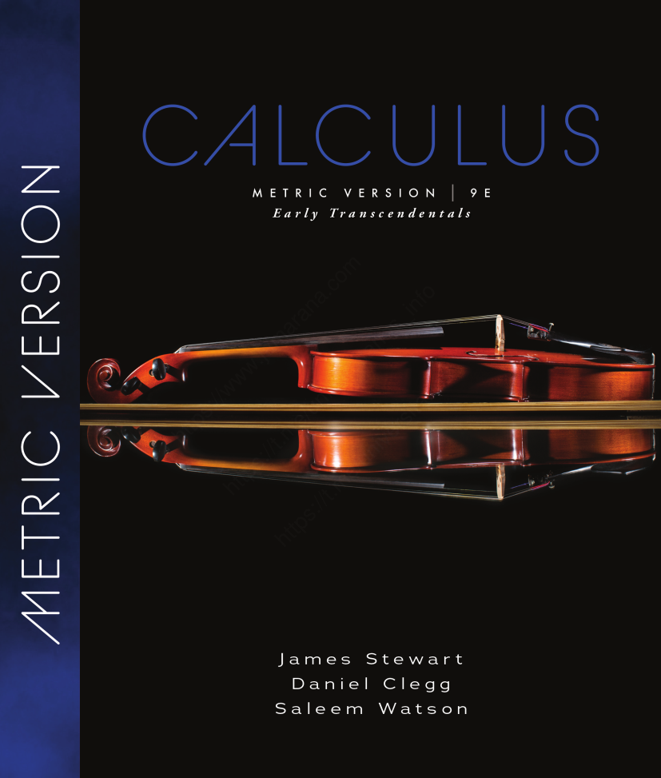

# Calculus and Analytical Geometry

## Prelude

### Dr. Aamir Alaud Din

### September 7, 2026

# About the Instructor

## Education

- PhD Environmental Engineering
    - Gwangju Institute of Science and Technology, South Korea

- MS Environmental Engineering
    - Gwangju Institute of Science and Technology, South Korea

- BS Chemical Engineering
    - University of the Punjab, Lahore

## Experience

- COMSATS University Islamabad, Lahore Campus
    - 2008 - 2013

- Khwaja Fareed University of Engineering and Information Technology, Rahim Yar Khan
    - 2018 - 2022

- National University of Sciences and Technology, Islamabad
    - 2022 - To Date

## Speciality

- Modelling and Simulation
    - Mathematics
    - Computer Programming
    - Physics
    - Chemical Engineering
    - Environmental Engineering

# Why are you studying Calculus?

You may be wondering:

**“I am a Computer Science student. Why do I need Calculus?”**

The answer is that Computer Science is not only about programming. Many areas of modern Computer Science are built on mathematics, and **calculus is one of the mathematical tools used to understand change, optimization, continuous functions, data, and computational models.**

There are five major reasons for studying Calculus.

## 1. To understand how things change

Computers and mathematical models often deal with quantities that change.

The derivative tells us **how fast a quantity changes**:

$$
f'(x)=\frac{df}{dx}.
$$

This idea becomes important in data analysis, simulations, computer graphics, scientific computing, and machine learning.

## 2. To understand optimization

A huge number of problems in Computer Science involve finding the **best solution**.

For example:

* minimize an error
* minimize computational cost
* maximize performance
* find the best parameters for a model
* optimize a system

Calculus provides the mathematical foundation for finding maximum and minimum values.

This becomes especially important in **Machine Learning and Artificial Intelligence**, where models are trained by minimizing a loss function.

## 3. To understand Machine Learning and Artificial Intelligence

Modern AI relies heavily on mathematics.

Suppose a machine-learning model has a loss function

$$
L(w).
$$

The derivative

$$
\frac{dL}{dw}
$$

tells us how the loss changes when the parameter \(w\) changes.

This idea leads to **gradient-based optimization**, which is fundamental to machine learning and deep learning.

The chain rule that you study in calculus also becomes a foundation for **backpropagation in neural networks**.

So you can think of:

$$
\boxed{
\text{Calculus}
\rightarrow
\text{Derivatives}
\rightarrow
\text{Optimization}
\rightarrow
\text{Machine Learning}
\rightarrow
\text{Deep Learning}
}
$$

## 4. To understand data and probability

When data is modeled using continuous probability distributions, integration is used to calculate probabilities and statistical quantities.

For example,

$$
P(a\leq X\leq b)
=
\int_a^b f(x)\,dx.
$$

Therefore, calculus provides an important foundation for **Data Science, Statistics, Machine Learning, and AI**.

## 5. To build the mathematical foundation for advanced Computer Science

Calculus will support your later studies in areas such as:

* Data Science
* Machine Learning
* Deep Learning
* Artificial Intelligence
* Computer Graphics
* Computer Vision
* Robotics
* Scientific Computing
* Numerical Methods
* Simulation
* Optimization

You may not use calculus directly in every programming course, but the mathematical thinking developed through calculus becomes valuable in many specialized areas of Computer Science.

## The big picture

You can think of calculus as giving you three important mathematical abilities:

$$
\boxed{\text{Change}}
\quad\rightarrow\quad
\boxed{\text{Derivative}}
$$

$$
\boxed{\text{Accumulation}}
\quad\rightarrow\quad
\boxed{\text{Integral}}
$$

$$
\boxed{\text{Best/Optimal Solution}}
\quad\rightarrow\quad
\boxed{\text{Optimization}}
$$

These ideas eventually connect mathematics with algorithms, data, machine learning, and artificial intelligence.

### Whys of Calculus in a Single Shot?

$$
\boxed{
\text{Calculus teaches you how to mathematically understand change, accumulation, and optimization—ideas that form an important foundation for modern Computer Science.}
}
$$

## Important Note {.red}

The above discussion is to convince you on the reasons, scope, and importance of studying calculus and is not required to prepare with reference to exams.

# Instructor's Point of View

## Mathematics is a Language

Mathematics is the language of science. A single mathematical model describes the reality (real physical world).

Consider,

$$
s = ut + \frac12at^2
$$

What is $ut$?

What is $at^2$?

## Major Math Models in Computer Science Courses Don't Involve Assumptions

- Multivariate Analysis
- Machine Learning
- Deep Learning
- Artificial Intelligence
    - Robots and Chatbots
- All subjects

## Understand Mathematics

Understanding the language of Mathematics is primary focus, solving is secondary focus give both equal weightage for success in Computer Science.

# Course Outline

- Review of vectors, scalar and vector products

- Three-dimensional coordinate system and equation of straight line and plane

- Limits & continuity, techniques of finding limits.

- Techniques of differentiation, Tangent lines and rates of change

- Extrema of functions, Rolle’s and Mean value theorems, Concavity

- Riemann sum, definite integrals, and properties of integrals

- Solids of revolution, volume of solids of revolution by cylindrical shell & Cross section methods

- Arc length, surface of revolution, Centre of mass

- Indeterminate forms and L Hospital rule, trigonometric integrals

- Improper Integrals

- Convergence and divergence of sequences and series, positive term series, integral test

- Basic comparison test, limit comparison test, the ratio and root tests, alternating series, absolute and conditional
convergence

- Power series, Maclaurin and Taylor series

# Assessments

## Homeworks
- Weightage: 10%
- Number of Homeworks: 3 - 4

## Quizzes 

- Weightage: 15%
- Number of Quizzes: 4 (Best three will be counted)
- Announced Quiz: All the material from last quiz to the upcoming quiz
- Unannounced Quiz: Limited to last 3 lectures
- No make up quizzes at all
- Since best 3 out of 4 quizzes will be counted, absence in one quiz will be counted as the quiz with zero marks
- Since there are no make up quizzes, don't be absent from the class which otherwise may lead to missing more than one quizzes

## Mid Semester Exam

- Weightage: 30%
- Number of Exams: 1

## End Semester Exam

- Weightage: 45%
- Number of Exams: 1

## Question Types

- Only quizzes may contain objective type question (very rare)
- All assessments will be comprised of full lenght questions
- Questions may be from theory
- There will be full length questions (unseen)
- 75-80% average
- 20-25% challenge

## Important Note {.red}

You need hard work on theoretical as well as solution part. Practice both on registers.

# Course Material

- Soon the course material will be available on LMS
- You can also download the lecture material from the GitHub repository by [clicking here](https://github.com/aamirai2025/fall26)
- Course material may include python programs which only to play with for the understanding of the topic and you can also skip them. However, playing with these graphs will lead to deeper understanding.

# Lecture Format

## Header

- Contains course title, topic, author, and date as can be seen in the header of this ongoing discussion.

## Objectives

- Objectives of the lectures to be read before the start of the lecture and review thoroughly again after preparing the lecture.

## The Why Section

- Corresponding to each objective, we will discuss the reasons of studying the topic objectives.

## Subtopics and Subsubtopics

- Subtopics appear as maroon headings and subsubtopics appear as purple headings.

## Subtopic

### Subsubtopic

## Definitions

## Definition: Color {.blue}

- Definitions appear in blue headings and a blue box represents the definition end.

$\blacksquare$

## Solved Examples

- Solved examples and solutions appear in green headings and a green box indicates end of solution. Examples may be solved on board and also left as an exercise depending upon the complexity of the problem

## Example {.green}

## Solution {.green}

$\blacksquare$

## Theorems and Proofs

- Theorems and Proofs headings are in orange heading and an orange box will be for the completeness of theorem or proof.

## Theorem {.orange}

## Proof {.orange}

$\blacksquare$

## Quick Checks

- After covering each subtopic, there will be a quick check sections and you need to be attentive during the lecture to answer these questions. These questions are in red color and a red box confirms the end of quick check section.

## Question No. 1 {.red}

## Question No. 2 {.red}

$\blacksquare$

## Summary

Self study summary aftere preparing the topic gives a bird's eye view of the topic and main points.

## Exercise

Mandatory part of the lecture and indicates the understanding of the topic. Assessment questions will be unseen. Exercises prepare you to solve those unseen questions.

# Rules

## Attendance

- Class attendance of 75% or above is mandatory to sit in the final exam. An attendance of 74.99% in Qalam leads to ineligibility to appear in the final exam. There is no concept of leave, sickness, urgent piece of works, family functions etc. and you have to use the cushion of 25% in attendance for such occasions. Once availed, you don't have any cushion for emergency or unforseen absents from the class.

- After 10 minutes, attendance will be closed. Late comers are allowed to join the class, however, their attendance will not be marked.

## Mobile Phones

- Use of mobile phones is strictly prohibited in the class. If any student is caught of using phone in the class, his/her marks in the quiz will be halved from one quiz. Upon similar activity next time, marks from other quizzes will be halved. Fifth time homeworks marks will be considered zero.

## Why are Rules and Instructor's Point of View?

Hard work $\ne$ No work/Just prepare

Everyone is the same for me

