# Calculus and Analytical Geometry

## Vectors and Vector Operations

### Dr. Aamir Alaud Din

### September 7, 2026

# Objectives

After preparing this topic, you should be able to:

1. Describe vectors geometrically as quantities having both magnitude and direction, and perform vector addition, subtraction, and scalar multiplication using the Triangle Law and Parallelogram Law.

2. Represent vectors algebraically using components, determine the magnitude and unit vector of a vector, and perform vector operations using component and standard unit-vector notation.

3. Apply vectors to practical problems involving physical quantities such as forces, tensions, velocity, displacement, and motion in engineering systems.

# The Why Section

## Objective 1: Why Study the Geometric Description of Vectors?

* In mechanical engineering, many physical quantities cannot be completely described by their magnitude alone because their direction also affects the physical result.

* For example, a force of $100;N$ acting toward the right does not have the same effect as a force of $100;N$ acting upward.

* Vectors provide a convenient mathematical representation of such quantities because the length of an arrow represents magnitude while its direction represents the direction of the physical quantity.

* When several forces or displacements act successively on a mechanical system, their combined effect can be represented by adding the corresponding vectors.

* The geometric laws of vector addition therefore provide a visual method for determining the resultant effect of several physical quantities.

* A similar idea is used in robotics and mechatronics, where movements of a robotic mechanism can be represented by displacement vectors and combined to determine the overall movement.

* A scenario involving several forces acting on a mechanical component can be solved by representing each force as a vector and combining the vectors using the geometric laws of vector addition.

## Objective 2: Why Study the Components of a Vector?

* Geometric constructions are useful for understanding vectors, but numerical calculations require an algebraic representation.

* In engineering and computer science, vectors are usually stored and manipulated using their numerical components.

* For example, the movement of a robot can be represented by a vector such as $\langle 4,3\rangle$ rather than by a drawing.

* Components allow vector addition, subtraction, and scalar multiplication to be performed efficiently using ordinary arithmetic.

* The magnitude of a vector can also be calculated from its components using the distance formula.

* Unit vectors allow us to separate the magnitude of a vector from its direction and provide a convenient way to express vectors in terms of standard coordinate directions.

* A scenario involving the movement of an autonomous robot through a two- or three-dimensional workspace can therefore be solved efficiently by representing its movements using vector components.

## Objective 3: Why Study Applications of Vectors?

* Vectors are used extensively in physics and engineering because quantities such as force, velocity, acceleration, and displacement have both magnitude and direction.

* When several forces act on an object, the resultant force is obtained by adding the force vectors.

* For example, a suspended mechanical component may be supported by several wires, and the tensions in those wires must balance the weight of the component.

* Similarly, the actual velocity of an aircraft or boat can be determined by combining its velocity with the velocity of the surrounding air or water.

* These problems cannot be solved correctly by adding magnitudes alone because the directions of the physical quantities must also be considered.

* Vector components provide a systematic method for converting such physical problems into algebraic equations that can be solved to determine unknown forces, velocities, or directions.

# Objective 1: Geometric Description of Vectors

## Vector

* A vector is a quantity that has both magnitude and direction.

* For example, to describe the velocity of a moving object, we must specify both its speed and its direction of motion.

* A vector is often represented by an arrow or directed line segment.

* The length of the arrow represents the magnitude of the vector, while the arrow points in the direction of the vector.

* Other physical quantities such as force, displacement, and acceleration can also be represented by vectors.

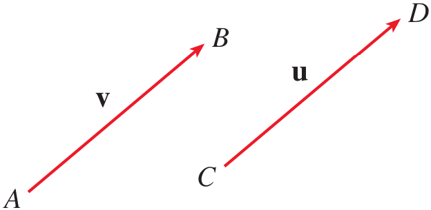

<strong>Figure 1.</strong> Representation of vectors for real physical quantities.

* A vector can be denoted by a bold letter such as $\mathbf v$ or by placing an arrow above the letter as $\vec v$.

* Suppose a particle moves along a line segment from point $A$ to point $B$.

* The corresponding displacement vector has initial point $A$, called the tail, and terminal point $B$, called the tip.

$$
\mathbf v=\overrightarrow{AB}
$$

* Two vectors are equal or equivalent when they have the same magnitude and the same direction, even if they are located at different positions.

* The zero vector, denoted by $\mathbf 0$, has magnitude zero and therefore has no specific direction.

## Vector Addition

* Suppose a particle moves from $A$ to $B$ with displacement $\overrightarrow{AB}$ and then from $B$ to $C$ with displacement $\overrightarrow{BC}$.

* The combined displacement is the displacement from $A$ to $C$.

$$
\overrightarrow{AC}
=
\overrightarrow{AB}
+
\overrightarrow{BC}
$$

* In general, to add two vectors $\mathbf u$ and $\mathbf v$, place the tail of $\mathbf v$ at the tip of $\mathbf u$.

* The vector from the initial point of $\mathbf u$ to the terminal point of $\mathbf v$ represents $\mathbf u+\mathbf v$.

* This method is called the **Triangle Law** of vector addition.

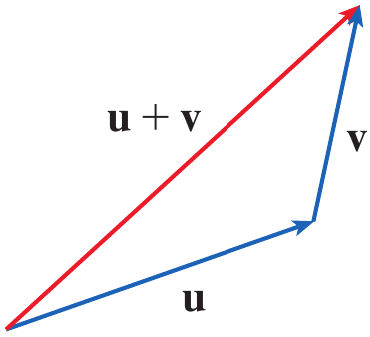

<strong>Figure 2.</strong> Triangle Law for vector addition.

* The same two vectors can also be placed with their initial points together.

* If the vectors are used as two sides of a parallelogram, the diagonal from their common initial point represents their sum.

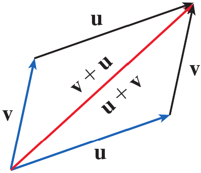

<strong>Figure 3.</strong> Parallelogram Law for vector addition.

* This method is called the **Parallelogram Law** of vector addition.

* For several vectors, the tail of each successive vector is placed at the tip of the preceding vector.

* The vector from the tail of the first vector to the tip of the last vector represents the resultant of all the vectors.

* This method is commonly called the **head-to-tail rule**.

## Example 1 {.green}

Draw the sum of the vectors $\mathbf a$ and $\mathbf b$ shown in Figure 5.

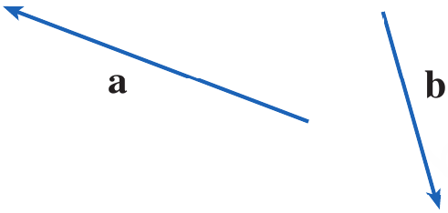

<strong>Figure 4.</strong> Vectors $\mathbf a$ and $\mathbf b$.

## Solution {.green}

First place the tail of $\mathbf b$ at the tip of $\mathbf a$ while keeping its magnitude and direction unchanged.

Then draw a vector from the tail of $\mathbf a$ to the tip of the translated copy of $\mathbf b$.

$$
\mathbf a+\mathbf b
$$

Alternatively, place $\mathbf a$ and $\mathbf b$ with their tails at the same point and complete the parallelogram.

The diagonal beginning at their common initial point represents $\mathbf a+\mathbf b$.

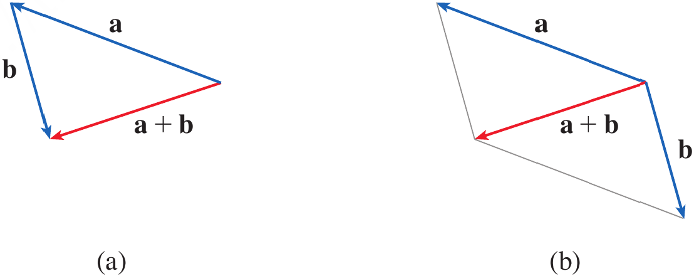

<strong>Figure 5.</strong> Geometric construction of $\mathbf a+\mathbf b$ using the Triangle Law and Parallelogram Law.

$\blacksquare$

## Scalar Multiplication

* A real number multiplied by a vector is called a **scalar multiple** of the vector.

* If $c$ is a scalar and $\mathbf v$ is a vector, then $c\mathbf v$ has magnitude $|c|$ times the magnitude of $\mathbf v$.

* If $c>0$, the scalar multiple has the same direction as $\mathbf v$.

* If $c<0$, the scalar multiple has the opposite direction.

* If $c=0$ or $\mathbf v=\mathbf0$, then

$$
c\mathbf v=\mathbf0
$$

* Thus, a scalar acts as a scaling factor for a vector.

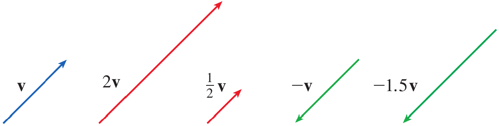

<strong>Figure 6.</strong> Scalar multiples of a vector.

* In particular,

$$
-\mathbf v=(-1)\mathbf v
$$

* The vector $-\mathbf v$ has the same magnitude as $\mathbf v$ but points in the opposite direction.

## Vector Subtraction

* The difference between two vectors is defined in terms of vector addition.

$$
\mathbf u-\mathbf v=\mathbf u+(-\mathbf v)
$$

* Therefore, to construct $\mathbf u-\mathbf v$, first construct $-\mathbf v$ and then add it to $\mathbf u$.

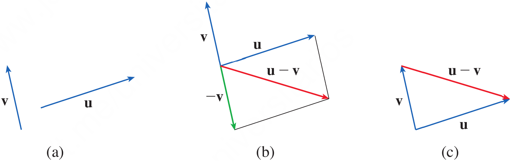

<strong>Figure 7.</strong> Geometric construction of $\mathbf u-\mathbf v$.

* If $\mathbf u$ and $\mathbf v$ have the same initial point, the vector $\mathbf u-\mathbf v$ connects the tip of $\mathbf v$ to the tip of $\mathbf u$.

## Example 2 {.green}

If $\mathbf a$ and $\mathbf b$ are the vectors shown in Figure 9, draw $\mathbf a-2\mathbf b$.

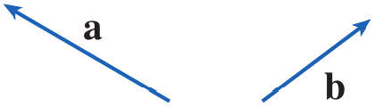

<strong>Figure 8.</strong> Vectors $\mathbf a$ and $\mathbf b$.

## Solution {.green}

First construct $-2\mathbf b$.

Since the scalar is negative, $-2\mathbf b$ points in the direction opposite to $\mathbf b$ and has twice its magnitude.

Place the tail of $-2\mathbf b$ at the tip of $\mathbf a$.

The vector from the tail of $\mathbf a$ to the tip of $-2\mathbf b$ represents $\mathbf a-2\mathbf b$.

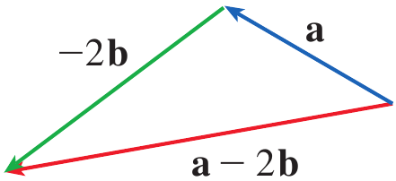

<strong>Figure 9.</strong> Geometric construction of $\mathbf a-2\mathbf b$.

$\blacksquare$

# Quick Check

## Question 1 {.red}

Two displacement vectors $\mathbf u$ and $\mathbf v$ are placed with their tails at the same point. Which geometric construction represents $\mathbf u+\mathbf v$?

## Question 2 {.red}

If $\mathbf v$ is a nonzero vector, what happens to its direction and magnitude when it is multiplied by $-3$?

$\blacksquare$

# Objective 2: Components of a Vector

## Components of a Vector

* A coordinate system allows vectors to be represented algebraically.

* If the initial point of a vector is placed at the origin, the coordinates of its terminal point give the components of the vector.

* In two dimensions, a vector can be written as

$$
\mathbf a=\langle a_1,a_2\rangle
$$

* In three dimensions, a vector can be written as

$$
\mathbf a=\langle a_1,a_2,a_3\rangle
$$

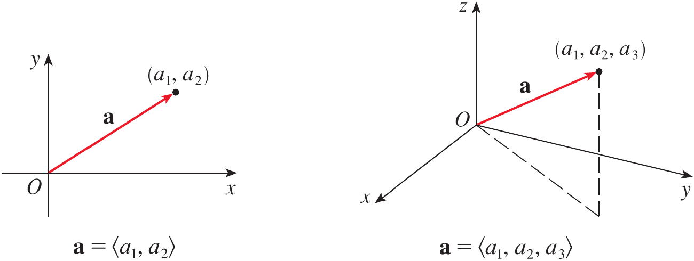

<strong>Figure 10.</strong> Representation of a vector in two and three dimensions using components.

* The ordered pair or ordered triple inside angle brackets represents a vector, whereas parentheses are used for the coordinates of a point.

* All vectors having the same components represent the same vector regardless of their position.

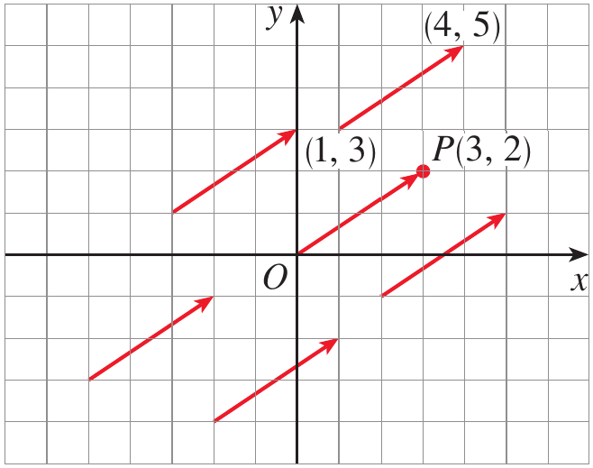

<strong>Figure 11.</strong> Different geometric representations of $\mathbf a=\langle3,2\rangle$.

* The vector from the origin to the point $P(3,2)$ is called the **position vector** of $P$.

* If a vector $\mathbf v=\overrightarrow{PQ}$ has initial point $P(x_1,y_1,z_1)$ and terminal point $Q(x_2,y_2,z_2)$ then its components are obtained by subtracting the coordinates of the initial point from the corresponding coordinates of the terminal point.

## Definition: Component Form of a Vector {.blue}

Given the points $P(x_1,y_1,z_1)$ and $Q(x_2,y_2,z_2)$, the vector represented by $\overrightarrow{PQ}$ is

$$
\overrightarrow{PQ}
=
\langle x_2-x_1,y_2-y_1,z_2-z_1\rangle
$$

$\blacksquare$

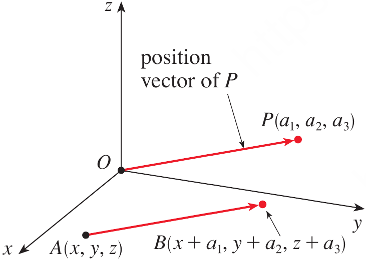

<strong>Figure 12.</strong> A vector $\overrightarrow{PQ}$ and its equivalent standard position vector.

## Magnitude of a Vector

* The magnitude or length of a vector is denoted by $|\mathbf v|$ or $|\mathbf v|$.

* For a three-dimensional vector $\mathbf v=\langle v_1,v_2,v_3\rangle$, its magnitude is obtained from the distance formula.

$$
|\mathbf v|
=
\sqrt{v_1^2+v_2^2+v_3^2}
$$

* For a two-dimensional vector $\mathbf v=\langle v_1,v_2\rangle$, the corresponding formula is

$$
|\mathbf v|
=
\sqrt{v_1^2+v_2^2}
$$

## Example 3 {.green}

Find the vector represented by the directed line segment with initial point $A(2,-3,4)$ and terminal point $B(-2,1,1)$.

## Solution {.green}

We subtract the coordinates of the initial point from the coordinates of the terminal point.

$$
\begin{aligned}
\mathbf v
&=
\langle-2-2,1-(-3),1-4\rangle\\
&=
\langle-4,4,-3\rangle
\end{aligned}
$$

Therefore,

$$
\boxed{\mathbf v=\langle-4,4,-3\rangle}
$$

$\blacksquare$

## Example 4 {.green}

Find the **(a)** component form and **(b)** length of the vector with initial point $P(-3,4,1)$ and terminal point $Q(-5,2,2)$.

## Solution {.green}

### (a) Component form {.green}

$$
\begin{aligned}
\overrightarrow{PQ}
&=
\langle-5-(-3),2-4,2-1\rangle\\
&=
\langle-2,-2,1\rangle
\end{aligned}
$$

### (b) Length {.green}

$$
\begin{aligned}
|\overrightarrow{PQ}|
&=
\sqrt{(-2)^2+(-2)^2+(1)^2}\\
&=3
\end{aligned}
$$

Therefore,

$$
\boxed{|\overrightarrow{PQ}|=3}
$$

$\blacksquare$

## Vector Addition and Scalar Multiplication in Components

* Suppose $\mathbf u=\langle u_1,u_2,u_3\rangle$ and $\mathbf v=\langle v_1,v_2,v_3\rangle$.

* Vector addition is performed by adding corresponding components.

$$
\mathbf u+\mathbf v
=
\langle
u_1+v_1,
u_2+v_2,
u_3+v_3
\rangle
$$

* Scalar multiplication is performed by multiplying every component by the scalar.

$$
k\mathbf u
=
\langle
ku_1,
ku_2,
ku_3
\rangle
$$

* Vector subtraction is therefore

$$
\mathbf u-\mathbf v
=
\langle
u_1-v_1,
u_2-v_2,
u_3-v_3
\rangle
$$

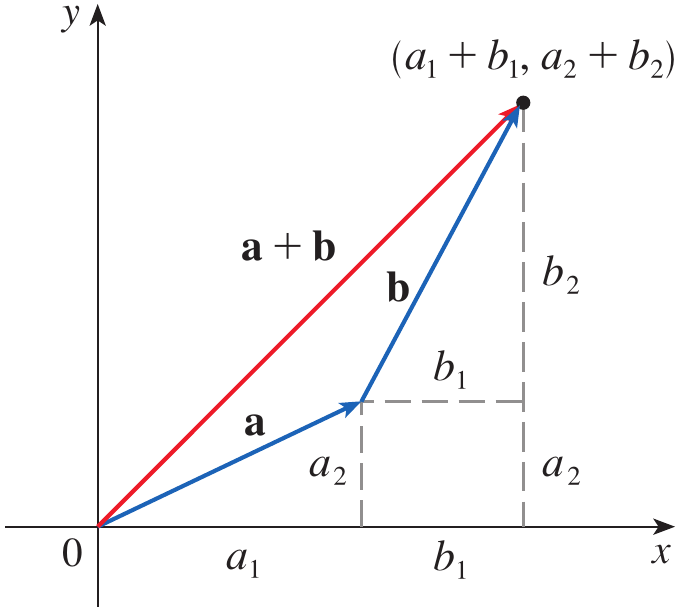

<strong>Figure 13.</strong> Addition of vectors using their components.

* The magnitude of a scalar multiple satisfies

$$
|k\mathbf u|=|k||\mathbf u|
$$

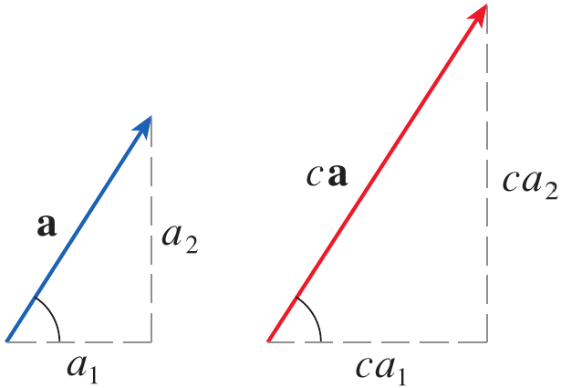

<strong>Figure 14.</strong> Geometric interpretation of scalar multiplication.

## Properties of Vectors

* Vector addition and scalar multiplication satisfy familiar algebraic properties.

* For vectors $\mathbf a$, $\mathbf b$, and $\mathbf c$ and scalars $c$ and $d$, these include

$$
\mathbf a+\mathbf b=\mathbf b+\mathbf a
$$

$$
\mathbf a+(\mathbf b+\mathbf c)
=
(\mathbf a+\mathbf b)+\mathbf c
$$

$$
\mathbf a+\mathbf0=\mathbf a
$$

$$
\mathbf a+(-\mathbf a)=\mathbf0
$$

$$
c(\mathbf a+\mathbf b)=c\mathbf a+c\mathbf b
$$

$$
(c+d)\mathbf a=c\mathbf a+d\mathbf a
$$

$$
(cd)\mathbf a=c(d\mathbf a)
$$

$$
1\mathbf a=\mathbf a
$$

* These properties can be verified algebraically by using the component definitions.

## Standard Unit Vectors

* The standard unit vectors in three dimensions are

$$
\mathbf i=\langle1,0,0\rangle
$$

$$
\mathbf j=\langle0,1,0\rangle
$$

$$
\mathbf k=\langle0,0,1\rangle
$$

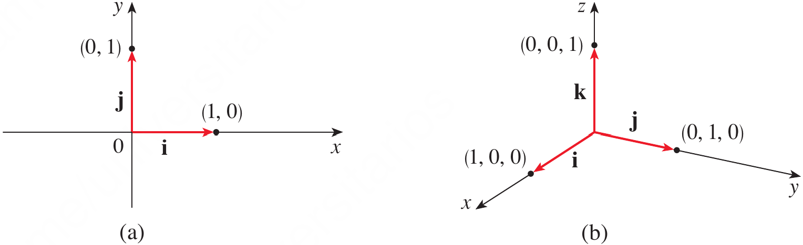

<strong>Figure 15.</strong> Standard basis vectors in two and three dimensions.

* Every three-dimensional vector can be expressed in terms of $\mathbf i$, $\mathbf j$, and $\mathbf k$.

$$
\mathbf a
=
a_1\mathbf i+a_2\mathbf j+a_3\mathbf k
$$

* Similarly, in two dimensions,

$$
\mathbf a=a_1\mathbf i+a_2\mathbf j
$$

* Thus, for example,

$$
\langle1,-2,6\rangle
=
\mathbf i-2\mathbf j+6\mathbf k
$$

## Unit Vectors

* A vector whose magnitude is $1$ is called a **unit vector**.

* The standard unit vectors $\mathbf i$, $\mathbf j$, and $\mathbf k$ are examples of unit vectors.

* If $\mathbf a\neq\mathbf0$, then the vector having the same direction as $\mathbf a$ and magnitude $1$ is obtained by dividing $\mathbf a$ by its magnitude.

## Definition: Unit Vector in the Direction of a Vector {.blue}

For a nonzero vector $\mathbf a$, the unit vector in the direction of $\mathbf a$ is

$$
\mathbf u=\frac{\mathbf a}{|\mathbf a|}
$$

$\blacksquare$

* Consequently, every nonzero vector can be expressed as its magnitude multiplied by its direction.

$$
\mathbf a
=
|\mathbf a|
\frac{\mathbf a}{|\mathbf a|}
$$

## Example 5 {.green}

If $\mathbf a=\mathbf i+2\mathbf j-3\mathbf k$ and $\mathbf b=4\mathbf i+7\mathbf k$, express the vector $2\mathbf a+3\mathbf b$ in terms of $\mathbf i$, $\mathbf j$, and $\mathbf k$.

## Solution {.green}

First multiply each vector by its scalar.

$$
2\mathbf a
=
2\mathbf i+4\mathbf j-6\mathbf k
$$

$$
3\mathbf b
=
12\mathbf i+21\mathbf k
$$

Now add corresponding components.

$$
\begin{aligned}
2\mathbf a+3\mathbf b
&=
(2\mathbf i+4\mathbf j-6\mathbf k)
+
(12\mathbf i+21\mathbf k)\\
&=
14\mathbf i+4\mathbf j+15\mathbf k
\end{aligned}
$$

Therefore,

$$
\boxed{2\mathbf a+3\mathbf b=14\mathbf i+4\mathbf j+15\mathbf k}
$$

$\blacksquare$

## Example 6 {.green}

Find the unit vector in the direction of the vector $2\mathbf i-\mathbf j-2\mathbf k$.

## Solution {.green}

Let

$$
\mathbf a=2\mathbf i-\mathbf j-2\mathbf k
$$

Its magnitude is

$$
|\mathbf a|
=
\sqrt{2^2+(-1)^2+(-2)^2}
=
3
$$

Therefore, the required unit vector is

$$
\begin{aligned}
\mathbf u
&=
\frac{\mathbf a}{|\mathbf a|}\\
&=
\frac13(2\mathbf i-\mathbf j-2\mathbf k)
\end{aligned}
$$

Hence,

$$
\boxed{
\mathbf u=
\frac23\mathbf i-\frac13\mathbf j-\frac23\mathbf k
}
$$

$\blacksquare$

# Quick Check

## Question 1 {.red}

Find the component form of the vector from $A(3,-2,1)$ to $B(-1,4,5)$.

## Question 2 {.red}

Find a unit vector in the direction of

$$
\mathbf v=3\mathbf i+4\mathbf j
$$

$\blacksquare$

# Objective 3: Applications

## Vectors in Physics and Engineering

* Vectors are used extensively in physics and engineering to represent quantities such as force, displacement, velocity, and acceleration.

* When several forces act on an object, the resultant force is obtained by adding the corresponding force vectors.

* Components are particularly useful because the vector equation can be separated into equations in the coordinate directions.

* This allows an engineering problem to be converted into algebraic equations for unknown magnitudes or directions.

## Example 7 {.green}

A $100;kg$ weight hangs from two wires as shown in Figure 19. Find the tensions $\mathbf T_1$ and $\mathbf T_2$ in the wires and the magnitudes of these tensions.

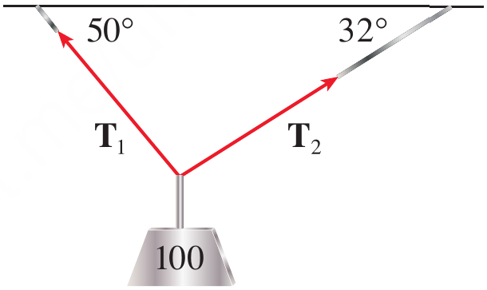

<strong>Figure 16.</strong> A $100;kg$ weight suspended by two wires.

## Solution {.green}

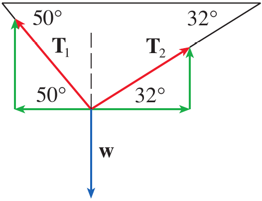

<strong>Figure 17.</strong> Component representation of the tension forces and weight.

The weight is

$$
\mathbf F=-980\mathbf j
$$

The tension vectors are

$$
\mathbf T_1
=
-|\mathbf T_1|\cos50^\circ\mathbf i
+
|\mathbf T_1|\sin50^\circ\mathbf j
$$

$$
\mathbf T_2
=
|\mathbf T_2|\cos32^\circ\mathbf i
+
|\mathbf T_2|\sin32^\circ\mathbf j
$$

Since the system is in equilibrium,

$$
\mathbf T_1+\mathbf T_2=980\mathbf j
$$

Equating components gives

$$
-|\mathbf T_1|\cos50^\circ
+
|\mathbf T_2|\cos32^\circ
=
0
$$

$$
|\mathbf T_1|\sin50^\circ
+
|\mathbf T_2|\sin32^\circ
=
980
$$

From the first equation,

$$
|\mathbf T_2|
=
|\mathbf T_1|
\frac{\cos50^\circ}{\cos32^\circ}
$$

Substituting into the second equation gives

$$
|\mathbf T_1|
\left(
\sin50^\circ
+
\cos50^\circ\tan32^\circ
\right)
=
980
$$

Therefore,

$$
|\mathbf T_1|\approx839\;N
$$

Substitution into the first equation gives

$$
|\mathbf T_2|\approx636\;N
$$

Thus, the tension vectors are approximately

$$
\boxed{
\mathbf T_1=-539\mathbf i+643\mathbf j
}
$$

$$
\boxed{
\mathbf T_2=539\mathbf i+337\mathbf j
}
$$

$\blacksquare$

## Example 8 {.green}

A woman launches a boat from the south shore of a straight river that flows directly west at $4;km/h$. She wants to land at the point directly across on the opposite shore. If the speed of the boat relative to the water is $8;km/h$, in what direction should she steer the boat in order to arrive at the desired landing point?

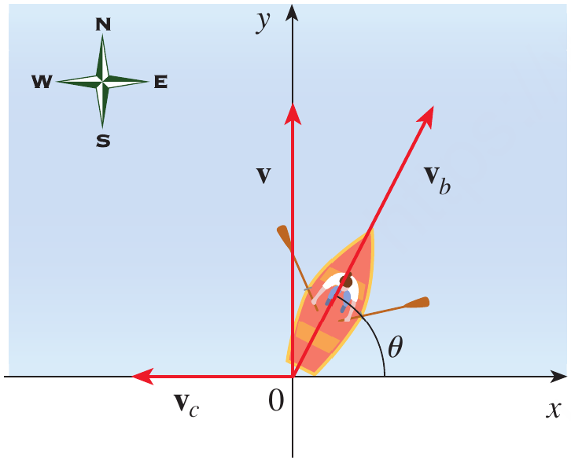

<strong>Figure 18.</strong> Velocity vectors for the boat and river current.

## Solution {.green}

Choose the coordinate axes with the origin at the initial position of the boat.

The velocity of the river is

$$
\mathbf v_c=-4\mathbf i
$$

If the boat is steered at an angle $\theta$ east of north, its velocity relative to the water is

$$
\mathbf v_b
=
8\cos\theta\mathbf i
+
8\sin\theta\mathbf j
$$

The resultant velocity is

$$
\begin{aligned}
\mathbf v
&=
\mathbf v_b+\mathbf v_c\\
&=
(8\cos\theta-4)\mathbf i
+
8\sin\theta\mathbf j
\end{aligned}
$$

To arrive directly opposite the starting point, the resultant velocity must have no horizontal component.

$$
8\cos\theta-4=0
$$

Hence,

$$
\cos\theta=\frac12
$$

so

$$
\theta=60^\circ
$$

Therefore, the boat should be steered in the direction

$$
\boxed{\theta=60^\circ}
$$

This is equivalent to a direction of $N30^\circ E$.

$\blacksquare$

# Quick Check

## Question 1 {.red}

A force of magnitude $100;N$ acts at an angle of $30^\circ$ above the positive $x$-axis. Express the force vector in terms of $\mathbf i$ and $\mathbf j$.

## Question 2 {.red}

A river current flows west at $3;km/h$. A boat moves north at $5;km/h$ relative to the water. What are the magnitude and direction of its ground velocity?

$\blacksquare$

# Scenario Problem

## Problem {.green}

A robotic lifting mechanism is holding a $75;N$ load using two cables. The left cable makes an angle of $50^\circ$ with the horizontal and the right cable makes an angle of $32^\circ$ with the horizontal.

Determine the magnitudes of the two cable tensions required to keep the load stationary.

## Solution {.green}

Let the magnitudes of the cable tensions be $T_1$ and $T_2$.

The downward force due to the load is

$$
\mathbf F=-75\mathbf j
$$

The two cable tensions can be represented by their components.

$$
\mathbf T_1
=
-T_1\cos50^\circ\mathbf i
+
T_1\sin50^\circ\mathbf j
$$

and

$$
\mathbf T_2
=
T_2\cos32^\circ\mathbf i
+
T_2\sin32^\circ\mathbf j
$$

Since the robotic mechanism is stationary, the resultant force must be zero.

$$
\mathbf T_1+\mathbf T_2=75\mathbf j
$$

Equating horizontal components gives

$$
-T_1\cos50^\circ+T_2\cos32^\circ=0
$$

Therefore,

$$
T_2
=
T_1\frac{\cos50^\circ}{\cos32^\circ}
$$

Equating vertical components gives

$$
T_1\sin50^\circ+T_2\sin32^\circ=75
$$

Substituting the expression for $T_2$ gives

$$
T_1
\left(
\sin50^\circ+
\cos50^\circ\tan32^\circ
\right)
=
75
$$

Hence,

$$
T_1
=
\frac{75}
{\sin50^\circ+\cos50^\circ\tan32^\circ}
$$

$$
T_1\approx64.3\;N
$$

Substituting this value into the expression for $T_2$ gives

$$
T_2
=
T_1\frac{\cos50^\circ}{\cos32^\circ}
$$

$$
T_2\approx48.7\;N
$$

Therefore, the required cable tensions are

$$
\boxed{T_1\approx64.3\;N}
$$

and

$$
\boxed{T_2\approx48.7\;N}
$$

$\blacksquare$

# Summary

* A vector is a quantity having both magnitude and direction and can be represented geometrically by a directed line segment. 

* Vectors can be added geometrically using the Triangle Law, Parallelogram Law, or head-to-tail rule. 

* Scalar multiplication changes the magnitude of a vector and may reverse its direction when the scalar is negative. 

* A vector can be represented algebraically by its components, and the vector from $P$ to $Q$ is obtained by subtracting the coordinates of $P$ from those of $Q$. 

* The magnitude of a vector is obtained from the distance formula using its components. 

* Vector addition, subtraction, and scalar multiplication can be performed component by component. 

* The standard unit vectors $\mathbf i$, $\mathbf j$, and $\mathbf k$ provide the standard coordinate directions, and every vector can be expressed as a linear combination of them. 

* A unit vector has magnitude $1$, and the unit vector in the direction of a nonzero vector $\mathbf a$ is $\mathbf a/|\mathbf a|$. 

* Vectors allow engineering quantities such as forces and velocities to be resolved into components and combined systematically. The Stewart material illustrates this with cable tensions and boat motion in a river. 

* The central idea of this topic is that **vectors provide a mathematical language for quantities whose magnitude and direction must be considered together, allowing geometric physical problems to be converted into systematic algebraic calculations**.

# Exercises

* Exercises help transform theoretical concepts into practical understanding.

* Mathematics is learned by doing and solving exercises will train you to analyze problems, select appropriate methods, and construct logical solutions.

* Attempting problems sometimes leads to mistakes which provide opportunities for learning and improvement.

* Regular practice increases speed, accuracy, and confidence.

* Exercises are given in the Exercises file and you are expected to solve them on your own.

## Exercises Set 1

* Solve all the odd number exercises from exercise 1 to 28.

## Exercises Set 2

* Solve all the exercises from exercise 29 to 40.
