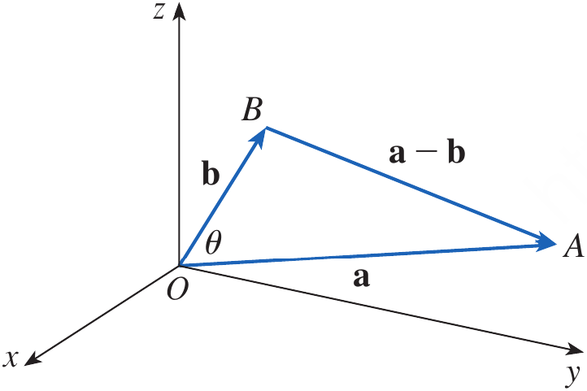
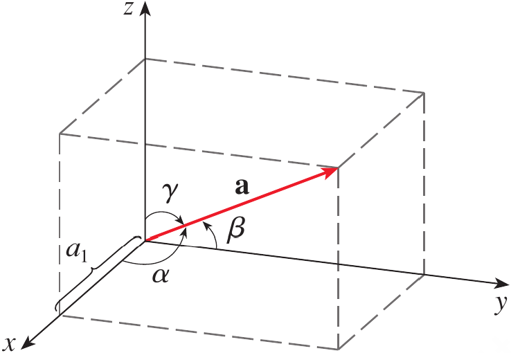
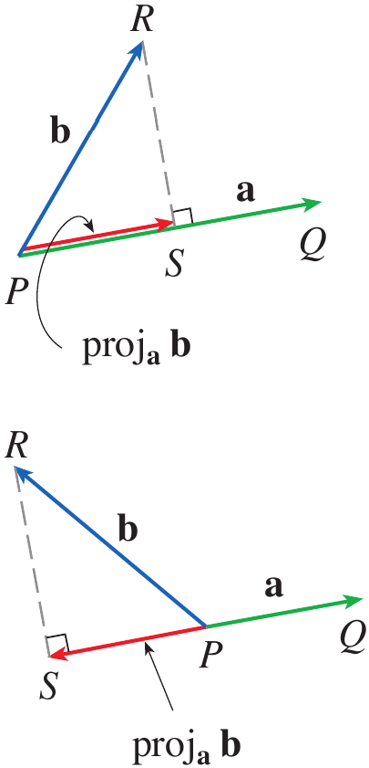
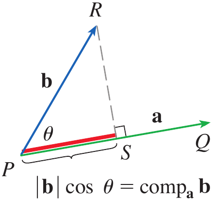
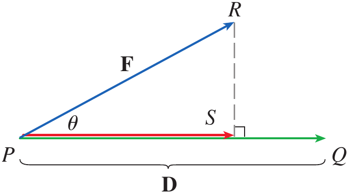

# Calculus and Analytical Geometry

## The Dot Product

### Dr. Aamir Alaud Din

### September 08, 2026

# Objectives

After preparing this topic, you should be able to:

1. Calculate the dot product of two vectors from their components and use its algebraic and geometric properties to determine relationships between vectors.

2. Determine the direction angles and direction cosines of a nonzero vector and use them to describe its orientation relative to the coordinate axes.

3. Calculate the scalar and vector projections of one vector onto another and interpret projection as the component of one vector in a specified direction.

4. Apply the dot product and vector projections to calculate the work done by a constant force acting through a displacement.

# The Why Section

## Objective 1: Why Study the Dot Product of Two Vectors?

* In engineering and computer science, vectors often describe quantities such as forces, velocities, displacements, and directions.

* Sometimes vector addition and scalar multiplication are not enough because we need a single number that tells us how strongly two vectors are aligned with each other.

* The **dot product** provides this information by combining two vectors to produce a scalar.

* For example, in a robotic arm, two vectors may represent the direction of a joint force and the direction in which a component is moving.

* The dot product can determine whether the two directions are generally aligned, perpendicular, or opposed.

* This type of mechanical-engineering or mechatronics problem can be analyzed systematically by studying the dot product.

## Objective 2: Why Study Direction Angles and Direction Cosines?

* In three-dimensional engineering systems, a vector can point in an arbitrary direction.

* Knowing its components tells us its orientation mathematically, but we may also want to know the angles that the vector makes with the positive $x$-, $y$-, and $z$-axes.

* Direction angles and direction cosines provide a convenient way to describe this orientation.

* For example, the orientation of a robotic arm, aircraft velocity vector, or force acting on a mechanical component can be described using its direction angles.

* This type of three-dimensional orientation problem can be handled by studying direction angles and direction cosines.

## Objective 3: Why Study Projections?

* In many physical problems, only the component of a vector acting in a particular direction is important.

* For example, a force may act at an angle to the direction in which a mechanical component moves.

* The entire force does not contribute equally to motion in that direction.

* Projection allows us to determine the part of one vector that lies along the direction of another vector.

* Therefore, scalar and vector projections provide mathematical tools for separating a vector into a component along a specified direction.

* This type of force-analysis problem can be solved by studying vector projections.

## Objective 4: Why Study the Application of the Dot Product to Work?

* In mechanics, a force does not necessarily act in the same direction as the displacement of an object.

* Only the component of the force in the direction of displacement contributes to the work done.

* The dot product combines the magnitude of the force, the magnitude of the displacement, and the angle between them into a single quantity.

* Therefore, the work done by a constant force can be expressed directly using the dot product.

* For example, pulling a wagon with a handle inclined above the horizontal requires the force and displacement to be treated as vectors.

* This mechanical-engineering problem can be solved by applying the dot product to force and displacement.

# Objective 1: The Dot Product of Two Vectors

## The Dot Product of Two Vectors

* The dot product is a way of multiplying two vectors so that the result is a scalar rather than another vector.

* If $\mathbf a$ and $\mathbf b$ are three-dimensional vectors with components $\mathbf a=\langle a_1,a_2,a_3\rangle$ and $\mathbf b=\langle b_1,b_2,b_3\rangle$, then their dot product is obtained by multiplying corresponding components and adding the results.

## Definition: The Dot Product {.blue}

If $\mathbf a=\langle a_1,a_2,a_3\rangle$ and $\mathbf b=\langle b_1,b_2,b_3\rangle$, then the dot product of $\mathbf a$ and $\mathbf b$, denoted by $\mathbf a\cdot\mathbf b$, is

$$
\mathbf a\cdot\mathbf b=a_1b_1+a_2b_2+a_3b_3
$$

$\blacksquare$

* The result of a dot product is a real number, not a vector.

* For this reason, the dot product is also called the **scalar product** or **inner product**.

* For two-dimensional vectors, the same idea gives

$$
\langle a_1,a_2\rangle\cdot\langle b_1,b_2\rangle
=
a_1b_1+a_2b_2
$$

## Example 1 {.green}

Find the following dot products.

$$
\langle2,4\rangle\cdot\langle3,-1\rangle
$$

$$
\langle-1,7,4\rangle \cdot \left \langle 6,2,-\frac12 \right \rangle
$$

$$
(\mathbf i+2\mathbf j-3\mathbf k)\cdot(2\mathbf j-\mathbf k)
$$

## Solution {.green}

For the first product,

$$
\begin{aligned}
\langle2,4\rangle\cdot\langle3,-1\rangle
&=2(3)+4(-1)\\
&=2
\end{aligned}
$$

For the second product,

$$
\begin{aligned}
\langle-1,7,4\rangle
\cdot
\left \langle6,2,-\frac12 \right \rangle
&=(-1)(6)+7(2)+4\left(-\frac12\right)\\
&=6
\end{aligned}
$$

For the third product,

$$
\begin{aligned}
(\mathbf i+2\mathbf j-3\mathbf k)
\cdot
(2\mathbf j-\mathbf k)
&=(1)(0)+(2)(2)+(-3)(-1)\\
&=7
\end{aligned}
$$

$\blacksquare$

## Properties of the Dot Product

* The dot product satisfies several properties similar to ordinary multiplication of real numbers.

## Theorem: Properties of the Dot Product {.orange}

If $\mathbf a$, $\mathbf b$, and $\mathbf c$ are vectors in $\mathbb R^3$ and $c$ is a scalar, then

1. $\mathbf a\cdot\mathbf a=|\mathbf a|^2$

2. $\mathbf a\cdot\mathbf b=\mathbf b\cdot\mathbf a$

3. $\mathbf a\cdot(\mathbf b+\mathbf c)=\mathbf a\cdot\mathbf b+\mathbf a\cdot\mathbf c$

4. $(c\mathbf a)\cdot\mathbf b=c(\mathbf a\cdot\mathbf b)=\mathbf a\cdot(c\mathbf b)$

5. $\mathbf 0\cdot\mathbf a=0$

## Proof {.orange}

For example, consider the first property.

$$
\begin{aligned}
\mathbf a\cdot\mathbf a
&=a_1^2+a_2^2+a_3^2\\
&=|\mathbf a|^2
\end{aligned}
$$

For the distributive property,

$$
\begin{aligned}
\mathbf a\cdot(\mathbf b+\mathbf c)
&=\langle a_1,a_2,a_3\rangle
\cdot
\langle b_1+c_1,b_2+c_2,b_3+c_3\rangle\\
&=a_1(b_1+c_1)+a_2(b_2+c_2)+a_3(b_3+c_3)\\
&=(a_1b_1+a_2b_2+a_3b_3)
 +(a_1c_1+a_2c_2+a_3c_3)\\
&=\mathbf a\cdot\mathbf b+\mathbf a\cdot\mathbf c
\end{aligned}
$$

The remaining properties follow similarly from the definition of the dot product.

$\blacksquare$

## Geometric Interpretation of the Dot Product

* The dot product can also be interpreted geometrically using the angle between two vectors.

* Let $\theta$ be the angle between nonzero vectors $\mathbf a$ and $\mathbf b$, where $0\leq\theta\leq\pi$.

<strong>Figure 1.</strong> The geometric interpretation of the dot product using the angle between vectors $\mathbf a$ and $\mathbf b$.

* The dot product is related to the magnitudes of the vectors and the angle between them.

## Theorem: Dot Product and Angle {.orange}

If $\theta$ is the angle between the vectors $\mathbf a$ and $\mathbf b$, then

$$
\boxed{\mathbf a\cdot\mathbf b=|\mathbf a||\mathbf b|\cos\theta}
$$

## Proof {.orange}

Applying the Law of Cosines to the triangle formed by $\mathbf a$, $\mathbf b$, and $\mathbf a-\mathbf b$ gives

$$
|\mathbf a-\mathbf b|^2
=
|\mathbf a|^2+|\mathbf b|^2
-2|\mathbf a||\mathbf b|\cos\theta
$$

On the other hand,

$$
\begin{aligned}
|\mathbf a-\mathbf b|^2
&=(\mathbf a-\mathbf b)\cdot(\mathbf a-\mathbf b)\\
&=\mathbf a\cdot\mathbf a
-\mathbf a\cdot\mathbf b
-\mathbf b\cdot\mathbf a
+\mathbf b\cdot\mathbf b\\
&=|\mathbf a|^2-2\mathbf a\cdot\mathbf b+|\mathbf b|^2
\end{aligned}
$$

Comparing the two expressions gives

$$
\mathbf a\cdot\mathbf b
=
|\mathbf a||\mathbf b|\cos\theta
$$

$\blacksquare$

## Example 2 {.green}

If the vectors $\mathbf a$ and $\mathbf b$ have lengths $4$ and $6$, and the angle between them is $\pi/3$, find $\mathbf a\cdot\mathbf b$.

## Solution {.green}

Using the dot-product formula,

$$
\mathbf a\cdot\mathbf b
=
|\mathbf a||\mathbf b|\cos\theta
$$

Substituting the given values gives

$$
\mathbf a\cdot\mathbf b
=
(4)(6)\cos\left(\frac{\pi}{3}\right)
$$

Therefore,

$$
\boxed{\mathbf a\cdot\mathbf b=12}
$$

$\blacksquare$

## Finding the Angle Between Two Vectors

* The geometric formula can be rearranged to determine the angle between two nonzero vectors.

## Corollary {.orange}

If $\theta$ is the angle between the nonzero vectors $\mathbf a$ and $\mathbf b$, then

$$
\boxed{\cos\theta=\frac{\mathbf a\cdot\mathbf b}{|\mathbf a||\mathbf b|}}
$$

$\blacksquare$

## Example 3 {.green}

Find the angle between the vectors

$$
\mathbf a=\langle2,2,-1\rangle
$$

and

$$
\mathbf b=\langle5,-3,2\rangle
$$

## Solution {.green}

First calculate the magnitudes.

$$
|\mathbf a|
=
\sqrt{2^2+2^2+(-1)^2}
=
3
$$

and

$$
|\mathbf b|
=
\sqrt{5^2+(-3)^2+2^2}
=
\sqrt{38}
$$

The dot product is

$$
\mathbf a\cdot\mathbf b
=
2(5)+2(-3)+(-1)(2)
=
2
$$

Therefore,

$$
\cos\theta
=
\frac{2}{3\sqrt{38}}
$$

Hence,

$$
\theta
=
\cos^{-1}\left(\frac{2}{3\sqrt{38}}\right)
\approx1.46
$$

Thus,

$$
\boxed{\theta\approx84^\circ}
$$

$\blacksquare$

## Orthogonal Vectors

* Two nonzero vectors are called **perpendicular** or **orthogonal** if the angle between them is $\pi/2$.

* Since $\cos(\pi/2)=0$, their dot product is zero.

## Theorem: Orthogonality {.orange}

Two vectors $\mathbf a$ and $\mathbf b$ are orthogonal if and only if

$$
\boxed{\mathbf a\cdot\mathbf b=0}
$$

$\blacksquare$

## Example 4 {.green}

Show that

$$
2\mathbf i+2\mathbf j-\mathbf k
$$

is perpendicular to

$$
5\mathbf i-4\mathbf j+2\mathbf k
$$

## Solution {.green}

Calculate the dot product.

$$
\begin{aligned}
(2\mathbf i+2\mathbf j-\mathbf k)
\cdot
(5\mathbf i-4\mathbf j+2\mathbf k)
&=2(5)+2(-4)+(-1)(2)\\
&=0
\end{aligned}
$$

Therefore, the two vectors are perpendicular.

$$
\boxed{\text{The vectors are orthogonal}}
$$

$\blacksquare$

### Interpreting the Sign of the Dot Product

* If the angle between two nonzero vectors is less than $\pi/2$, then $\cos\theta>0$ and therefore $\mathbf a\cdot\mathbf b>0$.

* If the vectors are perpendicular, then $\mathbf a\cdot\mathbf b=0$.

* If the angle is greater than $\pi/2$, then $\cos\theta<0$ and therefore $\mathbf a\cdot\mathbf b<0$.

* Thus, the sign of the dot product provides information about the general directional relationship between two vectors.

# Quick Check

## Question 1 {.red}

If

$$
\mathbf a=\langle2,1,3\rangle
$$

and

$$
\mathbf b=\langle1,-2,4\rangle
$$

find $\mathbf a\cdot\mathbf b$.

## Question 2 {.red}

Are the vectors

$$
\mathbf u=\langle1,2,-1\rangle
$$

and

$$
\mathbf v=\langle2,-1,0\rangle
$$

orthogonal?

$\blacksquare$

# Objective 2: Direction Angles and Direction Cosines

## Direction Angles

* A nonzero vector in three-dimensional space has a definite orientation relative to the coordinate axes.

* The **direction angles** of a vector $\mathbf a$ are the angles $\alpha$, $\beta$, and $\gamma$ that the vector makes with the positive $x$-, $y$-, and $z$-axes, respectively.

<strong>Figure 2.</strong> Direction angles $\alpha$, $\beta$, and $\gamma$ of a vector in three-dimensional space.

* The corresponding cosines $\cos\alpha$, $\cos\beta$, and $\cos\gamma$ are called the **direction cosines** of the vector.

* If $\mathbf a=\langle a_1,a_2,a_3\rangle$ then the magnitude of the vector is

$$
|\mathbf a|
=
\sqrt{a_1^2+a_2^2+a_3^2}
$$

* Taking the dot product of $\mathbf a$ with the standard unit vector $\mathbf i$ gives

$$
\mathbf a\cdot\mathbf i
=
|\mathbf a||\mathbf i|\cos\alpha
$$

* Since $|\mathbf i|=1$ and $\mathbf a\cdot\mathbf i=a_1$, we obtain

$$
\boxed{\cos\alpha=\frac{a_1}{|\mathbf a|}}
$$

* Similarly,

$$
\boxed{\cos\beta=\frac{a_2}{|\mathbf a|}, \qquad \cos\gamma=\frac{a_3}{|\mathbf a|}}
$$

* These three numbers are the direction cosines of $\mathbf a$.

## Direction Cosine Identity

* Since the direction cosines are the components of the unit vector in the direction of $\mathbf a$, they satisfy

$$
\boxed{\cos^2\alpha+\cos^2\beta+\cos^2\gamma=1}
$$

* Therefore, the unit vector in the direction of $\mathbf a$ can be written as

$$
\frac{1}{|\mathbf a|}\mathbf a
=
\langle\cos\alpha,\cos\beta,\cos\gamma\rangle
$$

## Example 5 {.green}

Find the direction angles of the vector

$$
\mathbf a=\langle1,2,3\rangle
$$

## Solution {.green}

First find the magnitude.

$$
|\mathbf a|
=
\sqrt{1^2+2^2+3^2}
=
\sqrt{14}
$$

The direction cosines are therefore

$$
\cos\alpha=\frac1{\sqrt{14}}
$$

$$
\cos\beta=\frac2{\sqrt{14}}
$$

and

$$
\cos\gamma=\frac3{\sqrt{14}}
$$

Thus,

$$
\alpha=\cos^{-1}\left(\frac1{\sqrt{14}}\right)\approx74^\circ
$$

$$
\beta=\cos^{-1}\left(\frac2{\sqrt{14}}\right)\approx58^\circ
$$

and

$$
\gamma=\cos^{-1}\left(\frac3{\sqrt{14}}\right)\approx37^\circ
$$

$\blacksquare$

# Quick Check

## Question 1 {.red}

Find the direction cosines of

$$
\mathbf a=\langle2,2,1\rangle
$$

## Question 2 {.red}

For a vector with direction angles $\alpha$, $\beta$, and $\gamma$, what relation must its direction cosines satisfy?

$\blacksquare$

# Objective 3: Projections

## Vector Projection

* Projection is useful when we want to determine how much of one vector acts in the direction of another vector.

* Consider vectors $\mathbf a$ and $\mathbf b$ with a common initial point.

<strong>Figure 3.</strong> Vector projections of $\mathbf b$ onto $\mathbf a$.

* The vector projection of $\mathbf b$ onto $\mathbf a$ is the vector component of $\mathbf b$ that lies in the direction of $\mathbf a$.

* The scalar projection gives the signed length of this component.

* If $\theta$ is the angle between $\mathbf a$ and $\mathbf b$, then the scalar projection is $|\mathbf b|\cos\theta$.

* From the dot-product theorem,

$$
\mathbf a\cdot\mathbf b
=
|\mathbf a||\mathbf b|\cos\theta
$$

* Dividing by $|\mathbf a|$ gives

$$
|\mathbf b|\cos\theta
=
\frac{\mathbf a\cdot\mathbf b}{|\mathbf a|}
$$

## Scalar Projection

* The scalar projection of $\mathbf b$ onto $\mathbf a$ is

$$
\boxed{\operatorname{comp}_{\mathbf a}\mathbf b
=
\frac{\mathbf a\cdot\mathbf b}{|\mathbf a|}}
$$

* This quantity may be positive or negative depending on the direction of the projection.

* It is positive when the component of $\mathbf b$ points generally in the direction of $\mathbf a$ and negative when it points generally opposite to $\mathbf a$.

## Vector Projection

* The unit vector in the direction of $\mathbf a$ is

$$
\frac{\mathbf a}{|\mathbf a|}
$$

* Multiplying the scalar projection by this unit vector gives the vector projection.

$$
\boxed{
\operatorname{proj}_{\mathbf a}\mathbf b
=
\left(
\frac{\mathbf a\cdot\mathbf b}{|\mathbf a|}
\right)
\frac{\mathbf a}{|\mathbf a|}
}
$$

* Therefore,

$$
\boxed{
\operatorname{proj}_{\mathbf a}\mathbf b
=
\frac{\mathbf a\cdot\mathbf b}{|\mathbf a|^2}\mathbf a
}
$$

<strong>Figure 4.</strong> Scalar projection of $\mathbf b$ onto $\mathbf a$.

* The scalar projection tells us the signed magnitude of the component, while the vector projection gives both its magnitude and direction.

## Example 6 {.green}

Find the scalar projection and vector projection of

$$
\mathbf b=\langle1,1,2\rangle
$$

onto

$$
\mathbf a=\langle-2,3,1\rangle
$$

## Solution {.green}

First find the magnitude of $\mathbf a$.

$$
|\mathbf a|
=
\sqrt{(-2)^2+3^2+1^2}
=
\sqrt{14}
$$

Now calculate the dot product.

$$
\mathbf a\cdot\mathbf b
=
(-2)(1)+(3)(1)+(1)(2)
=
3
$$

Therefore, the scalar projection is

$$
\boxed{
\operatorname{comp}_{\mathbf a}\mathbf b
=
\frac3{\sqrt{14}}
}
$$

The vector projection is

$$
\operatorname{proj}_{\mathbf a}\mathbf b
=
\frac3{\sqrt{14}}
\frac{\mathbf a}{|\mathbf a|}
$$

Thus,

$$
\begin{aligned}
\operatorname{proj}_{\mathbf a}\mathbf b
&=
\frac3{14}\langle-2,3,1\rangle\\
&=
\left\langle-\frac37,\frac9{14},\frac3{14}\right\rangle
\end{aligned}
$$

Therefore,

$$
\boxed{
\operatorname{proj}_{\mathbf a}\mathbf b
=
\left\langle-\frac37,\frac9{14},\frac3{14}\right\rangle
}
$$

$\blacksquare$

# Quick Check

## Question 1 {.red}

Find the scalar projection of

$$
\mathbf b=\langle2,1\rangle
$$

onto

$$
\mathbf a=\langle1,0\rangle
$$

## Question 2 {.red}

What is the vector projection of $\mathbf b$ onto $\mathbf a$ if $\mathbf a\cdot\mathbf b=0$?

$\blacksquare$

# Objective 4: Application — Work

## Work and the Dot Product

* One important application of vector projections occurs in physics when calculating work.

* If a constant force $\mathbf F$ acts on an object while the object moves through a displacement $\mathbf D$, only the component of the force in the direction of the displacement contributes to the work.

* If $\theta$ is the angle between $\mathbf F$ and $\mathbf D$, the scalar component of the force along the displacement is

$$
|\mathbf F|\cos\theta
$$

* Therefore, the work is

$$
W=(|\mathbf F|\cos\theta)|\mathbf D|
$$

* From the dot-product theorem,

$$
\boxed{W=\mathbf F\cdot\mathbf D}
$$

* Thus, the work done by a constant force is the dot product of the force vector and the displacement vector.

<strong>Figure 5.</strong> Force vector $\mathbf F$ and displacement vector $\mathbf D$ showing the component of force in the direction of motion.

## Example 7 {.green}

A wagon is pulled a distance of $100;m$ along a horizontal path by a constant force of $70;N$. The handle of the wagon is held at an angle of $35^\circ$ above the horizontal. Find the work done by the force.

## Solution {.green}

The force and displacement vectors have magnitudes

$$
|\mathbf F|=70\;N
$$

and

$$
|\mathbf D|=100\;m
$$

The angle between them is

$$
\theta=35^\circ
$$

Therefore,

$$
\begin{aligned}
W
&=\mathbf F\cdot\mathbf D\\
&=|\mathbf F||\mathbf D|\cos35^\circ\\
&=(70)(100)\cos35^\circ
\end{aligned}
$$

Hence,

$$
\boxed{W\approx5734\;J}
$$

$\blacksquare$

## Example 8 {.green}

A force is given by the vector

$$
\mathbf F=3\mathbf i+4\mathbf j+5\mathbf k
$$

and moves a particle from the point $P(2,1,0)$ to the point $Q(4,6,2)$. Find the work done.

## Solution {.green}

The displacement vector is

$$
\mathbf D=\overrightarrow{PQ}
$$

Therefore,

$$
\mathbf D
=
\langle4-2,6-1,2-0\rangle
=
\langle2,5,2\rangle
$$

The work is the dot product of the force and displacement.

$$
\begin{aligned}
W
&=\mathbf F\cdot\mathbf D\\
&=\langle3,4,5\rangle\cdot\langle2,5,2\rangle\\
&=3(2)+4(5)+5(2)\\
&=36
\end{aligned}
$$

Therefore,

$$
\boxed{W=36\;J}
$$

$\blacksquare$

# Quick Check

## Question 1 {.red}

A constant force

$$
\mathbf F=\langle4,3\rangle\;N
$$

moves an object through

$$
\mathbf D=\langle5,2\rangle\;m
$$

Find the work done.

## Question 2 {.red}

A force and displacement are perpendicular. What is the work done by the force?

$\blacksquare$

# Scenario Problem

## Problem {.green}

A robotic gripper in a mechatronic system applies a constant force

$$
\mathbf F=30\mathbf i+40\mathbf j\;N
$$

while moving an object from

$$
P(1,2)
$$

to

$$
Q(7,10)
$$

where the coordinates are measured in meters.

Determine the displacement vector and the work done by the gripper.

## Solution {.green}

The displacement vector is obtained from the initial and terminal points.

$$
\mathbf D
=
\overrightarrow{PQ}
=
\langle7-1,10-2\rangle
$$

Therefore,

$$
\mathbf D=\langle6,8\rangle\;m
$$

The work done by the constant force is the dot product of the force and displacement vectors.

$$
\begin{aligned}
W
&=\mathbf F\cdot\mathbf D\\
&=\langle30,40\rangle\cdot\langle6,8\rangle\\
&=30(6)+40(8)\\
&=180+320\\
&=500
\end{aligned}
$$

Therefore,

$$
\boxed{W=500\;J}
$$

This scenario combines the vector representation and vector operations developed earlier with the dot-product application to work. The uploaded vector lecture establishes displacement vectors from two points and component-based vector operations, while the Stewart material develops work as the dot product of force and displacement.  

$\blacksquare$

# Summary

* The **dot product** of two vectors is a scalar obtained by multiplying corresponding components and adding the results.

* The dot product satisfies important properties including commutativity, distributivity, scalar multiplication, and $\mathbf a\cdot\mathbf a=|\mathbf a|^2$.

* Geometrically, the dot product is related to the angle between two vectors by $\mathbf a\cdot\mathbf b=|\mathbf a||\mathbf b|\cos\theta$.

* Two vectors are orthogonal if and only if their dot product is zero.

* The **direction angles** $\alpha$, $\beta$, and $\gamma$ describe the angles a vector makes with the positive coordinate axes.

* The corresponding direction cosines satisfy $\cos\alpha=a_1/|\mathbf a|$, $\cos\beta=a_2/|\mathbf a|$, and $\cos\gamma=a_3/|\mathbf a|$.

* The direction cosines satisfy $\cos^2\alpha+\cos^2\beta+\cos^2\gamma=1$.

* The scalar projection of $\mathbf b$ onto $\mathbf a$ is $\operatorname{comp}*{\mathbf a}\mathbf b=(\mathbf a\cdot\mathbf b)/|\mathbf a|$, while the vector projection is $\operatorname{proj}*{\mathbf a}\mathbf b=(\mathbf a\cdot\mathbf b)\mathbf a/|\mathbf a|^2$.

* The work done by a constant force $\mathbf F$ through a displacement $\mathbf D$ is given by $W=\mathbf F\cdot\mathbf D$.

* The central idea of this topic is that **the dot product converts directional information between vectors into a scalar quantity that can be used to analyze angles, orthogonality, projections, and physical work**. 

# Exercises

* Exercises help transform theoretical concepts into practical understanding.

* Mathematics is learned by doing and solving exercises will train you to analyze problems, select appropriate methods, and construct logical solutions.

* Attempting problems sometimes leads to mistakes which provide opportunities for learning and improvement.

* Regular practice increases speed, accuracy, and confidence.

* Exercises are given in the Exercises file and you are expected to solve them on your own.

## Exercises Set 1

* Solve odd number exercises from exercise 1 to 30.

## Exercises Set 2

* Solve odd number exercises from exercise 33 to 48.

## Exercises Set 3

* Solve exercises from exercise 49 to 60.