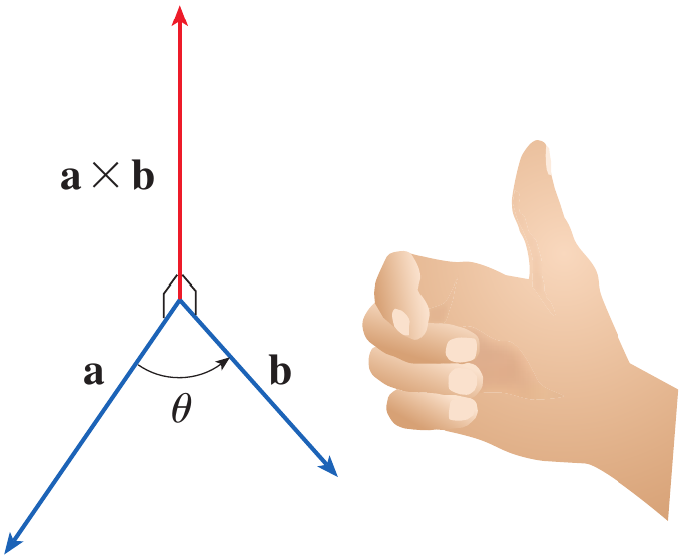
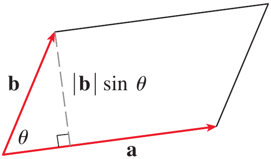
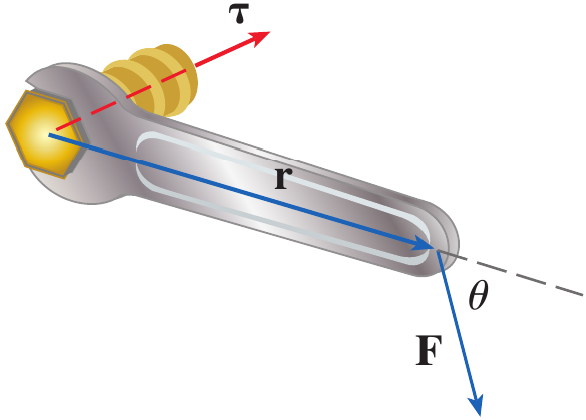

# Calculus and Analytical Geometry

## The Cross Product

### Dr. Aamir Alaud Din

### September 8, 2026

# Objectives

After preparing this topic, you should be able to:

1. Compute the cross product of two vectors in $\mathbb R^3$ using component and determinant forms and interpret its direction and magnitude geometrically.

2. Apply the properties of the cross product to determine perpendicular vectors, areas, and torque in physical and engineering applications.

# The Why Section

## Objective 1: Why Study the Cross Product of Two Vectors?

* In three-dimensional engineering problems, we often need to find a vector that is perpendicular to two given vectors.

* For example, consider a robotic arm in a three-dimensional workspace. The arm may have two directions represented by vectors, and its controller may need to determine a direction perpendicular to both of them.

* The cross product provides a systematic way to obtain such a vector.

* The magnitude of the cross product also has a geometric meaning because it gives the area of the parallelogram formed by the two vectors.

* Therefore, the cross product gives us both a **perpendicular direction** and useful geometric information about two vectors.

* The following type of mechatronics problem can be solved by studying the cross product.

* A robotic mechanism has two nonparallel links represented by vectors $\mathbf a$ and $\mathbf b$. The controller needs a vector perpendicular to both links to determine the orientation of a surface attached to the mechanism.

## Objective 2: Why Study the Properties of the Cross Product?

* Knowing how to calculate a cross product is not sufficient for many engineering applications.

* We also need to understand how the cross product behaves when the order of the vectors is changed, when vectors are added or multiplied by scalars, and when vectors are parallel or perpendicular.

* These properties allow us to simplify calculations and understand the geometric meaning of the resulting vector.

* The magnitude of the cross product is related to the area of a parallelogram formed by two vectors.

* The same idea appears in mechanics when a force produces a tendency to rotate an object.

* For example, the torque produced by a force $\mathbf F$ applied at a position vector $\mathbf r$ is given by the cross product $\mathbf r\times\mathbf F$.

* Thus, the properties of the cross product provide the mathematical foundation for analyzing rotation and torque in mechanical systems.

# Objective 1: The Cross Product of Two Vectors

## The Idea of the Cross Product

* Given two nonzero vectors $\mathbf a$ and $\mathbf b$ in three-dimensional space, we can construct a vector that is perpendicular to both of them.

* The cross product of $\mathbf a$ and $\mathbf b$ is denoted by $\mathbf a\times\mathbf b$.

* If $\mathbf a=\langle a_1,a_2,a_3\rangle$ and $\mathbf b=\langle b_1,b_2,b_3\rangle$ then their cross product is

$$
\mathbf a\times\mathbf b
=
\langle
a_2b_3-a_3b_2,
a_3b_1-a_1b_3,
a_1b_2-a_2b_1
\rangle
$$

* Unlike the dot product, which produces a scalar, the cross product produces a **vector**.

* The cross product is defined for vectors in three-dimensional space.

## Determinant Form of the Cross Product

* The component formula can be conveniently remembered using a determinant involving the standard basis vectors $\mathbf i$, $\mathbf j$, and $\mathbf k$.

* If $\mathbf a=a_1\mathbf i+a_2\mathbf j+a_3\mathbf k$ and $\mathbf b=b_1\mathbf i+b_2\mathbf j+b_3\mathbf k$, then

$$
\mathbf a\times\mathbf b
=
\begin{vmatrix}
\mathbf i&\mathbf j&\mathbf k\\
a_1&a_2&a_3\\
b_1&b_2&b_3
\end{vmatrix}
$$

* Expanding this determinant gives

$$
\mathbf a\times\mathbf b
=
\begin{vmatrix}
a_2&a_3\\
b_2&b_3
\end{vmatrix}\mathbf i
-
\begin{vmatrix}
a_1&a_3\\
b_1&b_3
\end{vmatrix}\mathbf j
+
\begin{vmatrix}
a_1&a_2\\
b_1&b_2
\end{vmatrix}\mathbf k
$$

* Therefore,

$$
\mathbf a\times\mathbf b
=
(a_2b_3-a_3b_2)\mathbf i
-
(a_1b_3-a_3b_1)\mathbf j
+
(a_1b_2-a_2b_1)\mathbf k
$$

## Example 1 {.green}

If $\mathbf a=\langle1,3,4\rangle$ and $\mathbf b=\langle2,7,-5\rangle$, find $\mathbf a\times\mathbf b$.

## Solution {.green}

We write the cross product as a determinant.

$$
\mathbf a\times\mathbf b
=
\begin{vmatrix}
\mathbf i&\mathbf j&\mathbf k\\
1&3&4\\
2&7&-5
\end{vmatrix}
$$

Expanding along the first row gives

$$
\mathbf a\times\mathbf b
=
\begin{vmatrix}
3&4\\
7&-5
\end{vmatrix}\mathbf i
-
\begin{vmatrix}
1&4\\
2&-5
\end{vmatrix}\mathbf j
+
\begin{vmatrix}
1&3\\
2&7
\end{vmatrix}\mathbf k
$$

Evaluate the three determinants.

$$
\mathbf a\times\mathbf b
=
(3(-5)-4(7))\mathbf i
-
(1(-5)-4(2))\mathbf j
+
(1(7)-3(2))\mathbf k
$$

Therefore,

$$
\mathbf a\times\mathbf b
=
-43\mathbf i+13\mathbf j+\mathbf k
$$

Hence,

$$
\boxed{\mathbf a\times\mathbf b=-43\mathbf i+13\mathbf j+\mathbf k}
$$

$\blacksquare$

## Direction of the Cross Product

* The cross product $\mathbf a\times\mathbf b$ is perpendicular to both $\mathbf a$ and $\mathbf b$.

* If $\mathbf a$ and $\mathbf b$ are represented by directed line segments with the same initial point, the direction of $\mathbf a\times\mathbf b$ is determined by the **right-hand rule**.

* Curl the fingers of your right hand from the direction of $\mathbf a$ toward the direction of $\mathbf b$ through an angle less than $180^\circ$.

* Your thumb then points in the direction of $\mathbf a\times\mathbf b$.

<strong>Figure 1.</strong> The right-hand rule showing the direction of $\mathbf a\times\mathbf b$ relative to $\mathbf a$ and $\mathbf b$.

## Theorem {.orange}

The vector $\mathbf a\times\mathbf b$ is orthogonal to both $\mathbf a$ and $\mathbf b$.

## Proof {.orange}

Let

$$
\mathbf a=\langle a_1,a_2,a_3\rangle
$$

and

$$
\mathbf b=\langle b_1,b_2,b_3\rangle
$$

Then

$$
\mathbf a\times\mathbf b
=
\langle
a_2b_3-a_3b_2,
a_3b_1-a_1b_3,
a_1b_2-a_2b_1
\rangle
$$

Take the dot product of $\mathbf a\times\mathbf b$ with $\mathbf a$.

$$
\begin{aligned}
(\mathbf a\times\mathbf b)\cdot\mathbf a
&=
(a_2b_3-a_3b_2)a_1
+(a_3b_1-a_1b_3)a_2
+(a_1b_2-a_2b_1)a_3\\
&=
a_1a_2b_3-a_1a_3b_2
+a_2a_3b_1-a_1a_2b_3
+a_1a_3b_2-a_2a_3b_1\\
&=0
\end{aligned}
$$

Therefore,

$$
(\mathbf a\times\mathbf b)\cdot\mathbf a=0
$$

so $\mathbf a\times\mathbf b$ is perpendicular to $\mathbf a$.

Similarly,

$$
(\mathbf a\times\mathbf b)\cdot\mathbf b=0
$$

so $\mathbf a\times\mathbf b$ is perpendicular to $\mathbf b$.

Hence,

$$
\boxed{\mathbf a\times\mathbf b\perp\mathbf a
\quad\text{and}\quad
\mathbf a\times\mathbf b\perp\mathbf b}
$$

## Example 2 {.green}

Show that $\mathbf a\times\mathbf a=\mathbf0$ for any vector $\mathbf a$ in $V_3$.

## Solution {.green}

Let

$$
\mathbf a=\langle a_1,a_2,a_3\rangle
$$

Then

$$
\mathbf a\times\mathbf a
=
\begin{vmatrix}
\mathbf i&\mathbf j&\mathbf k\\
a_1&a_2&a_3\\
a_1&a_2&a_3
\end{vmatrix}
$$

Expanding gives

$$
\mathbf a\times\mathbf a
=
(a_2a_3-a_3a_2)\mathbf i
-
(a_1a_3-a_3a_1)\mathbf j
+
(a_1a_2-a_2a_1)\mathbf k
$$

Each component is zero.

$$
\mathbf a\times\mathbf a
=
0\mathbf i+0\mathbf j+0\mathbf k
$$

Therefore,

$$
\boxed{\mathbf a\times\mathbf a=\mathbf0}
$$

$\blacksquare$

## Magnitude of the Cross Product

* If $\theta$ is the angle between two vectors $\mathbf a$ and $\mathbf b$, where $0\leq\theta\leq\pi$, then the magnitude of their cross product is

$$
\boxed{|\mathbf a\times\mathbf b|
=
|\mathbf a||\mathbf b|\sin\theta}
$$

* This formula shows that the magnitude depends on the lengths of the two vectors and the sine of the angle between them.

* When the vectors are perpendicular, $\theta=\pi/2$, so

$$
|\mathbf a\times\mathbf b|
=
|\mathbf a||\mathbf b|
$$

* When the vectors are parallel, $\theta=0$ or $\pi$, so

$$
|\mathbf a\times\mathbf b|=0
$$

## Geometric Meaning of the Magnitude

* Suppose $\mathbf a$ and $\mathbf b$ form two adjacent sides of a parallelogram.

* The base of the parallelogram is $|\mathbf a|$.

* The corresponding height is $|\mathbf b|\sin\theta$.

* Therefore, its area is

$$
A=|\mathbf a|(|\mathbf b|\sin\theta)
$$

* Thus,

$$
A=|\mathbf a\times\mathbf b|
$$

* Therefore, the magnitude of the cross product equals the area of the parallelogram determined by the two vectors.

<strong>Figure 2.</strong> Geometric characterization of $\mathbf a\times\mathbf b$ showing the parallelogram determined by $\mathbf a$ and $\mathbf b$.

## Example 3 {.green}

Find a vector perpendicular to the plane that passes through the points $P(1,4,6)$, $Q(-2,5,-1)$, and $R(1,-1,1)$.

## Solution {.green}

We first find two vectors lying in the plane.

$$
\overrightarrow{PQ}
=
\langle-2-1,5-4,-1-6\rangle
$$

Therefore,

$$
\overrightarrow{PQ}
=
\langle-3,1,-7\rangle
$$

Similarly,

$$
\overrightarrow{PR}
=
\langle1-1,-1-4,1-6\rangle
$$

Thus,

$$
\overrightarrow{PR}
=
\langle0,-5,-5\rangle
$$

A vector perpendicular to both vectors is their cross product.

$$
\overrightarrow{PQ}\times\overrightarrow{PR}
=
\begin{vmatrix}
\mathbf i&\mathbf j&\mathbf k\\
-3&1&-7\\
0&-5&-5
\end{vmatrix}
$$

Expanding,

$$
\begin{aligned}
\overrightarrow{PQ}\times\overrightarrow{PR}
&=
(1(-5)-(-7)(-5))\mathbf i\\
&\quad-
((-3)(-5)-(-7)(0))\mathbf j\\
&\quad+
((-3)(-5)-1(0))\mathbf k
\end{aligned}
$$

Therefore,

$$
\boxed{
\overrightarrow{PQ}\times\overrightarrow{PR}
=
-40\mathbf i-15\mathbf j+15\mathbf k
}
$$

Hence, one vector perpendicular to the plane is

$$
\boxed{\langle-40,-15,15\rangle}
$$

Any nonzero scalar multiple of this vector is also perpendicular to the plane. 

$\blacksquare$

## Example 4 {.green}

Find the area of the triangle with vertices $P(1,4,6)$, $Q(-2,5,-1)$, and $R(1,-1,1)$.

## Solution {.green}

From Example 3,

$$
\overrightarrow{PQ}\times\overrightarrow{PR}
=
\langle-40,-15,15\rangle
$$

The area of the parallelogram determined by $\overrightarrow{PQ}$ and $\overrightarrow{PR}$ is

$$
|\overrightarrow{PQ}\times\overrightarrow{PR}|
=
\sqrt{(-40)^2+(-15)^2+(15)^2}
$$

Therefore,

$$
|\overrightarrow{PQ}\times\overrightarrow{PR}|
=
\sqrt{1600+225+225}
$$

$$
=\sqrt{2050}
$$

$$
=5\sqrt{82}
$$

The triangle has half the area of the parallelogram.

$$
A=\frac12(5\sqrt{82})
$$

Hence,

$$
\boxed{A=\frac{5\sqrt{82}}2}
$$

$\blacksquare$

# Quick Check

## Question 1 {.red}

If

$$
\mathbf a=\langle1,0,0\rangle
\qquad\text{and}\qquad
\mathbf b=\langle0,1,0\rangle
$$

find $\mathbf a\times\mathbf b$.

## Question 2 {.red}

If $\mathbf a$ and $\mathbf b$ are parallel nonzero vectors, what is $\mathbf a\times\mathbf b$?

$\blacksquare$

# Objective 2: Properties of the Cross Product

## Anticommutative Property

* The cross product is **not commutative**.

* Reversing the order of the vectors reverses the direction of the resulting vector.

$$
\boxed{\mathbf a\times\mathbf b=-\mathbf b\times\mathbf a}
$$

* Consequently, in general

$$
\mathbf a\times\mathbf b\neq\mathbf b\times\mathbf a
$$

* For example, the standard basis vectors satisfy

$$
\mathbf i\times\mathbf j=\mathbf k
$$

* Therefore, 

$$
\mathbf j\times\mathbf i=-\mathbf k
$$

* This difference in direction is consistent with the right-hand rule.

## Cross Products of the Standard Unit Vectors

* The standard unit vectors satisfy

$$
\mathbf i\times\mathbf j=\mathbf k
$$

$$
\mathbf j\times\mathbf k=\mathbf i
$$

$$
\mathbf k\times\mathbf i=\mathbf j
$$

* Reversing the order changes the sign.

$$
\mathbf j\times\mathbf i=-\mathbf k
$$

$$
\mathbf k\times\mathbf j=-\mathbf i
$$

$$
\mathbf i\times\mathbf k=-\mathbf j
$$

* A vector crossed with itself is zero.

$$
\mathbf i\times\mathbf i
=
\mathbf j\times\mathbf j
=
\mathbf k\times\mathbf k
=
\mathbf0
$$

## Other Properties

* If $\mathbf a$, $\mathbf b$, and $\mathbf c$ are vectors and $c$ is a scalar, the cross product satisfies the following properties.

$$
\mathbf a\times\mathbf b=-\mathbf b\times\mathbf a
$$

$$
(c\mathbf a)\times\mathbf b
=
c(\mathbf a\times\mathbf b)
=
\mathbf a\times(c\mathbf b)
$$

$$
\mathbf a\times(\mathbf b+\mathbf c)
=
\mathbf a\times\mathbf b+\mathbf a\times\mathbf c
$$

$$
\mathbf a+\mathbf b)\times\mathbf c
=
\mathbf a\times\mathbf c+\mathbf b\times\mathbf c
$$

$$
\mathbf a\cdot(\mathbf b\times\mathbf c)
=
(\mathbf a\times\mathbf b)\cdot\mathbf c
$$

* The cross product does not generally satisfy the associative law.

$$
(\mathbf a\times\mathbf b)\times\mathbf c
\neq
\mathbf a\times(\mathbf b\times\mathbf c)
$$

* Thus, the order and grouping of vectors are important when working with cross products.

## Corollary {.orange}

Two nonzero vectors $\mathbf a$ and $\mathbf b$ are parallel if and only if

$$
\mathbf a\times\mathbf b=\mathbf0
$$

## Proof {.orange}

From the magnitude formula,

$$
|\mathbf a\times\mathbf b|
=
|\mathbf a||\mathbf b|\sin\theta
$$

For nonzero vectors,

$$
|\mathbf a||\mathbf b|>0
$$

Therefore,

$$
|\mathbf a\times\mathbf b|=0
$$

exactly when

$$
\sin\theta=0
$$

This occurs when

$$
\theta=0
\qquad\text{or}\qquad
\theta=\pi
$$

These are precisely the angles for parallel vectors.

Hence,

$$
\boxed{\mathbf a\times\mathbf b=\mathbf0
\iff
\mathbf a\parallel\mathbf b}
$$

The supplied material states this result as a corollary. 

## Application: Torque

* A major physical application of the cross product occurs in rotational mechanics.

* Suppose a force $\mathbf F$ acts on a rigid body at a point whose position relative to the origin is represented by the vector $\mathbf r$.

* The torque $\boldsymbol\tau$ produced by the force about the origin is defined by

$$
\boldsymbol\tau=\mathbf r\times\mathbf F
$$

* The direction of the torque vector gives the axis about which the force tends to rotate the object.

* Its direction is determined by the right-hand rule.

* If $\theta$ is the angle between $\mathbf r$ and $\mathbf F$, then the magnitude of the torque is

$$
|\boldsymbol\tau|
=
|\mathbf r||\mathbf F|\sin\theta
$$

* This shows that only the component of the force perpendicular to $\mathbf r$ contributes to the magnitude of the torque.

* The torque magnitude is also equal to the area of the parallelogram determined by $\mathbf r$ and $\mathbf F$.

<strong>Figure 3.</strong> Torque produced by a force $\mathbf F$ acting at a position vector $\mathbf r$.

## Example 5 {.green}

A bolt is tightened by applying a $40$-N force to a $0.25$-m wrench, as shown in Figure 5. Find the magnitude of the torque about the center of the bolt.

Location of Figure 5: A $40$-N force applied to a $0.25$-m wrench at an angle of $75^\circ$.

## Solution {.green}

The magnitude of the torque is

$$
|\boldsymbol\tau|
=
|\mathbf r||\mathbf F|\sin\theta
$$

Here,

$$
|\mathbf r|=0.25\;m
$$

$$
|\mathbf F|=40\;N
$$

and

$$
\theta=75^\circ
$$

Therefore,

$$
|\boldsymbol\tau|
=
(0.25)(40)\sin75^\circ
$$

$$
=10\sin75^\circ
$$

Using

$$
\sin75^\circ\approx0.9659
$$

we obtain

$$
|\boldsymbol\tau|
\approx9.66\;N\cdot m
$$

Hence,

$$
\boxed{|\boldsymbol\tau|\approx9.66\;N\cdot m}
$$

$\blacksquare$

# Quick Check

## Question 1 {.red}

If

$$
\mathbf a\times\mathbf b=\mathbf c
$$

what is

$$
\mathbf b\times\mathbf a
$$

## Question 2 {.red}

A force of magnitude $50;N$ acts at the end of a $0.4;m$ lever arm. If the angle between the lever arm and force is $90^\circ$, find the magnitude of the torque.

$\blacksquare$

# Scenario Problem

## Problem {.green}

A robotic gripper in a three-dimensional manufacturing system applies a force

$$
\mathbf F=30\mathbf i+40\mathbf j\;N
$$

at a point whose position relative to the rotation axis is

$$
\mathbf r=0.2\mathbf k\;m
$$

Determine the torque vector produced by the force and its magnitude.

## Solution {.green}

The torque is obtained from the cross product

$$
\boldsymbol\tau=\mathbf r\times\mathbf F
$$

Substituting the given vectors gives

$$
\boldsymbol\tau
=
(0.2\mathbf k)\times(30\mathbf i+40\mathbf j)
$$

Using the distributive property,

$$
\boldsymbol\tau
=
6(\mathbf k\times\mathbf i)
+
8(\mathbf k\times\mathbf j)
$$

The standard unit-vector cross products are

$$
\mathbf k\times\mathbf i=\mathbf j
$$

and

$$
\mathbf k\times\mathbf j=-\mathbf i
$$

Therefore,

$$
\boldsymbol\tau
=
6\mathbf j-8\mathbf i
$$

Hence,

$$
\boxed{\boldsymbol\tau=-8\mathbf i+6\mathbf j\;N\cdot m}
$$

The magnitude is

$$
|\boldsymbol\tau|
=
\sqrt{(-8)^2+6^2}
$$

$$
=\sqrt{64+36}
$$

$$
=10
$$

Therefore,

$$
\boxed{|\boldsymbol\tau|=10\;N\cdot m}
$$

Thus, the cross product gives the robotic system both the **direction of the rotational effect** and its **magnitude**.

$\blacksquare$

# Summary

* The cross product of two vectors in $\mathbb R^3$ produces a vector perpendicular to both given vectors.

* For $\mathbf a=\langle a_1,a_2,a_3\rangle$ and $\mathbf b=\langle b_1,b_2,b_3\rangle$, the cross product can be calculated using its component formula or determinant form.

* The direction of $\mathbf a\times\mathbf b$ is determined by the right-hand rule.

* The magnitude of the cross product is $|\mathbf a\times\mathbf b|=|\mathbf a||\mathbf b|\sin\theta$.

* The magnitude of a cross product equals the area of the parallelogram determined by the two vectors.

* Two nonzero vectors are parallel if and only if their cross product is the zero vector.

* The cross product is anticommutative, so $\mathbf a\times\mathbf b=-\mathbf b\times\mathbf a$.

* The cross product obeys useful scalar and distributive properties but is not generally associative.

* In mechanics, torque is represented by the cross product $\boldsymbol\tau=\mathbf r\times\mathbf F$, and its magnitude is $|\mathbf r||\mathbf F|\sin\theta$.

* The central idea is that the cross product provides a mathematical way to obtain a perpendicular direction and quantify the geometric or rotational effect produced by two three-dimensional vectors.

# Exercises

## Exercises Set 1

Solve the odd number exercises from exercise 1 to 68.

* Exercises help transform theoretical concepts into practical understanding.

* Mathematics is learned by doing and solving exercises will train you to analyze problems, select appropriate methods, and construct logical solutions.

* Attempting problems sometimes leads to mistakes which provide opportunities for learning and improvement.

* Regular practice increases speed, accuracy, and confidence.

* Exercises are given in the Exercises file and you are expected to solve them on your own.
