# Calculus and Analytical Geometry

## Equations of Lines and Planes

### Dr. Aamir Alaud Din

### September 8, 2026

# Objectives

After preparing this topic, you should be able to:

1. **Describe lines in three-dimensional space using vector, parametric, and symmetric equations, and use these representations to analyze lines and their relationships.**

2. **Describe planes in three-dimensional space using normal vectors and scalar equations, and use these equations to determine intersections, parallelism, and angles between planes.**

# The Why Section

## Objective 1: Why Study Equations of Lines?

* In three-dimensional engineering and computing applications, we often need to describe the position and direction of an object mathematically.

* For example, consider a robotic arm moving its end-effector through three-dimensional space. The robot may move along a straight path from one position to another, so we need a mathematical equation that describes every point on that path.

* A point alone tells us **where** the motion starts, but it does not tell us **which direction** the object moves.

* A direction vector together with a point completely determines a line in space.

* Once the line is represented mathematically, we can determine the position of the object for different values of a parameter, find where its path intersects a plane, and determine whether two paths intersect, are parallel, or are skew.

* Therefore, vector, parametric, and symmetric equations provide mathematical tools for describing and analyzing straight-line motion in three-dimensional space.

* A robotic-arm positioning problem of this type can be solved by studying the first objective.

## Objective 2: Why Study Equations of Planes?

* In engineering and computer science, many important objects and boundaries are naturally represented by planes.

* For example, a computer-controlled cutting machine may move a tool toward a flat surface, while a robot may need to determine where a straight trajectory intersects a planar surface.

* To describe such a surface mathematically, we need more information than a single point.

* A vector perpendicular to the plane, called a **normal vector**, provides the direction that uniquely determines the orientation of the plane.

* Once a point on the plane and a normal vector are known, we can construct an equation that describes every point on the plane.

* Plane equations also allow us to determine whether two planes are parallel, find the angle between them, and determine the line where two nonparallel planes intersect.

* Therefore, equations of planes provide a mathematical framework for describing flat surfaces and analyzing their geometric relationships in three-dimensional space.

* A robotic-tool and planar-surface positioning problem of this type can be solved by studying the second objective.

# Objective 1: Lines

## Vector Equation of a Line

* A line in the $xy$-plane is determined when a point on the line and its direction are known.

* The same basic idea applies to a line in three-dimensional space.

* Suppose a line $L$ passes through the point $P_0(x_0,y_0,z_0)$ and has direction vector $\mathbf v$.

* Let $\mathbf r_0$ be the position vector of $P_0$ and let $\mathbf r$ be the position vector of an arbitrary point $P(x,y,z)$ on the line.

* The vector from $P_0$ to $P$ is parallel to the direction vector $\mathbf v$.

* Therefore, there is a scalar $t$ such that

$$
\mathbf r-\mathbf r_0=t\mathbf v
$$

* Hence, the vector equation of the line is

$$
\mathbf r=\mathbf r_0+t\mathbf v
$$

* As the parameter $t$ varies through all real numbers, the tip of $\mathbf r$ traces out the line.

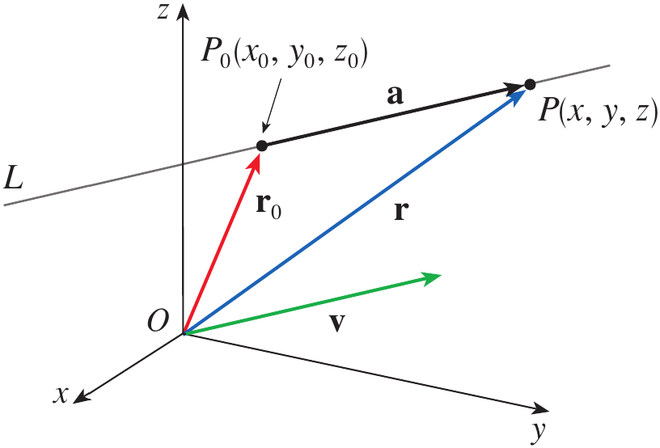

<strong>Figure 1.</strong> A line in three-dimensional space determined by a point and a direction vector.

* If the direction vector is written in component form as $\mathbf v=\langle a,b,c\rangle$ and $\mathbf r_0=\langle x_0,y_0,z_0\rangle$ then the vector equation becomes

$$
\langle x,y,z\rangle
=
\langle x_0,y_0,z_0\rangle
+t\langle a,b,c\rangle
$$

* Equating corresponding components gives the parametric equations.

$$
\langle x, y, z \rangle = \langle x_0 + at, y_0 + bt, z_0 + ct \rangle
$$

## Parametric Equations of a Line

* The parametric equations of a line through $P_0(x_0,y_0,z_0)$ parallel to the direction vector $\langle a,b,c\rangle$ are

$$
x=x_0+at
$$

$$
y=y_0+bt
$$

$$
z=z_0+ct
$$

* Every value of $t$ gives a point on the line.

* Different choices of the starting point or a parallel direction vector can produce different-looking equations for the same line.

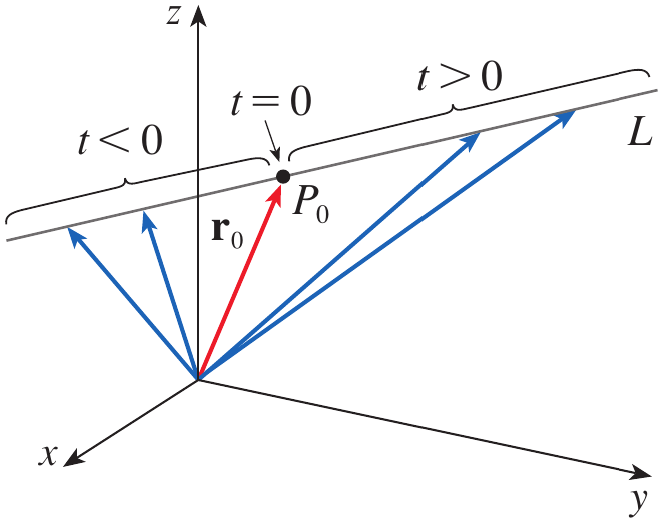

<strong>Figure 2.</strong> A line traced by the position vector as the parameter $t$ varies.

## Example 1 {.green}

Find a vector equation and parametric equations for the line that passes through the point $(5,1,3)$ and is parallel to the vector $\mathbf i+4\mathbf j-2\mathbf k$.

Find two other points on the line.

## Solution {.green}

The given point has position vector

$$
\mathbf r_0=5\mathbf i+\mathbf j+3\mathbf k
$$

The direction vector is

$$
\mathbf v=\mathbf i+4\mathbf j-2\mathbf k
$$

Therefore, using the vector equation of a line,

$$
\mathbf r
=
(5\mathbf i+\mathbf j+3\mathbf k)
+t(\mathbf i+4\mathbf j-2\mathbf k)
$$

Equivalently,

$$
\boxed{
\mathbf r
=
(5+t)\mathbf i+(1+4t)\mathbf j+(3-2t)\mathbf k
}
$$

Therefore, the parametric equations are

$$
\boxed{x=5+t}
$$

$$
\boxed{y=1+4t}
$$

$$
\boxed{z=3-2t}
$$

For $t=1$,

$$
x=6,\qquad y=5,\qquad z=1
$$

Thus, one other point on the line is

$$
\boxed{(6,5,1)}
$$

For $t=-1$,

$$
x=4,\qquad y=-3,\qquad z=5
$$

Thus, another point is

$$
\boxed{(4,-3,5)}
$$

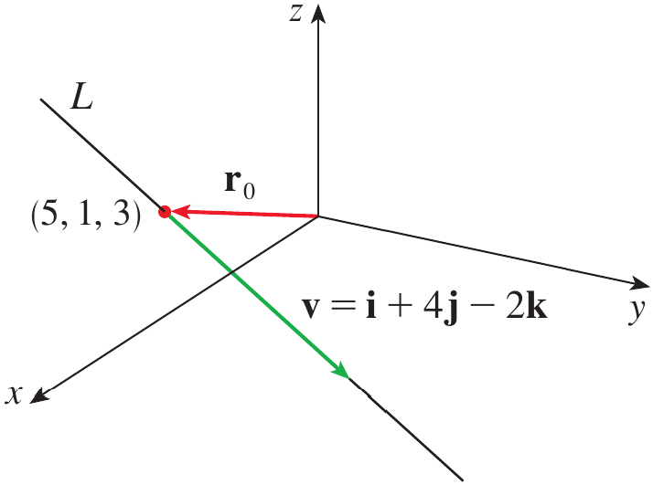

<strong>Figure 3.</strong> A line and the given points used to describe its direction and position.

$\blacksquare$

## Direction Numbers and Symmetric Equations

* If a direction vector of a line is $\mathbf v=\langle a,b,c\rangle$ then $a$, $b$, and $c$ are called the **direction numbers** of the line.

* Consider the parametric equations

$$
x=x_0+at,\qquad y=y_0+bt,\qquad z=z_0+ct
$$

* From these equations, we can solve for $t$ when the corresponding direction number is nonzero.

$$
t=\frac{x-x_0}{a}
$$

$$
t=\frac{y-y_0}{b}
$$

$$
t=\frac{z-z_0}{c}
$$

* Equating these expressions gives the symmetric equations of the line.

$$
\frac{x-x_0}{a}
=
\frac{y-y_0}{b}
=
\frac{z-z_0}{c}
$$

* If one of the direction numbers is zero, the corresponding coordinate remains constant rather than appearing as a denominator.

## Example 2 {.green}

Find parametric equations and symmetric equations of the line that passes through the points $A(2,4,-3)$ and $B(3,-1,1)$.

At what point does this line intersect the $xy$-plane?

## Solution {.green}

A direction vector for the line is obtained from $\overrightarrow{AB}$.

$$
\mathbf v
=
\langle
3-2,-1-4,1-(-3)
\rangle
$$

$$
\mathbf v=\langle1,-5,4\rangle
$$

Taking $A(2,4,-3)$ as the point on the line, the parametric equations are

$$
\boxed{x=2+t}
$$

$$
\boxed{y=4-5t}
$$

$$
\boxed{z=-3+4t}
$$

Therefore, the symmetric equations are

$$
\boxed{
\frac{x-2}{1}
=
\frac{y-4}{-5}
=
\frac{z+3}{4}
}
$$

To find where the line intersects the $xy$-plane, we use $z=0$.

$$
-3+4t=0
$$

Hence,

$$
t=\frac34
$$

Substituting this value into the equations for $x$ and $y$ gives

$$
x=2+\frac34=\frac{11}{4}
$$

$$
y=4-5\left(\frac34\right)=\frac14
$$

Therefore, the line intersects the $xy$-plane at

$$
\boxed{\left(\frac{11}{4},\frac14,0\right)}
$$

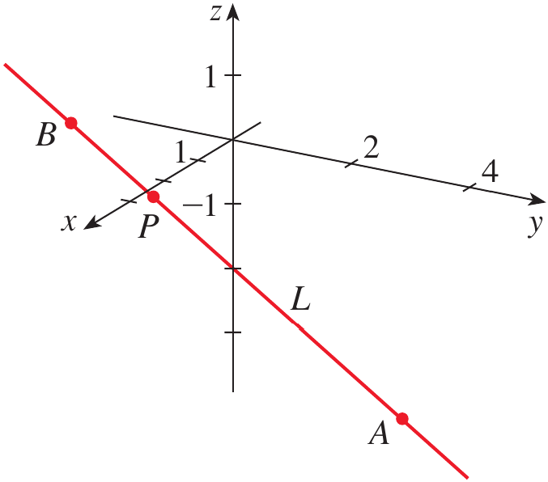

<strong>Figure 4.</strong> Line $L$ and point $P$ where it intersects the $xy$-plane.

$\blacksquare$

## Line Segments

* A line extends indefinitely in both directions, but sometimes we need only the portion between two points.

* Suppose the position vectors of two endpoints are $\mathbf r_0$ and $\mathbf r_1$.

* The line through the two points can be written as

$$
\mathbf r=\mathbf r_0+t(\mathbf r_1-\mathbf r_0)
$$

* For the line segment, the parameter is restricted to

$$
0\leq t\leq1
$$

* Therefore, the vector equation of the line segment from $\mathbf r_0$ to $\mathbf r_1$ is

$$
\boxed{
\mathbf r(t)=(1-t)\mathbf r_0+t\mathbf r_1
\qquad 0\leq t\leq1
}
$$

## Relationships Between Lines

* Two lines in space can be **parallel**, **intersecting**, or **skew**.

* Two lines are parallel when their direction vectors are parallel.

* If their direction vectors are not parallel, we can determine whether they intersect by solving their parametric equations simultaneously.

* If two nonparallel lines do not intersect, they are called **skew lines**.

### Example 3 {.green}

Show that the lines

$$
L_1:\quad x=1+t,\qquad y=-2+3t,\qquad z=4-t
$$

$$
L_2:\quad x=2s,\qquad y=3+s,\qquad z=-3+4s
$$

are skew lines.

## Solution {.green}

The direction vectors are

$$
\mathbf v_1=\langle1,3,-1\rangle
$$

and

$$
\mathbf v_2=\langle2,1,4\rangle
$$

These vectors are not scalar multiples of each other, so the lines are not parallel.

If the lines intersect, there must be values of $t$ and $s$ satisfying all three equations simultaneously.

Equating corresponding coordinates gives

$$
1+t=2s
$$

$$
-2+3t=3+s
$$

$$
4-t=-3+4s
$$

Solving the first two equations gives

$$
t=\frac{11}{5}
\qquad\text{and}\qquad
s=\frac85
$$

However, these values do not satisfy the third equation.

Therefore, the two lines do not intersect.

Since the lines are neither parallel nor intersecting, they are skew lines.

$$
\boxed{L_1\text{ and }L_2\text{ are skew lines}}
$$

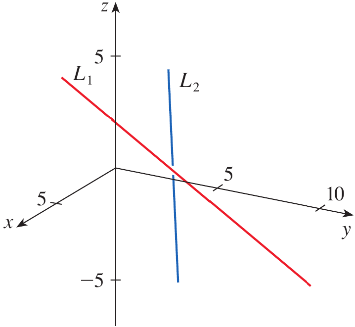

<strong>Figure 5.</strong> Two skew lines in three-dimensional space.

$\blacksquare$

# Quick Check

## Question 1 {.red}

Find parametric equations for the line through $P(1,2,-1)$ parallel to $\mathbf v=\langle2,-3,4\rangle$.

## Question 2 {.red}

Are the lines

$$
L_1:\quad x=1+t,\quad y=2+2t,\quad z=3-t
$$

and

$$
L_2:\quad x=4+2s,\quad y=8+4s,\quad z=1-2s
$$

parallel?

$\blacksquare$

# Objective 2: Planes

## Normal Vector to a Plane

* A line in space is determined by a point and a direction vector, but a plane requires a different type of directional information.

* A vector perpendicular to a plane completely determines the orientation of that plane.

## Definition: Normal Vector {.blue}

A **normal vector** to a plane is a nonzero vector that is perpendicular to every direction lying in the plane.

$\blacksquare$

* Suppose a plane contains the point $P_0(x_0,y_0,z_0)$ and has normal vector

$$
\mathbf n=\langle a,b,c\rangle
$$

* Let $P(x,y,z)$ be any point on the plane.

* The vector from $P_0$ to $P$ is

$$
\mathbf r-\mathbf r_0
$$

* Since this vector lies in the plane and $\mathbf n$ is perpendicular to the plane, their dot product is zero.

$$
\boxed{
\mathbf n\cdot(\mathbf r-\mathbf r_0)=0
}
$$

* Equivalently,

$$
\boxed{
\mathbf n\cdot\mathbf r=\mathbf n\cdot\mathbf r_0
}
$$

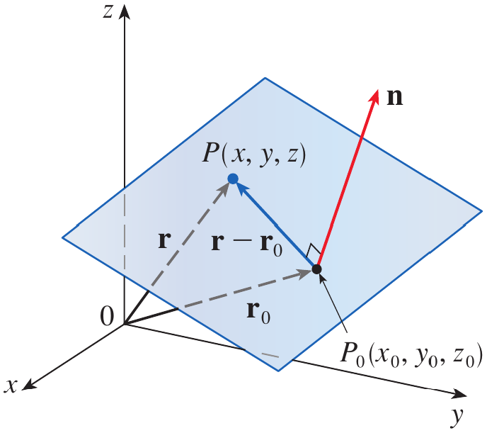

<strong>Figure 6.</strong> A plane determined by a point and a normal vector.

## Scalar Equation of a Plane

* Let $\mathbf n=\langle a,b,c\rangle$ and $\mathbf r=\langle x,y,z\rangle$.

* If $P_0=(x_0,y_0,z_0)$ then the vector equation $\mathbf n\cdot(\mathbf r-\mathbf r_0)=0$ becomes

$$
\langle a,b,c\rangle
\cdot
\langle x-x_0,y-y_0,z-z_0\rangle
=0
$$

* Taking the dot product gives the scalar equation of the plane.

$$
\boxed{
a(x-x_0)+b(y-y_0)+c(z-z_0)=0
}
$$

* Expanding this equation gives the familiar linear form

$$
\boxed{ax+by+cz+d=0}
$$

* Here $\langle a,b,c\rangle$ is a normal vector to the plane.

## Example 4 {.green}

Find an equation of the plane through the point $(2,4,-1)$ with normal vector $\mathbf n=(2,3,4)$. Find the intercepts and sketch the plane.

## Solution {.green}

The point is

$$
(x_0,y_0,z_0)=(2,4,-1)
$$

The normal vector is

$$
\mathbf n=\langle2,3,4\rangle
$$

Using the scalar equation of a plane,

$$
a(x-x_0)+b(y-y_0)+c(z-z_0)=0
$$

we obtain

$$
2(x-2)+3(y-4)+4(z+1)=0
$$

Expanding,

$$
2x-4+3y-12+4z+4=0
$$

Therefore,

$$
\boxed{2x+3y+4z=12}
$$

To find the $x$-intercept, set $y=z=0$.

$$
2x=12
$$

$$
x=6
$$

Thus, the $x$-intercept is $(6,0,0)$.

Similarly, setting $x=z=0$ gives

$$
y=4
$$

Thus, the $y$-intercept is $(0,4,0)$.

Setting $x=y=0$ gives

$$
z=3
$$

Thus, the $z$-intercept is $(0,0,3)$.

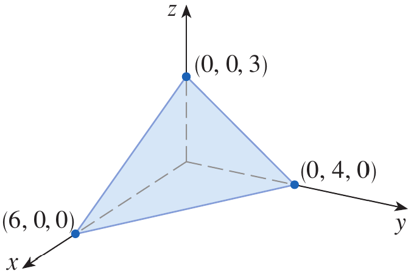

<strong>Figure 7.</strong> Plane through $(2,4,-1)$ with intercepts on the coordinate axes.

$\blacksquare$

## Finding a Plane Through Three Points

* Three noncollinear points determine a unique plane.

* Suppose a plane contains the points $P$, $Q$, and $R$.

* Two vectors lying in the plane can be formed as $\mathbf a=\overrightarrow{PQ}$ and $\mathbf b=\overrightarrow{PR}$.

* Both vectors lie in the plane.

* Therefore, their cross product is perpendicular to both vectors and hence is a normal vector to the plane.

$$
\boxed{\mathbf n=\mathbf a\times\mathbf b}
$$

## Example 5 {.green}

Find an equation of the plane that passes through the points

$$
P(1,3,2),\qquad Q(3,-1,6),\qquad R(5,2,0)
$$

## Solution {.green}

First find two vectors lying in the plane.

$$
\mathbf a=\overrightarrow{PQ}
$$

$$
\mathbf a
=
\langle3-1,-1-3,6-2\rangle
=
\langle2,-4,4\rangle
$$

Similarly,

$$
\mathbf b=\overrightarrow{PR}
$$

$$
\mathbf b
=
\langle5-1,2-3,0-2\rangle
=
\langle4,-1,-2\rangle
$$

A normal vector is obtained from their cross product.

$$
\mathbf n=\mathbf a\times\mathbf b
$$

$$
\mathbf n=
\begin{vmatrix}
\mathbf i&\mathbf j&\mathbf k\\
2&-4&4\\
4&-1&-2
\end{vmatrix}
$$

Expanding,

$$
\mathbf n
=
12\mathbf i+20\mathbf j+14\mathbf k
$$

Therefore, a normal vector is

$$
\mathbf n=\langle12,20,14\rangle
$$

Using point $P(1,3,2)$, the equation of the plane is

$$
12(x-1)+20(y-3)+14(z-2)=0
$$

Dividing by $2$ gives

$$
6(x-1)+10(y-3)+7(z-2)=0
$$

Therefore,

$$
\boxed{6x+10y+7z=50}
$$

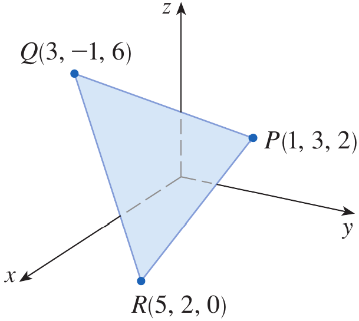

<strong>Figure 8.</strong> Portion of the plane through the three points $P$, $Q$, and $R$.

$\blacksquare$

## Intersection of a Line and a Plane

* A line and a plane may intersect at one point, be parallel, or in special cases the line may lie entirely in the plane.

* When the line is given parametrically, we can substitute its coordinates into the equation of the plane.

## Example 6 {.green}

Find the point at which the line with parametric equations

$$
x=2+3t,\qquad y=-4t,\qquad z=5+t
$$

intersects the plane

$$
4x+5y-2z=18
$$

## Solution {.green}

Substitute the parametric expressions for $x$, $y$, and $z$ into the plane equation.

$$
4(2+3t)+5(-4t)-2(5+t)=18
$$

Simplifying,

$$
8+12t-20t-10-2t=18
$$

$$
-10t-2=18
$$

$$
-10t=20
$$

$$
t=-2
$$

Substitute $t=-2$ into the parametric equations.

$$
x=2+3(-2)=-4
$$

$$
y=-4(-2)=8
$$

$$
z=5+(-2)=3
$$

Therefore, the point of intersection is

$$
\boxed{(-4,8,3)}
$$

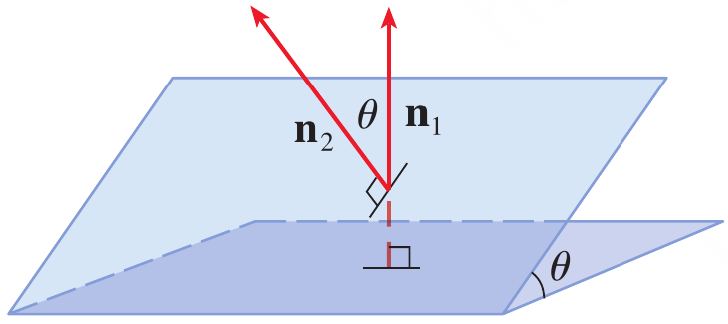

<strong>Figure 9.</strong> Intersection of line and plane.

$\blacksquare$

## Relationships Between Planes

* The relationship between two planes can be determined from their normal vectors.

* If two normal vectors are parallel, the planes are parallel.

* For example, the planes $x+2y-3z=4$ and $2x+4y-6z=3$ have normal vectors $\mathbf n_1=\langle1,2,-3\rangle$ and $\mathbf n_2=\langle2,4,-6\rangle$.

* Since $\mathbf n_2=2\mathbf n_1$ the planes are parallel.

* If the normal vectors are not parallel, the planes intersect in a line.

* The angle between two planes is defined as the acute angle between their normal vectors.

* If $\theta$ is the angle between the planes and $\mathbf n_1$ and $\mathbf n_2$ are normal vectors, then

$$
\boxed{
\cos\theta
=
\frac{|\mathbf n_1\cdot\mathbf n_2|}
{|\mathbf n_1||\mathbf n_2|}
}
$$

## Example 7 {.green}

Find the angle between the planes

$$
x+y+z=1
$$

and

$$
x-2y+3z=1
$$

Find symmetric equations for the line of intersection $L$ of these two planes.

## Solution {.green}

### Part (a): Angle Between the Planes {.green}

The normal vectors are

$$
\mathbf n_1=\langle1,1,1\rangle
$$

and

$$
\mathbf n_2=\langle1,-2,3\rangle
$$

Their dot product is

$$
\mathbf n_1\cdot\mathbf n_2
=
1(1)+1(-2)+1(3)
=
2
$$

Their magnitudes are

$$
|\mathbf n_1|=\sqrt3
$$

and

$$
|\mathbf n_2|=\sqrt{1+4+9}=\sqrt{14}
$$

Therefore,

$$
\cos\theta
=
\frac{2}{\sqrt3\sqrt{14}}
=
\frac{2}{\sqrt{42}}
$$

Hence,

$$
\boxed{
\theta=\cos^{-1}\left(\frac{2}{\sqrt{42}}\right)\approx72^\circ
}
$$

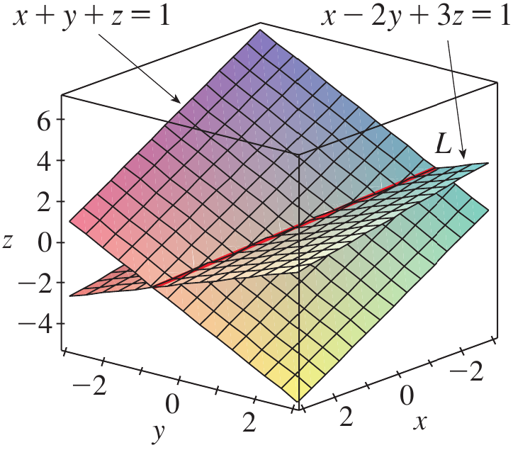

<strong>Figure 10.</strong> Two planes with normal vectors showing the angle between the planes.

### Part (b): Line of Intersection {.green}

First find a point on the line of intersection.

Set $z=0$ in the two plane equations.

$$
x+y=1
$$

$$
x-2y=1
$$

Solving these equations gives

$$
x=1,\qquad y=0
$$

Thus, a point on the intersection line is

$$
P=(1,0,0)
$$

The line of intersection is perpendicular to both normal vectors.

Therefore, its direction vector is parallel to their cross product.

$$
\mathbf v=\mathbf n_1\times\mathbf n_2
$$

$$
\mathbf v=
\begin{vmatrix}
\mathbf i&\mathbf j&\mathbf k\\
1&1&1\\
1&-2&3
\end{vmatrix}
$$

$$
\mathbf v
=
5\mathbf i-2\mathbf j-3\mathbf k
$$

Thus,

$$
\mathbf v=\langle5,-2,-3\rangle
$$

Using the point $(1,0,0)$ and this direction vector, the symmetric equations are

$$
\boxed{
\frac{x-1}{5}
=
\frac{y}{-2}
=
\frac{z}{-3}
}
$$

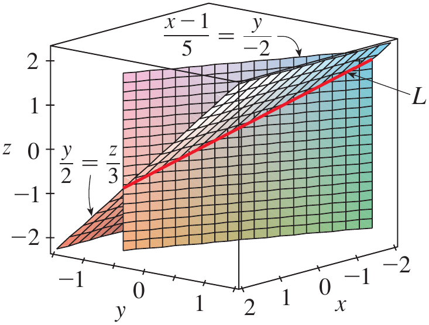

<strong>Figure 11.</strong> Two intersecting planes and their line of intersection.

$\blacksquare$

# Quick Check

## Question 1 {.red}

Find an equation of the plane through the point $(1,2,3)$ with normal vector

$$
\mathbf n=\langle2,-1,4\rangle
$$

## Question 2 {.red}

Are the planes

$$
2x+4y-6z=5
$$

and

$$
x+2y-3z=7
$$

parallel?

$\blacksquare$

# Scenario Problem

## Problem {.green}

A robotic positioning system moves the end-effector along a straight path in three-dimensional space. Its initial position is

$$
P_0=(1,2,3)
$$

and its direction of motion is represented by

$$
\mathbf v=\langle2,-1,2\rangle
$$

A flat calibration surface is represented by the plane

$$
x+y+z=12
$$

Determine the point at which the robotic end-effector's straight-line path intersects the calibration surface.

## Solution {.green}

The line passes through $P_0=(1,2,3)$ and has direction vector

$$
\mathbf v=\langle2,-1,2\rangle
$$

Therefore, its parametric equations are

$$
x=1+2t
$$

$$
y=2-t
$$

$$
z=3+2t
$$

The calibration surface is

$$
x+y+z=12
$$

Substitute the parametric expressions into the plane equation.

$$
(1+2t)+(2-t)+(3+2t)=12
$$

Simplifying,

$$
6+3t=12
$$

Therefore,

$$
t=2
$$

Substituting $t=2$ into the line equations gives

$$
x=1+2(2)=5
$$

$$
y=2-2=0
$$

$$
z=3+2(2)=7
$$

Therefore, the robotic end-effector reaches the calibration surface at

$$
\boxed{(5,0,7)}
$$

This problem illustrates why equations of lines and planes are useful in robotics and mechatronics: the line describes the robot's straight-line trajectory, while the plane describes the physical surface, and their intersection gives the exact position where the trajectory reaches the surface.

$\blacksquare$

# Summary

* A line in three-dimensional space is determined by a point on the line and a direction vector.

* The vector equation of a line through $\mathbf r_0$ with direction vector $\mathbf v$ is $\mathbf r=\mathbf r_0+t\mathbf v$.

* Parametric equations describe the coordinates of points on a line as functions of a parameter $t$.

* Symmetric equations can be obtained from the parametric equations when the direction numbers are nonzero.

* Two lines in space may be parallel, intersecting, or skew, with skew lines being neither parallel nor intersecting.

* A plane is determined by a point on the plane and a normal vector perpendicular to the plane.

* The scalar equation of a plane through $(x_0,y_0,z_0)$ with normal vector $\langle a,b,c\rangle$ is $a(x-x_0)+b(y-y_0)+c(z-z_0)=0$.

* Three noncollinear points determine a plane, and a normal vector can be obtained by taking the cross product of two vectors lying in the plane.

* Two planes are parallel when their normal vectors are parallel, while nonparallel planes intersect in a line whose direction is perpendicular to both normal vectors.

* Equations of lines and planes provide essential mathematical tools for describing trajectories, surfaces, intersections, and spatial relationships in engineering, robotics, computer graphics, and other three-dimensional applications.

# Exercises

## Exercises Set 1

Solve the odd number exercises from exercise 1 to 68.

* Exercises help transform theoretical concepts into practical understanding.

* Mathematics is learned by doing and solving exercises will train you to analyze problems, select appropriate methods, and construct logical solutions.

* Attempting problems sometimes leads to mistakes which provide opportunities for learning and improvement.

* Regular practice increases speed, accuracy, and confidence.

* Exercises are given in the Exercises file and you are expected to solve them on your own.
