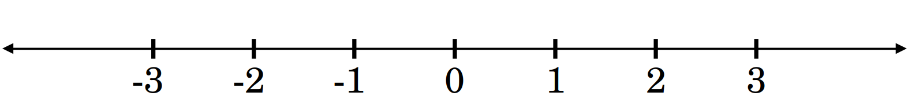
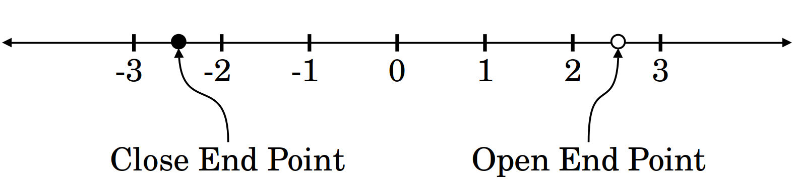
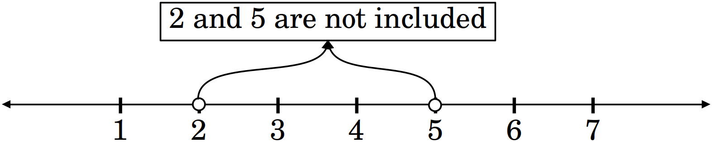
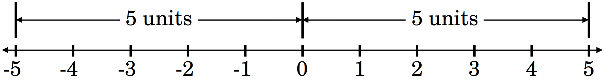

# Calculus and Analyticl Geometry

## Intervals, Inequalities, and Absolute Values

### Dr. Aamir Alaud Din

### August 25, 2026

# Objectives

After preparing this topic, you should be able

1. To represent and interpret intervals and inequalities on the real number line.

2. To understand absolute value as distance and solve absolute-value equations and inequalities.

3. To translate distance statements into intervals and use them to understand the language of limits.

# The Why Section

* Before studying limits, we need to understand three basic ideas:

    1. **where a number is located,**
    2. **how far one number is from another, and**
    3. **how to describe “getting close” to a number precisely.**

* These three ideas form a natural progression toward the concept of a limit.

## Objective 1: Why Study Intervals and Inequalities?

* At this stage, we are learning how to **describe the location of numbers** on the real number line.

* But why is this important for limits?

* When we study a limit, we are interested in what happens when the input $x$ is **near a particular number $c$**.

* Therefore, we must be able to describe precisely **which values of $x$ are allowed**.

* For example, the following inequality tells us that $x$ lies between $2$ and $5$.

$$
2<x<5
$$

* In interval notation,

$$
x\in(2,5).
$$

* Similarly, the following inequality describes all the values of $x$ lying in an interval around $c$.

$$
c-\delta<x<c+\delta
$$

* Therefore, we study intervals and inequalities because they allow us to:

    * **describe regions of the real number line;**
    * **specify which values are included or excluded;**
    * **describe the set of possible values of $x$;**
    * **describe the values of $x$ lying near a particular number.**

* This last idea is especially important.

* Later, when we say that $x$ is **close to $c$**, we will need a precise way to describe the corresponding interval of values of $x$.

* So, the purpose of this objective is to learn how to describe where $x$ can be and to identify the interval of values near a particular number.

## Objective 2: Why Study Absolute Value as Distance?

* Intervals and inequalities tell us **where a number is**.

* But they do not directly tell us **how far one number is from another**.

* For example, if we want to describe how far $x$ is from $c$, we need a mathematical measure of distance.

* That is exactly what absolute value provides:

$$
|x-c|=\text{distance between }x\text{ and }c.
$$

* For example, the following absolute value equality means that $7$ and $3$ are $4$ units apart.

$$
|7-3|=4
$$

* This interpretation becomes particularly useful when we want to express statements such as “$x$ is within $2$ units of $c$.”

* Mathematically, we can write

$$
|x-c|<2
$$

* Using the properties of absolute-value inequalities, this can be rewritten as

$$
c-2<x<c+2
$$

* Thus, absolute value allows us to translate between two equivalent ways of describing closeness:

$$
\boxed{|x-c|<a}
\qquad
\text{and}
\qquad
\boxed{c-a<x<c+a}
$$

* This is important for limits because a limit is concerned with what happens when $x$ gets **closer and closer** to a particular number.

* Therefore, we study absolute value as distance because it gives us a mathematical way to **measure and describe closeness**.

* So, the purpose of this objective is to learn how to measure the distance between $x$ and $c$, so that we can describe precisely what it means for $x$ to be close to $c$.

## Objective 3: Why Study “From Distance to the Language of Limits”?

* Now we have two important ideas.

* From **Objective 1**, we know how to describe a region of values using intervals and inequalities.

* From **Objective 2**, we know how to describe distance using absolute value.

* The next question is how can we use these ideas to express what we mean when we say that $x$ approaches $c$?

* In ordinary language, saying “$x$ gets close to $c$” is not precise. How close is “close”?

* We can make the statement precise by introducing a positive distance $\delta$:

$$
|x-c|<\delta.
$$

* This means $x$ is less than $\delta$ units away from $c$.

* Using our knowledge of absolute-value inequalities, we can also write

$$
c-\delta<x<c+\delta.
$$

* Therefore,

$$
\boxed{|x-c|<\delta
\iff
c-\delta<x<c+\delta}.
$$

* Now we have a precise mathematical description of the phrase **“$x$ is close to $c$”**.

* But a limit requires something slightly more specific.

* When we say $x\to c$$, we are interested in values of $x$ that get close to $c$, **without requiring $x=c$**.

* Therefore, we write

$$
0<|x-c|<\delta
$$

* The first part, $|x-c|<\delta$, puts $x$ within $\delta$ units of $c$.

* The second part, $0<|x-c|$, ensures that

$$
x\neq c
$$

* Thus, $\boxed{0<|x-c|<\delta}$ means $x$ is within $\delta$ units of $c$, but $x$ is not equal to $c$.

* This is the basic language we need before we can understand the precise definition of a limit.

* Eventually, we will also need to describe what happens to the **output** $f(x)$.

* The distance between $f(x)$ and a number $L$ is

$$
|f(x)-L|
$$

* Thus, a limit connects two distances:

$$
\underbrace{|x-c|}_{\text{input distance}}
\qquad\longrightarrow\qquad
\underbrace{|f(x)-L|}_{\text{output distance}}.
$$

* This leads to the central idea behind the formal definition of a limit:

$$
\boxed{
0<|x-c|<\delta
\quad\Longrightarrow\quad
|f(x)-L|<\varepsilon
}
$$

* In words, if $x$ is sufficiently close to $c$, but not equal to $c$, then $f(x)$ is sufficiently close to $L$.

* So, the purpose of this objective is to combine intervals, inequalities, and distance into a precise mathematical language for describing how $x$ approaches $c$, which prepares us for the definition of a limit.

## The Overall Reason for These Three Objectives

* The three objectives build the required ideas step by step:

$$
\boxed{
\text{Location}
\;\longrightarrow\;
\text{Distance}
\;\longrightarrow\;
\text{Closeness}
\;\longrightarrow\;
\text{Limits}
}
$$

* **Intervals and inequalities** tell us **where $x$ is**.
* **Absolute value** tells us **how far $x$ is from $c$**.
* **The language of distance and inequalities** allows us to describe **$x$ approaching $c$ precisely**.
* This prepares us to understand the mathematical definition of a **limit**.

* Therefore, these are not three unrelated topics. They are three successive steps that build the mathematical language needed to understand limits.

# Objective 1: Intervals and Inequalities

## The Real Number Line

- The real number line gives us a way to represent every real number as a point.

<strong>Figure 1.</strong> The real number line.

- Moving to the right means numbers become larger.

- Moving to the left means numbers become smaller.

- For example, $-2 \lt 3$ because $-2$ lies to the left of $3$.

## Inequalities

- An inequality compares two quantities.

- The four basic symbols are:

    1. $\lt\;\;\;\Longrightarrow\;\;\;$Less then symbol

    2. $\gt\;\;\;\Longrightarrow\;\;\;$Greater then symbol

    3. $\leq\;\;\;\Longrightarrow\;\;\;$Less than or equal to symbol
    
    4. $\geq\;\;\;\Longrightarrow\;\;\;$Greater than or equal to symbol

- For example, $x \lt 4$ means $x$ is somewhere to the left of $4$.

- Similarly, $x \gt 4$ means $x$ is somewhere to the right of $4$.

## Open and Closed Endpoints

- Consider $x<4$.

- The number $4$ is not included.

- We represent this using an open endpoint $\circ$.

- But, $x \leq 4$ includes $4$, so we use a filled endpoint $\bullet$.

<strong>Figure 2.</strong> Open and close end points on number line.

- This distinction will later matter when we discuss open intervals around the point $c$.

## Intervals

- An interval is a set of real numbers between two endpoints.

- For example, $2 \lt x \lt 5$ means all numbers between $2$ and $5$.

- In interval notation $(2,5)$, the parentheses mean that $2$ and $5$ are not included.

<strong>Figure 3.</strong> Representation of $(2,5)$ on real number line.

## Important Types of Intervals

- Open interval $a \lt x \lt b$ becomes $(a,b)$.

- Closed interval $a \leq x \leq b$ becomes $[a,b]$.

- Left-closed, right-open $a \leq x \lt b$ becomes $[a,b)$.	​

- Left-open, right-closed $a \lt x \leq b$ becomes $(a,b]$.

## Intervals Extending to Infinity

- For $x \gt 3$, we write $(3,\infty)$.

- For $x \leq 3$, we write $(−\infty,3]$.

- Remember that $\infty$ is not a real number, so we always use a parenthesis with infinity.

## Example 1 {.green}

Write $−2 \lt x \lt 4$ in interval notation.

## Solution {.green}

The endpoints are both excluded. Therefore, $\boxed{x \in (−2,4)}$

$\blacksquare$

## Example 2 {.green}

Write $[−3,5)$ as an inequality.

## Solution {.green}

The square bracket at −3 means included, so

$$
x \geq −3
$$

The parenthesis at 5 means excluded, so

$$
x \lt 5
$$

Therefore,

$$
\boxed{−3 \leq x \lt 5}
$$

$\blacksquare$

## Example 3 {.green}

Solve

$$
3x−2 \lt 10
$$

## Solution {.green}

Adding $2$ to both sides, we get

$$
3x \lt 12
$$

Dividing both sides of above inequality by $3$, we get

$$
x \lt 4
$$

Therefore,

$$
\boxed{x\in(−\infty,4)}
$$	​

$\blacksquare$

## Example 4 {.green}

Solve

$$
−2x+3 \lt 7
$$

## Solution {.green}

Subtracting $3$ from both sides of the given inequality, we get

$$
−2x \lt 4
$$

Dividing both sides of above inequality by $−2$, we get

$$
x \gt -2
$$

Therefore,

$$
\boxed{x \in (−2,\infty)}
$$	​

### Important Note {.red}

Multiplication or division by a negative number reverses the inequality.

$\blacksquare$

## Example 5 {.green}

Solve

$$
2 \lt 3x−1 \lt 8
$$

## Solution {.green}

Adding $1$ to all three parts of the above inequality, we get

$$
3 \lt 3x \lt 9
$$

Dividing all parts of above inequality by $3$, we get

$$
1 \lt x \lt 3
$$

Therefore,

$$
\boxed{x \in (1,3)}
$$	​

$\blacksquare$

# Quick Check

## Question No. 1 {.red}

Express the inequality

$$
−4 \leq x \lt 3
$$

in interval notation.

## Question No. 2 {.red}

Solve

$$
−3x+6 \geq 12
$$

and express your answer in interval notation.

$\blacksquare$

# Objective 2: Absolute Value as Distance

- Now we move from order to distance.

- This is where the material becomes directly connected to limits.

## What Is Absolute Value?

- The **absolute value of a number** is its **distance from zero**.

- For example, $∣5∣=5$ because $5$ is $5$ units from zero.

- Also, $∣−5∣=5$ because $−5$ is also $5$ units from zero.

<strong>Figure 4.</strong> Absolute value as distance from $0$.

Therefore,

$$
∣x∣ \geq 0
$$	​

## Absolute Value as Distance Between Two Numbers

- The distance between x and c is $∣x−c∣$.

- For example, the distance between $x=3$ and $c=7$ is

$$
∣3−7|=∣−4∣=4=|7-3|
$$

The distance between $x=9$ and $c=7$ is

$$
∣9−7∣=2=|7-9|
$$

Thus,

$$
∣x−c∣= \text{distance from } x \text{ to } c
$$	​

- This interpretation is much more important for limits than simply memorizing the definition of absolute value.

## Absolute-Value Equations

- Consider $∣x∣=3$.

- Which numbers are exactly 3 units from zero?

- The numbers $x=3$ and $x=−3$ are exactly 3 units from zero.

- Therefore,

$$
\boxed{∣x∣=3 \iff x=\pm3}
$$	​

## Example 6 {.green}

Solve

$$
∣x−4∣=2
$$

## Solution {.green}

The equality $|x-4|=2$ means $x$ is exactly $2$ units from $4$.

Therefore,

$$
x−4=2
\qquad
\text{or}
\qquad
x−4=−2
$$

Thus,

$$
x=6
\qquad
\text{or}
\qquad
x=2
$$

Hence,

$$
\boxed{x=2,6}
$$	​

$\blacksquare$

## Absolute-Value Inequalities

- Now consider

$$
∣x∣ \lt 3
$$

- This means the distance of $x$ from zero is less than 3.

- Therefore $x$ must lie between $−3$ and $3$, _i.e.,_

$$
−3 \lt x \lt 3
$$	​

- Thus,

$$
∣x∣ \lt 3 \iff −3 \lt x \lt 3
$$

### Fundamental Rule

- For $a \gt 0$

$$
∣x∣ \lt a \iff −a \lt x \lt a
$$	​

- More generally,

$$
∣x−c∣ \lt a \iff c−a \lt x \lt c+a
$$	​

- This formula is extremely important for limits.

## Example 7 {.green}

Solve

$$
∣x−5∣ \lt 2
$$

## Solution {.green}

Write the equivalent compound inequality

$$
−2 \lt x−5 \lt 2
$$

$$
3 \lt x \lt 7
$$

Therefore,

$$
\boxed{x \in (3,7)}
$$

### Logic {.green}

$∣x−5∣ \lt 2$ means $x$ is within $2$ units of $5$. So the interval is $(5−2,5+2)=(3,7)$.

$\blacksquare$

## Absolute Value Greater Than a Number

- Consider $∣x∣ \gt 3$.

- This means $x$ is more than $3$ units away from zero.

- Therefore, $x$ must be outside the interval $[−3,3]$.

- It means $x \lt −3$ or $x \gt 3$.

- Hence, 

$$
∣x∣ \gt 3 \iff x \lt −3 \text{ or } x \gt 3
$$	​

- This is an important contrast and the following key helps to remember it.

$$
∣x∣ \lt a \rightarrow \text{Between}
\qquad
∣x∣ \gt a \rightarrow \text{Outside}
$$	​

## Example 8 {.green}

Solve

$$
∣x−2∣ \gt 4
$$

## Solution {.green}

We have two possibilities

$$
x−2 \lt −4
\qquad
\text{or}
\qquad
x−2 \gt 4
$$

Therefore,

$$
x \lt −2
\qquad
\text{or}
\qquad
x \gt 6
$$

Hence,

$$
\boxed{x \in (−\infty,−2)∪(6,\infty)}
$$

$\blacksquare$

## Example 9 {.green}

Consider

$$
∣2x−8∣ \lt 2
$$

## Solution {.green}

We write

$$
−2 \lt 2x−8 \lt 2
$$

Adding $8$ to all parts of above expression

$$
6 \lt 2x \lt 10
$$

Dividing all parts of above expression by $2$

$$
3 \lt x \lt 5
$$

Therefore,

$$
\boxed{x \in (3,5)}
$$	​

Or, equivalently,

$$
\boxed{∣x−4∣ \lt 1}
$$

This last form is particularly important because it says, "$x$ is within $1$ unit of $4$". That is precisely the idea needed for limits.

$\blacksquare$

# Quick Check

## Question 1 {.red}

Solve

$$
∣x−3∣ \lt 4
$$

## Question 2 {.red}

Solve

$$
∣2x+4∣ \leq 6
$$

$\blacksquare$

# Objective 3: From Distance to the Language of Limits

- Now we connect everything.

- This is the most important objective of the lecture.

## What Does “Close to $c$” Mean?

- Suppose we say, "$x$ is close to $c$".

- Mathematically, we need to specify how close.

- Suppose we choose a positive number $\delta$, such that

$$
|x-c| \lt \delta
$$

- Then $x$ is less than $\delta$ units away from $c$.

- Using our absolute-value rule

$$
-\delta \lt x-c \lt \delta
$$

Add $c$ to all parts.

$$
c-\delta \lt x \lt c+\delta
$$

Therefore,

$$
\boxed{|x-c| \lt \delta \iff c-\delta \lt x \lt c+\delta}
$$

And in interval notation, we can write

$$
\boxed{|x-c| \lt \delta \iff x \in (c-\delta,c+\delta)}
$$

## This Is a Neighborhood Around $c$

- The interval $(c-\delta,c+\delta)$ is centered at $c$.

- Its radius is $\delta$.

- For example, let 

$$
c=4,\qquad\delta=1
$$

- Then $(c-\delta,c+\delta)$ becomes $(3,5)$.

- Thus,

$$
|x-4| \lt 1
$$

- The above inequality means exactly the same thing as

$$
3 \lt x \lt 5
$$

## Example 10 {.green}

Rewrite

$$|x-6| \lt 0.5
$$

as an interval.

## Solution {.green}

Using $|x-c| \lt \delta \iff c-\delta \lt x \lt c+\delta$, we get

$$
6-0.5 \lt x \lt 6+0.5
$$

Therefore,

$$
\boxed{5.5 \lt x \lt 6.5}
$$

Or,

$$
\boxed{x \in (5.5,6.5)}
$$

$\blacksquare$

## What Does “Approaching $c$” Mean?

- When we write $x\to c$$, we mean that $x$ gets closer and closer to $c$.

- But in a limit, $x$ is not required to equal $c$.

- Therefore we use

$$
0 \lt |x-c| \lt \delta
$$

- The condition $|x-c| \lt \delta$ puts $x$ inside the neighborhood.

- The condition $0 \lt |x-c|$ removes the point $x=c$.

- Thus, $0 \lt |x-c| \lt \delta$ means, $x$ is within $\delta$ units of $c$, but $x\ne c$.

## Deleted Neighborhood

- The interval $(c-\delta,c+\delta)$ contains $c$.

- But $0 \lt |x-c| \lt \delta$ excludes $c$.

- Therefore, $(c-\delta,c)\cup(c,c+\delta)$ is the corresponding deleted neighborhood.

- This distinction is important because the definition of a limit specifically uses the following expression

$$
0 \lt |x-c| \lt \delta
$$

- The PDF emphasizes that the value of $f(c)$ itself does not influence the existence of the limit.

## One-Sided Neighborhoods

- Sometimes we approach $c$ only from one side.

- From the right

$$
x \gt c
$$

- Within $\delta$ units

$$
c<x<c+\delta
$$

- From the left

$$
x \lt c
$$

- Within $\delta$ units

$$
c-\delta \lt x \lt c
$$

- These are the interval structures that appear later in the PDF's definitions of right-hand and left-hand limits.

## Example 11 {.green}

Let

$$
c=3,\qquad\delta=0.2
$$

Describe the points within $0.2$ units of $3$, from the right.

## Solution {.green}

We need

$$
3 \lt x \lt 3.2
$$

Therefore,

$$
x \in (3,3.2)
$$

$\blacksquare$

## Example 12 {.green}

Let

$$
c=3,\qquad\delta=0.2
$$

Describe the points within $0.2$ units of $3$, from the left.

## Solution {.green}

We need

$$
2.8 \lt x \lt 3
$$

Therefore,

$$
x \in (2.8,3)
$$

$\blacksquare$

## From Output Distance to Input Distance

- Now we reach the exact idea that motivates the precise definition of a limit.

- Suppose

$$
f(x)=2x-1
$$

- We want $f(x)$ to be within $2$ units of $7$.

- We write $|f(x)-7| \lt 2$.

- Substitution of $f(x)$ in the above inequality gives

$$
|2x-1-7| \lt 2
$$

- Thus,

$$
|2x-8| \lt 2
$$

- From Objective 2, $3 \lt x \lt 5$.

- So we have discovered 

$$
|f(x)-7| \lt 2 \quad\text{whenever}\quad 3 \lt x \lt 5
$$

- Since $3 \lt x \lt 5$ is equivalent to $|x-4| \lt 1$, so we can write

$$
|f(x)-7| \lt 2 \quad\text{whenever}\quad |x-4| \lt 1
$$

- This reasoning will be used in solving limits.

## The Two Types of Closeness

- This gives us two different distances.

### Input distance

- The distance $|x-c|$ measures how far $x$ is from $c$.

### Output distance

- The distance $|f(x)-L|$ measures how far $f(x)$ is from $L$.

- For a limit, $x \to c$ means we control $|x-c|$.

- And we want this to force $|f(x)-L|$ to become small.

## The Language We Are Preparing For

- The precise definition of a limit says

$$
|f(x)-L| \lt \epsilon \quad\text{whenever}\quad 0 \lt |x-c| \lt \delta
$$

- We are not proving this definition yet.

- We are simply understanding its language.

- The expression $0 \lt |x-c| \lt \delta$ means $x$ is close to $c$, but $x \ne c$.

- The expression $|f(x)-L| \lt \epsilon$ means $f(x)$ is close to $L$.

- The PDF introduces exactly this definition after motivating the need to replace the vague phrase “gets arbitrarily close” with precise conditions.

## Example 13 {.green}

Suppose

$$
|x-5| \lt 0.1
$$

What interval contains $x$?

## Solution {.green}

Using $|x-c| \lt \delta \iff c-\delta \lt x \lt c+\delta$, we have $5-0.1 \lt x \lt 5+0.1$.

Therefore,

$$
\boxed{4.9 \lt x \lt 5.1}
$$

Or,

$$
\boxed{x \in (4.9,5.1)}
$$

$\blacksquare$

## Example 14 {.green}

Suppose

$$
0 \lt |x-5| \lt 0.1
$$

Find the interval in which $x$ exists.

## Solution {.green}

Then

$$
4.9 \lt x \lt 5.1
$$

but

$$
x \ne 5
$$

Therefore,

$$
\boxed{x \in (4.9,5)\cup(5,5.1)}
$$

### Important Note {.red}

This is exactly the type of input restriction used in the precise definition of a limit.

$\blacksquare$

## Example 15 {.green}

Suppose $x$ must remain inside $(2,10)$ and we want a symmetric interval around $5$

$$
(5-\delta,5+\delta)
$$

How large can $\delta$ be?

## Solution {.green}

Distance from $5$ to the left endpoint

$$
5-2=3
$$

Distance from $5$ to the right endpoint

$$
10-5=5
$$

The nearer endpoint is $2$.

Therefore,

$$
\boxed{\delta=3}
$$

This is the largest possible symmetric radius.

Then

$$
(5-3,5+3)=(2,8)
$$

Thus,

$$
(2,8)\subset(2,10)
$$

### Important Note {.red}

This idea will also be used in limits.

$\blacksquare$

# Quick Check

## Question 1 {.red}

Rewrite

$$
|x-4| \lt 0.2
$$

as an interval.

## Question 2 {.red}

If

$$
0 \lt |x-3| \lt 0.5
$$

Describe the corresponding interval(s) for $x$.

$\blacksquare$

# Summary

- Today we built the mathematical language needed for limits.

- We learned how to describe regions of the real number line

$$
\boxed{a \lt x \lt b \iff x \in (a,b)}
$$

- We also learned how to solve inequalities and remember, "multiplying or dividing by a negative reverses the inequality".

- The most important interpretation is

$$
\boxed{|x-c|=\text{distance between }x\text{ and }c}
$$

- Therefore, $|x-c| \lt a$ means that $x$ lies within $a$ units of $c$.

- Equivalently,

$$
\boxed{|x-c| \lt a \iff c-a \lt x \lt c+a}
$$

- We learned the crucial translation

$$
\boxed{|x-c| \lt \delta \iff c-\delta \lt x \lt c+\delta}
$$

- Therefore

$$
\boxed{|x-c| \lt \delta \iff x\in(c-\delta,c+\delta)}
$$

- If $x=c$ is excluded $0 \lt |x-c| \lt \delta$ means

$$
\boxed{ x\in(c-\delta,c)\cup(c,c+\delta)}
$$

- Finally, we can now understand the basic language behind the precise definition of a limit

$$
\boxed{ 0 \lt |x-c| \lt \delta \quad\Longrightarrow\quad |f(x)-L| \lt \epsilon }
$$

- In words, 

- If $x$ is sufficiently close to $c$, but not equal to $c$, then $f(x)$ is as close to $L$ as we want.

- That is why intervals, inequalities, and absolute values are the essential prerequisites for understanding the precise definition of a limit.

# Exercises

## Important Note: The Lucky Day {.red}

This is your lucky day, we don't have exercises. But, you need to solve all the examples with their logical understanding. If you understand limits, you will be able to understand continuity. And, if you understand continuity, you will be able to understand logical understanding of the derivatives.