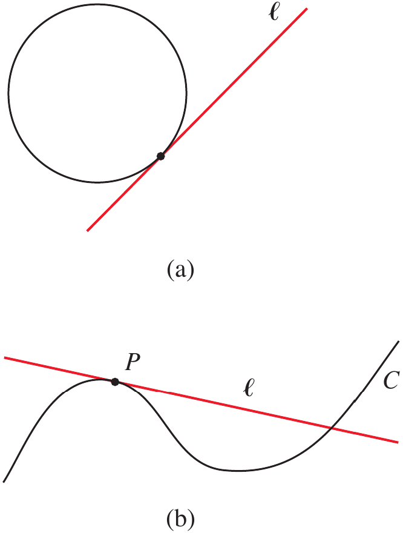
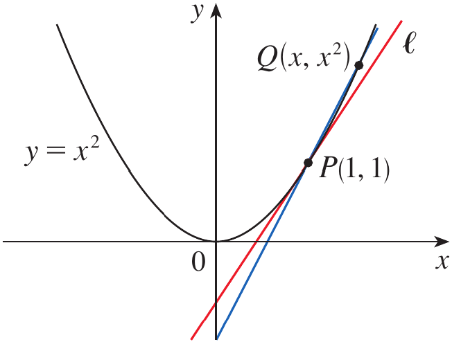
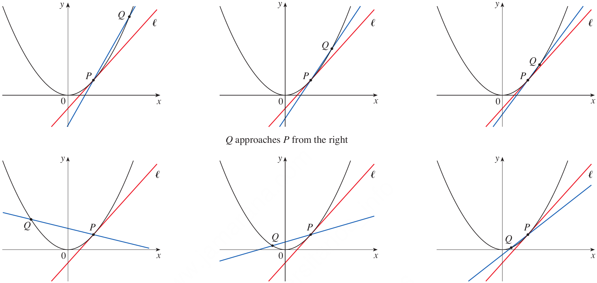
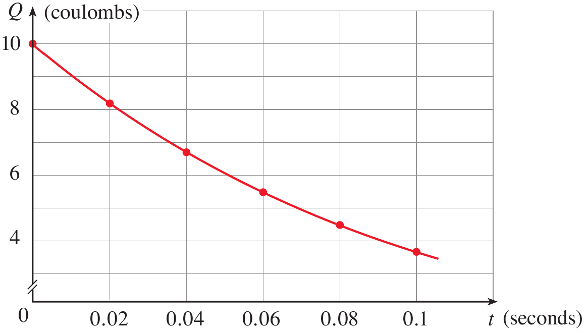
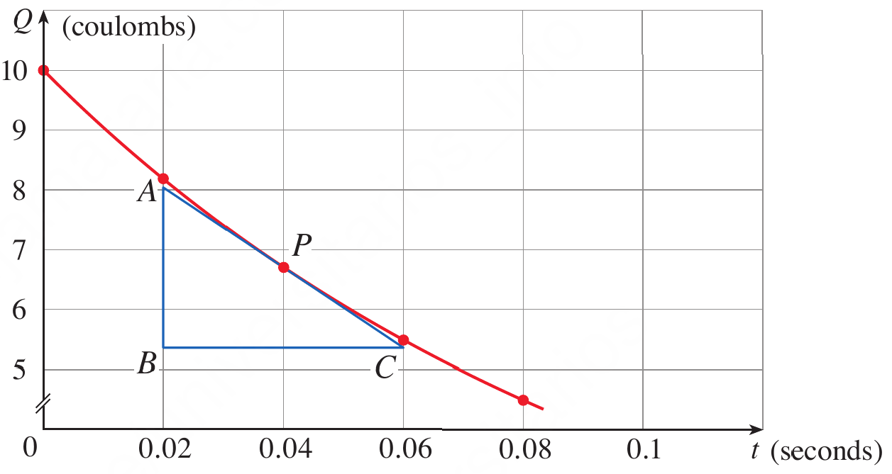
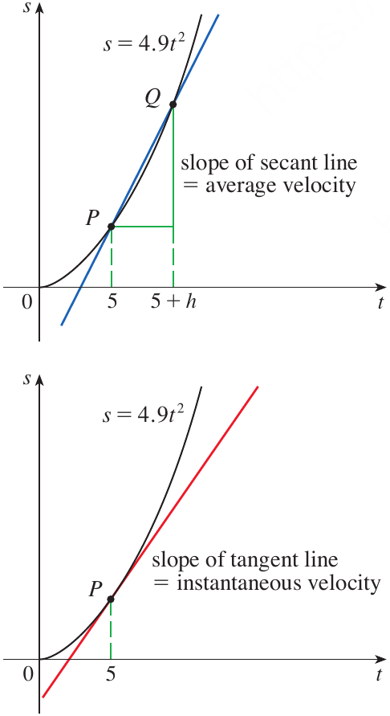

# Calculus and Analytical Geometry

## The Idea of Limits

### Dr. Aamir Alaud Din

### September 18, 2026

# Objectives

After studying this topic, you should be able

1. To understand how the problem of finding a tangent line to a curve leads naturally to the concept of a limit.

2. To understand how the problem of determining instantaneous velocity leads to the same limiting process and connects the slope of a tangent line with instantaneous rate of change.

# The Why Section

## Objective 1: Why Study the Tangent Problem?

* In engineering, we frequently need to determine the **direction or slope of a curve at a particular point**.

* For example, consider the profile of a mechanical component represented by a curve. At a particular point on the component, we may need to determine the slope of the profile to understand its local geometry or to specify the direction of a tangent tool path.

* Finding the slope of a straight line is straightforward because we can select any two points on the line. However, a curve does not have a constant slope.

* At a particular point on a curve, we cannot directly use the usual slope formula because we need two distinct points.

* We therefore approach the chosen point with a second point and examine the slopes of the resulting **secant lines**.

* As the second point gets closer and closer to the chosen point, the secant lines approach a particular line called the **tangent line**.

* This limiting process provides the mathematical foundation for finding the slope of a curve at a point.

* Therefore, the tangent problem gives us our first natural reason for studying limits.

* The mechanical-engineering scenario described above can be solved by understanding the tangent problem and the limiting process.

## Objective 2: Why Study the Velocity Problem?

* In mechanical engineering, velocity is one of the most important quantities used to describe motion.

* The average velocity of an object over a time interval can be found by dividing the change in position by the elapsed time.

* However, engineering applications often require the **velocity at one particular instant**, such as the velocity of a moving component at $t=5$ seconds.

* The difficulty is that an instantaneous velocity is associated with a single instant, so there is no ordinary time interval over which we can directly calculate it.

* We can overcome this difficulty by calculating average velocities over shorter and shorter time intervals.

* As the length of the time interval approaches zero, the average velocity approaches a definite value.

* This limiting value is called the **instantaneous velocity**.

* The velocity problem therefore reveals that the same limiting process used to find the slope of a tangent line can also be used to find an instantaneous physical quantity.

* The mechanical-engineering scenario described above can be solved by understanding average velocity and its limiting value.

# Objective 1: The Tangent Problem

## What Is a Tangent Line?

* The word **tangent** comes from the Latin word *tangens*, meaning "touching."

* We can think of a tangent to a curve as a line that touches the curve and follows the same direction as the curve at the point of contact.

* For a circle, we can define a tangent as a line that intersects the circle exactly once, as shown in Figure 1(a).

* For more complicated curves, however, this definition is not sufficient because a tangent line may intersect the curve more than once, as shown in Figure 1(b).

<strong>Figure 1.</strong> Tangent lines to a circle and to a more complicated curve.

* To make the idea precise, consider finding the tangent line to the parabola

$$
y=x^2
$$

* Suppose we want the tangent line at the point

$$
P(1,1)
$$

* The difficulty is that we know only one point, $P$, whereas the slope formula requires two points.

* We therefore choose another point $Q$ on the parabola and use the line through $P$ and $Q$ to approximate the tangent line.

## The Secant Line

* Let $Q(x,x^2)$ be another point on the parabola, as shown in Figure 2.

<strong>Figure 2.</strong> A secant line approaching the tangent line to the parabola $y=x^2$ at $P(1,1)$.

* The line through $P$ and $Q$ is called a **secant line** because it intersects the curve at two points.

* Since $Q\neq P$, we have $x\neq1$.

* The slope of the secant line $PQ$ is

$$
m_{PQ}=\frac{x^2-1}{x-1}
$$

* For example, if $Q=(1.5,2.25)$, then

$$
m_{PQ}=\frac{2.25-1}{1.5-1}=2.5
$$

* The following values show what happens as $Q$ gets closer to $P$.

<strong>Table 1.</strong> Slope of line as $Q$ gets closer to $P$.

|     $x$ | $m_{PQ}$ |
| ------: | -------: |
|     $2$ |      $3$ |
|   $1.5$ |    $2.5$ |
|   $1.1$ |    $2.1$ |
|  $1.01$ |   $2.01$ |
| $1.001$ |  $2.001$ |

* As $x$ gets closer to $1$, the slope of the secant line gets closer to $2$.

* We therefore expect the slope of the tangent line to be $2$.

* We can express this limiting process symbolically by writing

$$
\lim_{Q\to P}m_{PQ}=m
$$

* For this particular parabola, the corresponding limit is

$$
\lim_{x\to1}\frac{x^2-1}{x-1}=2
$$

* Thus, the slope of the tangent line is the **limit of the slopes of the secant lines** as the second point approaches the point of tangency.

## Example 1 {.green}

Find an equation of the tangent line to the parabola $y=x^2$ at the point $P(1,1)$.

## Solution {.green}

We choose another point $Q(x,x^2)$ on the parabola, where $x\neq1$.

The slope of the secant line $PQ$ is

$$
m_{PQ}=\frac{x^2-1}{x-1}
$$

As $Q$ approaches $P$, the corresponding value of $x$ approaches $1$.

From the table, the secant-line slopes approach $2$.

Therefore, the slope of the tangent line is

$$
m=\lim_{x\to1}\frac{x^2-1}{x-1}=2
$$

We now use the point-slope form of a line through $(1,1)$.

$$
y-1=2(x-1)
$$

Simplifying gives

$$
\boxed{y=2x-1}
$$

$\blacksquare$

## The Limiting Process Geometrically

* Figure 3 illustrates the limiting process used in Example 1.

* As $Q$ approaches $P$ along the parabola from the right, the corresponding secant lines rotate about $P$ and approach the tangent line.

* The same process occurs when $Q$ approaches $P$ from the left.

<strong>Figure 3.</strong> Secant lines approaching the tangent line from the right and from the left.

* The important observation is that the secant lines do not become tangent lines simply because they pass through two points on the curve.

* Rather, the tangent line is obtained as the **limiting position** of the secant lines as the second point approaches the first.

* This is the first appearance of the central idea of limits.

## Estimating a Tangent from Experimental Data

* Many functions that occur in science and engineering are not given by explicit equations.

* Instead, the behavior of the quantity may be known from experimental measurements.

* We can still estimate the slope of a tangent line by using nearby data points.

## Example 2 {.green}

A pulse laser operates by storing charge on a capacitor and releasing it suddenly when the laser is fired. The data in the table describe the charge $Q$ remaining on the capacitor at time $t$ after the laser is fired. Use the data to draw the graph of this function and estimate the slope of the tangent line at $t=0.04$.

## Solution {.green}

The given data are

<strong>Table 2.</strong> The charge $Q$ remaining on the capacitor at tiem $t$.

|    $t$ |     $Q$ |
| -----: | ------: |
|    $0$ |    $10$ |
| $0.02$ | $8.187$ |
| $0.04$ | $6.703$ |
| $0.06$ | $5.488$ |
| $0.08$ | $4.493$ |
| $0.10$ | $3.676$ |

We plot the data and draw a smooth curve that approximates the behavior of the charge.

<strong>Figure 4.</strong> Charge remaining on the capacitor as a function of time.

Let $P=(0.04,6.703)$ be the point where we want the tangent slope.

We first choose the point

$$
R=(0,10)
$$

The slope of the secant line $PR$ is

$$
m_{PR}=\frac{10-6.703}{0-0.04}
$$

$$
m_{PR}=-82.425
$$

We can calculate similar slopes using other points closer to $P$.

<strong>Table 3.</strong> The slopes as $R$ gets closer to $P$.

| $R$            |  $m_{PR}$ |
| -------------- | --------: |
| $(0,10)$       | $-82.425$ |
| $(0.02,8.187)$ | $-74.200$ |
| $(0.06,5.488)$ | $-60.750$ |
| $(0.08,4.493)$ | $-55.250$ |
| $(0.10,3.676)$ | $-50.450$ |

The closest secant-line slopes on either side of $t=0.04$ are $-74.20$ and $-60.75$.

Their average is

$$
\frac{1}{2}(-74.20-60.75)=-67.475
$$

Therefore, using this method, we estimate the slope of the tangent line to be approximately

$$
\boxed{-67.5}
$$

The slope represents the rate at which the electric charge is changing with time.

Thus, the tangent problem is not limited to geometric curves. It can also describe the rate of change of a physical quantity.

Another method is to draw an approximation to the tangent line and measure the sides of a suitable triangle, as shown in Figure 5.

<strong>Figure 5.</strong> Approximation of the tangent line at $t=0.04$ using a right triangle.

* From the triangle in Figure 5, the slope can be estimated as

$$
-\frac{|AB|}{|BC|}
\approx
-\frac{8.0-5.4}{0.06-0.02}
=-65.0
$$

* Both methods give a value near $-65$ to $-67.5$ amperes per second for the rate represented by the slope.

$\blacksquare$

# Quick Check

## Question 1 {.red}

For the parabola $y=x^2$, the secant-line slopes near $P(1,1)$ approach $2$. What does the number $2$ represent?

## Question 2 {.red}

What happens to a secant line as the second point on the curve approaches the point of tangency?

$\blacksquare$

# Objective 2: The Velocity Problem

## Average Velocity

* If you watch the speedometer of a car while driving in city traffic, you see that the speed does not remain constant.

* We therefore distinguish between **average velocity** over a time interval and **instantaneous velocity** at a particular time.

* Suppose the position of a moving object at time $t$ is given by $s(t)$.

* The average velocity over the time interval from $t=a$ to $t=b$ is

$$
\text{average velocity}
=
\frac{\text{change in position}}{\text{elapsed time}}
$$

* Therefore,

$$
\text{average velocity}
=
\frac{s(b)-s(a)}{b-a}
$$

* The velocity problem asks us to determine the velocity of an object at a **specific instant**.

* Because a single instant has no elapsed time interval, we cannot directly apply the average-velocity formula.

* Instead, we calculate average velocities over shorter and shorter time intervals.

## The Falling-Ball Problem

* Galileo discovered through experiments that the distance traveled by a freely falling body is proportional to the square of the time it has been falling, when air resistance is neglected.

* If $s(t)$ denotes the distance fallen in meters after $t$ seconds, the model is

$$
s(t)=4.9t^2
$$

## Example 3 {.green}

Suppose a ball is dropped from the upper observation deck of the CN Tower in Toronto, $450$ m above the ground. Find the velocity of the ball after $5$ seconds.

## Solution {.green}

The difficulty is that we want the velocity at one specific instant, namely $t=5$.

We first approximate the desired velocity by calculating the average velocity over the interval from $t=5$ to $t=5.1$.

The average velocity is

$$
\frac{s(5.1)-s(5)}{5.1-5}
$$

Since

$$
s(t)=4.9t^2
$$

We obtain

$$
\frac{4.9(5.1)^2-4.9(5)^2}{0.1}
$$

Therefore,

$$
\boxed{49.49\text{ m/s}}
$$

We now repeat the calculation over progressively shorter time intervals.

<strong>Table 4.</strong> Velocity over progressively short intervals.

| Time interval      | Average velocity (m/s) |
| ------------------ | ---------------------: |
| $5\leq t\leq5.1$   |                $49.49$ |
| $5\leq t\leq5.05$  |               $49.245$ |
| $5\leq t\leq5.01$  |               $49.049$ |
| $5\leq t\leq5.001$ |              $49.0049$ |

As the time interval becomes shorter, the average velocity gets closer and closer to $49$ m/s.

We therefore define the instantaneous velocity at $t=5$ as the limiting value of these average velocities.

$$
\boxed{\text{Instantaneous velocity at }t=5\text{ s}=49\text{ m/s}}
$$

<strong>Figure 6.</strong> Secant line and tangent line for the falling-ball position function $s=4.9t^2$.

$\blacksquare$

## The Connection Between Tangent and Velocity

* The velocity problem is closely connected to the tangent problem.

* Consider the graph of

$$
s(t)=4.9t^2
$$

* Let $P=(5,4.9(5)^2)$ and choose a nearby point $Q=(5+h,4.9(5+h)^2)$ on the graph.

* The slope of the secant line $PQ$ is

$$
m_{PQ}
=
\frac{4.9(5+h)^2-4.9(5)^2}{(5+h)-5}
$$

* Since $(5+h)-5=h$, this becomes

$$
m_{PQ}
=
\frac{4.9(5+h)^2-4.9(5)^2}{h}
$$

* But this slope has another interpretation.

* It is exactly the **average velocity** of the ball over the time interval from $5$ to $5+h$.

* As $h$ approaches $0$, the point $Q$ approaches $P$.

* Therefore, the secant line approaches the tangent line.

* At the same time, the average velocity approaches the instantaneous velocity.

* Consequently, the instantaneous velocity is the slope of the tangent line to the position-time graph.

* Symbolically,

$$
\boxed{\text{instantaneous velocity}=\text{slope of tangent line}}
$$

* More generally, if $s(t)$ gives the position of an object, then the instantaneous velocity at time $t$ is obtained from the limiting process

$$
\boxed{
\lim_{h\to0}
\frac{s(t+h)-s(t)}{h}
}
$$

* This is the same limiting process that appeared in the tangent problem.

# Quick Check

## Question 1 {.red}

What is the average velocity of an object whose position changes from $20$ m to $32$ m during a time interval of $4$ s?

## Question 2 {.red}

What happens to the average velocity when the time interval used to calculate it becomes shorter and shorter around a fixed time?
 

$\blacksquare$

# Scenario Problem

## Problem {.green}

A slider in a mechanical machine moves along a straight guide. Its position, measured in meters, is modeled by

$$
s(t)=2t^2
$$

where $t$ is measured in seconds.

Determine the velocity of the slider at $t=3$ seconds using the limiting idea developed in the velocity problem.

## Solution {.green}

The velocity at exactly $t=3$ cannot be obtained directly from the average-velocity formula because we are considering only one instant.

We therefore calculate the average velocity over the interval from $t=3$ to $t=3+h$.

The average velocity is

$$
\frac{s(3+h)-s(3)}{h}
$$

Since

$$
s(t)=2t^2
$$

we have

$$
s(3+h)=2(3+h)^2
$$

and

$$
s(3)=18
$$

Therefore,

$$
\frac{2(3+h)^2-18}{h}
$$

Expanding the square gives

$$
\frac{2(9+6h+h^2)-18}{h}
$$

Simplifying gives

$$
\frac{18+12h+2h^2-18}{h}
$$

$$
=12+2h
$$

As the time interval becomes smaller, $h$ approaches $0$.

Therefore, the instantaneous velocity is

$$
\lim_{h\to0}(12+2h)=12
$$

Hence, the velocity of the slider at $t=3$ seconds is

$$
\boxed{12\text{ m/s}}
$$

Thus, the mechanical-engineering problem is solved by the same limiting process that arose naturally from the tangent problem.

$\blacksquare$

# Summary

* The **tangent problem** arises when we want to determine the slope of a curve at a particular point.

* A secant line passes through two points on a curve, whereas a tangent line represents the limiting position of the secant line as the second point approaches the first.

* For the parabola $y=x^2$ at $P(1,1)$, the slope of the secant line is

$$
m_{PQ}=\frac{x^2-1}{x-1}
$$

* As $x$ approaches $1$, the secant-line slopes approach $2$.

$$
\lim_{x\to1}\frac{x^2-1}{x-1}=2
$$

* Therefore, the tangent line to $y=x^2$ at $(1,1)$ has slope $2$ and equation

$$
\boxed{y=2x-1}
$$

* Experimental data can also be used to estimate the slope of a tangent line when an explicit equation is not available.

* The **velocity problem** arises when we want to determine the velocity of an object at one particular instant.

* Average velocity over an interval is the change in position divided by the elapsed time.

$$
\boxed{
\text{Average velocity}
=
\frac{\text{change in position}}{\text{elapsed time}}
}
$$

* For a position function $s(t)$, the average velocity from $t$ to $t+h$ is

$$
\frac{s(t+h)-s(t)}{h}
$$

* As $h$ approaches $0$, the average velocity approaches the instantaneous velocity.

* The tangent and velocity problems are closely connected because the slope of a secant line on a position-time graph represents average velocity.

* As the second point approaches the first, the secant line approaches the tangent line and the average velocity approaches the instantaneous velocity.

* Therefore,

$$
\boxed{\text{Instantaneous velocity}=\text{slope of the tangent line}}
$$

* The central idea emerging from both problems is that a quantity associated with a single point or instant can be found by examining what happens over smaller and smaller intervals.

* This limiting process is the fundamental idea that leads to the formal concept of a **limit** in calculus.
