# Calculus and Analytical Geometry

## The Limit of a Function

### Dr. Aamir Alaud Din

### August 29, 2026

# Objectives

After preparing this topic, you should be able

1. To estimate and interpret the limit of a function numerically and graphically as the independent variable approaches a particular value.

2. To understand left-hand and right-hand limits and use them to determine whether a two-sided limit exists.

3. To identify the different ways in which a limit can fail to exist and recognize why numerical calculations and graphs can sometimes give misleading conclusions.

4. To understand infinite limits and use one-sided behavior to identify vertical asymptotes of functions.

# The Why Section

## Objective 1: Why Study Limits Numerically and Graphically?

* In engineering, we frequently need to understand what happens to a physical quantity when another quantity gets very close to a particular value.

* For example, suppose the displacement of a vibrating mechanical component is described by a function $s(t)$, and we want to know what happens to its velocity as the time $t$ approaches a particular instant.

* At first, we may not have an algebraic method for calculating the required value directly.

* We can instead investigate values of the function for numbers increasingly close to the point of interest and observe the corresponding behavior.

* Tables provide numerical evidence, while graphs allow us to see the overall behavior visually.

* Therefore, numerical and graphical methods provide an intuitive first approach to the concept of a limit.

* The following type of mechanical-engineering problem can be handled by studying the first objective.

* A sensor records the response of a mechanical system by a function $R(t)$. The system behaves differently at an exact operating time, but we want to determine what value the response approaches as $t$ gets closer and closer to that time.

* We will be able to estimate the required value from a table and graph.

## Objective 2: Why Study One-Sided Limits?

* In many physical systems, behavior may be different immediately before and immediately after a particular point.

* For example, a mechanical mechanism may change its operating mode when a control parameter reaches a critical value.

* The response approaching the critical value from below may therefore be different from the response approaching it from above.

* A two-sided limit can exist only when the function approaches the same value from both directions.

* Therefore, left-hand and right-hand limits allow us to examine the behavior on each side separately.

* This idea is especially useful for piecewise-defined functions, switching mechanisms, and engineering models involving sudden changes.

* The following type of problem can be handled by studying one-sided limits.

* A mechanical control system changes its operating rule when the input reaches a critical setting $c$.

* We want to determine whether the system response approaches the same value as the setting approaches $c$ from below and from above.

## Objective 3: Why Study How a Limit Can Fail to Exist?

* It is not always true that a function approaches a single number as $x$ approaches a particular value.

* A limit can fail to exist because the left-hand and right-hand limits are different.

* A limit can also fail to exist because the function oscillates indefinitely or because its values become arbitrarily large.

* Recognizing these possibilities prevents us from making an incorrect conclusion simply by examining a few numerical values.

* This is important in engineering because oscillatory behavior and rapidly increasing responses can indicate important characteristics of a physical system.

* For example, a mathematical model may oscillate increasingly rapidly near a particular operating condition.

* A few calculator values might suggest a particular limit even though the function does not actually approach a single number.

* These situations can be understood by studying the different ways in which a limit can fail to exist.

## Objective 4: Why Study Infinite Limits and Vertical Asymptotes?

* In some engineering models, a quantity can become extremely large as an input approaches a particular value.

* For example, a mathematical model of a mechanical response may contain a denominator that becomes very small near a critical parameter value.

* The resulting function may increase without bound as the parameter approaches that value.

* Such behavior is described using an infinite limit.

* A vertical asymptote provides a geometric way to describe this behavior.

* Understanding infinite limits and vertical asymptotes helps us recognize values at which a mathematical model becomes unbounded and therefore requires special interpretation.

* The following type of engineering situation can be analyzed using this idea.

* A simplified mechanical model contains a response function whose denominator approaches zero when an operating parameter reaches a critical value.

* We want to determine what happens to the response near that value and whether a vertical asymptote occurs.

# Objective 1: Finding Limits Numerically and Graphically

## Investigating a Limit Numerically

* We begin by considering the function

$$
f(x)=\frac{x-1}{x^2-1}
$$

* We want to investigate the behavior of $f(x)$ for values of $x$ close to $1$ but not equal to $1$.

* A table of values from both sides of $1$ gives

<div style="text-align: center;">

<span><strong>Table 1.</strong> Values of $x$ and corresponding $f(x)$ values.</span>

</div>


|    $x<1$ |     $f(x)$ |    $x>1$ |     $f(x)$ |
| -------: | ---------: | -------: | ---------: |
|    $0.5$ | $0.666667$ |    $1.5$ | $0.400000$ |
|    $0.9$ | $0.526316$ |    $1.1$ | $0.476190$ |
|   $0.99$ | $0.502513$ |   $1.01$ | $0.497512$ |
|  $0.999$ | $0.500250$ |  $1.001$ | $0.499750$ |
| $0.9999$ | $0.500025$ | $1.0001$ | $0.499975$ |

* As $x$ approaches $1$ from either side, the values of $f(x)$ approach $0.5$.

* Therefore, we estimate that

$$
\lim_{x\to1}\frac{x-1}{x^2-1}=0.5
$$

* Notice that the question concerns what happens **near** $x=1$, not necessarily what happens at $x=1$ itself.

## Investigating a Limit Graphically

* The same function can be investigated by examining its graph.


<div style="text-align: center;">
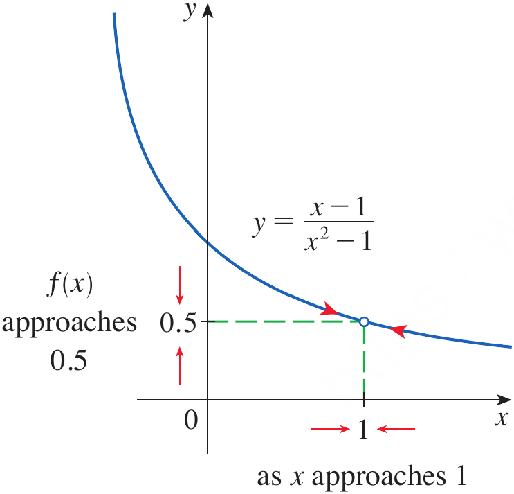

<span><strong>Figure 1.</strong> The graph of $f(x)=\dfrac{x-1}{x^2-1}$ showing $f(x)$ approaching $0.5$ as $x$ approaches $1$.</span>
</div>

* The graph also suggests that the values of $f(x)$ approach $0.5$ as $x$ approaches $1$.

* Thus, numerical tables and graphs give two complementary ways of investigating a limit.

## Intuitive Definition of a Limit

* Suppose $f(x)$ is defined when $x$ is near $a$, possibly except at $a$ itself.

* We write the following limit and say that **the limit of $f(x)$ as $x$ approaches $a$ is $L$** if the values of $f(x)$ can be made arbitrarily close to $L$ by taking $x$ sufficiently close to $a$ on either side of $a$, but not equal to $a$.

$$
\lim_{x\to a}f(x)=L
$$

* Roughly speaking, the values of $f(x)$ approach $L$ as $x$ approaches $a$.

* The function does not even have to be defined at $x=a$ for the limit to exist.


<div style="text-align: center;">
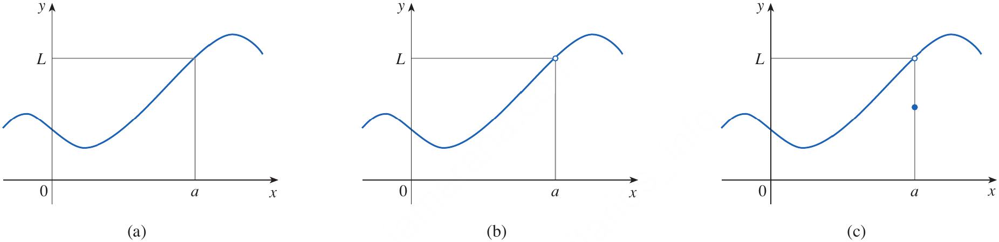

<span><strong>Figure 2.</strong> Graphs illustrating that $\lim_{x\to a}f(x)=L$ can exist even when the value of $f(a)$ is different or undefined.</span>
</div>

* The three graphs illustrate an important point: the behavior of $f(x)$ near $a$ determines the limit, not necessarily the value of $f(a)$.

* An alternative notation is

$$
f(x)\to L\qquad\text{as}\qquad x\to a
$$

* This is usually read as "$f(x)$ approaches $L$ as $x$ approaches $a$."

## Example 1 {.green}

Estimate the value of

$$
\lim_{t\to0}\frac{\sqrt{t^2+9}-3}{t^2}
$$

## Solution {.green}

We construct a table of values for $t$ near $0$.

<div style="text-align: center;">

<span><strong>Table 2.</strong> The values of $t$ and corresponding function.</span>

</div>

|       $t$ | $\dfrac{\sqrt{t^2+9}-3}{t^2}$ |
| --------: | ----------------------------: |
|  $\pm1.0$ |              $0.162277\ldots$ |
|  $\pm0.5$ |              $0.165525\ldots$ |
|  $\pm0.1$ |              $0.166620\ldots$ |
| $\pm0.05$ |              $0.166655\ldots$ |
| $\pm0.01$ |              $0.166666\ldots$ |

The values appear to approach $0.166666\ldots$.

Therefore, our initial estimate is

$$
\boxed{\lim_{t\to0}\frac{\sqrt{t^2+9}-3}{t^2}=\frac16}
$$

If we use extremely small values of $t$, however, a calculator may give misleading results.

For example, direct calculation can eventually produce values such as $0.000000$ because of rounding errors.

This does not mean that the limit is $0$.

The actual limit is

$$
\boxed{\frac16}
$$

This example shows that numerical calculations are useful for estimating limits, but they must be used carefully.

<div style="text-align: center;">
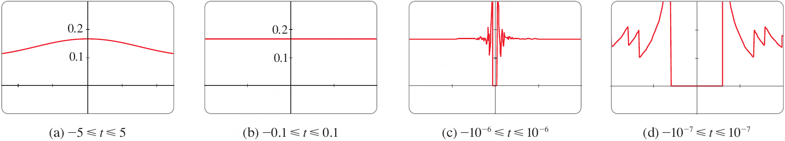

<span><strong>Figure 3.</strong> The graph of $y=\dfrac{\sin x}{x}$ near $x=0$.</span>
</div>

The following Python programs shows that the behaviour of the function is captured with small step increments (in the order of $1 \times 10^{-6}$)in the independent variable near the limiting points.

```python
import numpy as np
import matplotlib.pyplot as plt

def f(t):
    return (np.sqrt(t**2 + 9) - 3) / t**2

t_values = np.linspace(-5, 5, 1000)
plt.plot(t_values, f(t_values), linewidth=2, color='k')
plt.xticks(fontsize=12, fontweight='bold')
plt.yticks(fontsize=12, fontweight='bold')
plt.xlabel('t', fontsize=14, fontweight='bold')
plt.ylabel('f(t)', fontsize=14, fontweight='bold')
plt.title("Big Jumps", fontsize=16, fontweight='bold')
plt.grid(True)
plt.show()

t_values = np.linspace(-0.01, 0.01, 1000)
plt.plot(t_values, f(t_values), linewidth=2, color='k')
plt.xticks(fontsize=12, fontweight='bold')
plt.yticks(fontsize=12, fontweight='bold')
plt.xlabel('t', fontsize=14, fontweight='bold')
plt.ylabel('f(t)', fontsize=14, fontweight='bold')
plt.title("Very Small Jumps", fontsize=16, fontweight='bold')
plt.grid(True)
plt.show()

t_values = np.linspace(-0.000001, 0.000001, 1000)
plt.plot(t_values, f(t_values), linewidth=2, color='k')
plt.xticks(fontsize=12, fontweight='bold')
plt.yticks(fontsize=12, fontweight='bold')
plt.xlabel('t', fontsize=14, fontweight='bold')
plt.ylabel('f(t)', fontsize=14, fontweight='bold')
plt.title("Microscopic Jumps", fontsize=16, fontweight='bold')
plt.grid(True)
plt.show()

t_values = np.linspace(-0.0000001, 0.0000001, 1000)
plt.plot(t_values, f(t_values), linewidth=2, color='k')
plt.xticks(fontsize=12, fontweight='bold')
plt.yticks(fontsize=12, fontweight='bold')
plt.xlabel('t', fontsize=14, fontweight='bold')
plt.ylabel('f(t)', fontsize=14, fontweight='bold')
plt.title("Ten Times Smaller Microscopic Jumps", fontsize=16, fontweight='bold')
plt.grid(True)
plt.show()

t_values = np.linspace(-0.00000001, 0.00000001, 1000)
plt.plot(t_values, f(t_values), linewidth=2, color='k')
plt.xticks(fontsize=12, fontweight='bold')
plt.yticks(fontsize=12, fontweight='bold')
plt.xlabel('t', fontsize=14, fontweight='bold')
plt.ylabel('f(t)', fontsize=14, fontweight='bold')
plt.title("100 Times Stronger Microscopic Jumps", fontsize=16, fontweight='bold')
plt.grid(True)
plt.show()

```

<div class="example-end">$\blacksquare$</div>

## Example 2 {.green}

Guess the value of

$$
\lim_{x\to0}\frac{\sin x}{x}
$$

## Solution {.green}

The function $f(x)=\dfrac{\sin x}{x}$ is not defined at $x=0$.

We calculate values for $x$ close to $0$.

<div style="text-align: center;">

<span><strong>Table 3.</strong> Values of $x$ and corresponding function values.</span>

</div>

|        $x$ | $\dfrac{\sin x}{x}$ |
| ---------: | ------------------: |
|   $\pm1.0$ |        $0.84147098$ |
|   $\pm0.5$ |        $0.95885108$ |
|   $\pm0.4$ |        $0.97354586$ |
|   $\pm0.3$ |        $0.98506736$ |
|   $\pm0.2$ |        $0.99334665$ |
|   $\pm0.1$ |        $0.99833417$ |
|  $\pm0.05$ |        $0.99958339$ |
|  $\pm0.01$ |        $0.99998333$ |
| $\pm0.005$ |        $0.99999583$ |
| $\pm0.001$ |        $0.99999983$ |

The values approach $1$ as $x$ approaches $0$.

Therefore, we guess that

$$
\boxed{\lim_{x\to0}\frac{\sin x}{x}=1}
$$

This result is correct and will later be established using a geometric argument.

<div style="text-align: center;">
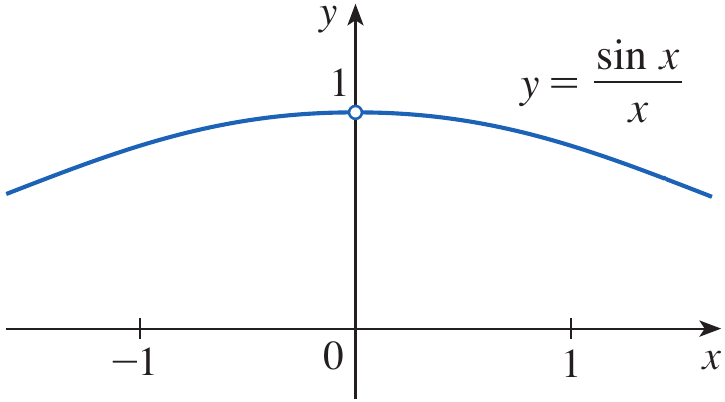

<span><strong>Figure 4.</strong> The graph of the Heaviside function.</span>
</div>

<div class="example-end">$\blacksquare$</div>

## Example 3 {.green}

Find

$$
\lim_{x\to0}\left(x^3+\frac{\cos5x}{10,000}\right)
$$

## Solution {.green}

We first calculate values of the function for several values of $x$ near $0$.

<div style="text-align: center;">

<span><strong>Table 4.</strong> Values of $x$ with bigger increments and corresponding function values.</span>

</div>

|    $x$ | $x^3+\dfrac{\cos5x}{10,000}$ |
| -----: | ---------------------------: |
|    $1$ |                   $1.000028$ |
|  $0.5$ |                   $0.124920$ |
|  $0.1$ |                   $0.001088$ |
| $0.05$ |                   $0.000222$ |
| $0.01$ |                   $0.000101$ |

For values even closer to zero we obtain

<div style="text-align: center;">

<span><strong>Table 5.</strong> Values of $x$ with shorter increments and corresponding function values.</span>

</div>

|     $x$ | $x^3+\dfrac{\cos5x}{10,000}$ |
| ------: | ---------------------------: |
| $0.005$ |                 $0.00010009$ |
| $0.001$ |                 $0.00010000$ |

The values approach $0.0001$.

Therefore,

$$
\boxed{\lim_{x\to0}\left(x^3+\frac{\cos5x}{10,000}\right)=0.0001}
$$

<div class="example-end">$\blacksquare$</div>

## Limits and Technology

* Calculators and computer algebra systems can be useful when investigating limits numerically.

* However, numerical calculations can sometimes produce false impressions because of rounding and finite numerical precision.

* Therefore, tables and graphs should be viewed as tools for **estimating and understanding** a limit rather than as proof that a limit has a particular value.

# Quick Check

## Question 1 {.red}

Use the following information to estimate the limit.

<div style="text-align: center;">

<span><strong>Table 6.</strong> Value of $x$ and corresponding values of $f(x)$.</span>

</div>

|     $x$ |  $f(x)$ |
| ------: | ------: |
|   $0.9$ |   $2.1$ |
|  $0.99$ |  $2.01$ |
| $0.999$ | $2.001$ |
| $1.001$ | $1.999$ |
|  $1.01$ |  $1.99$ |

What value does $f(x)$ appear to approach as $x\to1$?

## Question 2 {.red}

If $f(x)$ approaches $5$ as $x$ approaches $3$, but $f(3)=10$, what is $\lim_{x\to3}f(x)$?

<div class="questions-end">$\blacksquare$</div>

# Objective 2: One-Sided Limits

## Approaching from One Side

* Sometimes we are interested in what happens as $x$ approaches $a$ from only one direction.

* The following notation means that we consider values of $x$ less than $a$ and approach $a$ from the left.

$$
x\to a^-
$$

* Similarly, the following notation means means that we consider values of $x$ greater than $a$ and approach $a$ from the right.

$$
x\to a^+
$$

## The Heaviside Function

* Consider the Heaviside function $H$ defined by

$$
H(t)=
\begin{cases}
0 & \text{if }t<0\\
1 & \text{if }t\geq0
\end{cases}
$$

* This function can describe an electric current that is switched on at time $t=0$.

* As $t$ approaches $0$ from the left, $H(t)$ approaches $0$.

* As $t$ approaches $0$ from the right, $H(t)$ approaches $1$.

* Since the two values are different, there is no single two-sided limit at $t=0$.

* We write

$$
\lim_{t\to0^-}H(t)=0
\qquad
\text{and}
\qquad
\lim_{t\to0^+}H(t)=1
$$

* These are called the **left-hand limit** and **right-hand limit**, respectively.

## Definition: Intuitive Definitions of One-Sided Limits {.blue}

We write the following limit when the values of $f(x)$ can be made arbitrarily close to $L$ by restricting $x$ to be sufficiently close to $a$ with $x<a$.

$$
\lim_{x\to a^-}f(x)=L
$$

Similarly, the following limit means means that the values of $f(x)$ can be made arbitrarily close to $L$ by restricting $x$ to be sufficiently close to $a$ with $x>a$.

$$
\lim_{x\to a^+}f(x)=L
$$

<div class="definition-end">$\blacksquare$</div>

* Thus, the only difference between one-sided and ordinary limits is the direction from which $x$ approaches $a$.


<div style="text-align: center;">
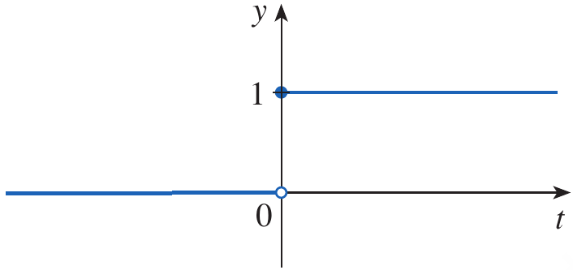

<span><strong>Figure 5.</strong> One-sided approaches to $a$ from the left and from the right.</span>
</div>

* For example, $x\to5^-$ means that we consider only values $x<5$, while $x\to5^+$ means that we consider only values $x>5$.

## Relationship Between One-Sided and Two-Sided Limits

* A two-sided limit exists only if both one-sided limits exist and are equal.

* Therefore,

$$
\boxed{
\lim_{x\to a}f(x)=L
\iff
\lim_{x\to a^-}f(x)=L
\quad\text{and}\quad
\lim_{x\to a^+}f(x)=L
}
$$

<div style="text-align: center;">
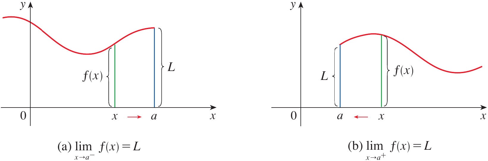

<span><strong>Figure 6.</strong> Graph of the function $g$ used to determine its one-sided and two-sided limits.</span>
</div>

## Example 4 {.green}

The graph of a function $g$ is shown in Figure 7. Use the graph to state the values, if they exist, of the following

$$
\text{(a)}\quad\lim_{x\to2^-}g(x)
$$

$$
\text{(b)}\quad\lim_{x\to2^+}g(x)
$$

$$
\text{(c)}\quad\lim_{x\to2}g(x)
$$

$$
\text{(d)}\quad\lim_{x\to5^-}g(x)
$$

$$
\text{(e)}\quad\lim_{x\to5^+}g(x)
$$

$$
\text{(f)}\quad\lim_{x\to5}g(x)
$$

<div style="text-align: center;">
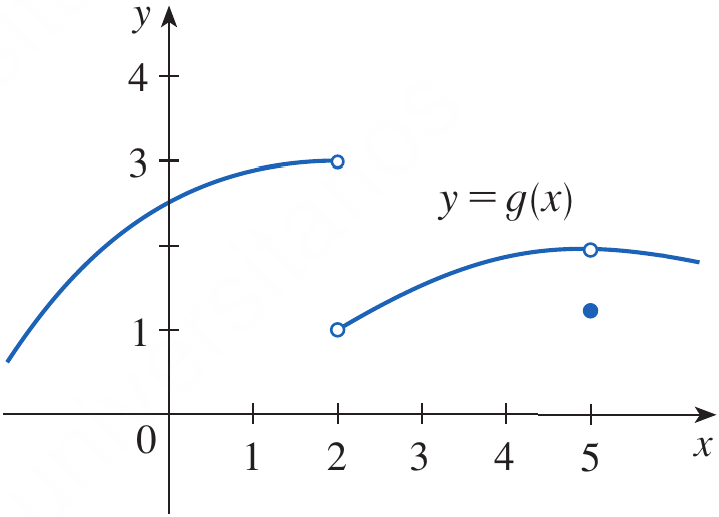

<span><strong>Figure 7.</strong> The graph of a function $g$.</span>
</div>

## Solution {.green}

From the graph, the values of $g(x)$ approach $3$ as $x$ approaches $2$ from the left.

$$
\boxed{\lim_{x\to2^-}g(x)=3}
$$

As $x$ approaches $2$ from the right, the values approach $1$.

$$
\boxed{\lim_{x\to2^+}g(x)=1}
$$

Because the left-hand and right-hand limits are different, the two-sided limit does not exist.

$$
\boxed{\lim_{x\to2}g(x)\text{ does not exist}}
$$

At $x=5$, both one-sided limits approach $2$.

$$
\boxed{\lim_{x\to5^-}g(x)=2}
$$

$$
\boxed{\lim_{x\to5^+}g(x)=2}
$$

Since these one-sided limits are equal,

$$
\boxed{\lim_{x\to5}g(x)=2}
$$

Notice that the graph has $g(5)\neq2$.

Again, this demonstrates that the value of the function at $x=a$ does not by itself determine the limit.

<div class="example-end">$\blacksquare$</div>

# Quick Check

## Question 1 {.red}

Suppose

$$
\lim_{x\to3^-}f(x)=4
\qquad
\text{and}
\qquad
\lim_{x\to3^+}f(x)=4
$$

What is the two-sided limit?

## Question 2 {.red}

Suppose

$$
\lim_{x\to2^-}f(x)=5
\qquad
\text{and}
\qquad
\lim_{x\to2^+}f(x)=7
$$

Does $\lim_{x\to2} f(x)$ exist?

<div class="questions-end">$\blacksquare$</div>

# Objective 3: How Can a Limit Fail to Exist?

## Different One-Sided Limits

* The first way a limit can fail to exist is when the left-hand and right-hand limits are different.

* Example 4 demonstrated this situation at $x=2$.

* Since

$$
\lim_{x\to2^-}g(x)=3
$$

* While

$$
\lim_{x\to2^+}g(x)=1
$$

* There is no single number approached by $g(x)$ from both sides.

* Therefore,

$$
\boxed{\lim_{x\to2}g(x)\text{ does not exist}}
$$

## Oscillation

* A second way a limit can fail to exist is when the function oscillates between different values and does not approach a single number.

* The similar behaviour was observed in Example 1.

## Example 5 {.green}

Investigate

$$
\lim_{x\to0}\sin\frac{\pi}{x}
$$

## Solution {.gree}

The function $f(x)=\sin(\pi/x)$ is undefined at $x=0$.

If we choose values such as

$$
x=1,\quad \frac12,\quad\frac13,\quad\frac1{10},\quad\frac1{100}
$$

then

$$
\sin\frac{\pi}{x}
$$

gives values such as $0$.

However, this information is misleading.

For every positive integer $n$,

$$
f\left(\frac1n\right)=\sin(n\pi)=0
$$

But there are also sequences of values approaching zero for which the function equals $1$ or $-1$.

For example, if

$$
x=\frac{2}{4n+1}
$$

then

$$
\frac{\pi}{x}=\frac{(4n+1)\pi}{2}
$$

and the sine is $1$.

Similarly, other values approaching zero produce $-1$.

Thus, as $x$ approaches $0$, the function continues to oscillate between $-1$ and $1$.


<div style="text-align: center;">
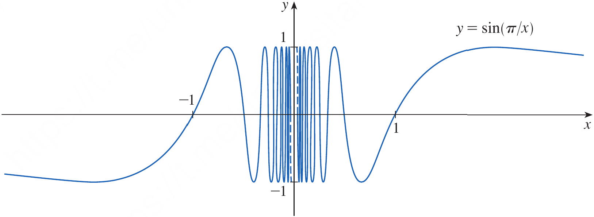

<span><strong>Figure 8.1.</strong> Graph of $y=\sin(\pi/x)$ showing increasingly rapid oscillation near $x=0$.</span>
</div>

Because the function does not approach a single fixed number,

$$
\boxed{\lim_{x\to0}\sin\frac{\pi}{x}\text{ does not exist}}
$$

This example shows why checking only a few calculator values can lead to a wrong conclusion.

The following Python program shows this behaviour in depth.

```python
import numpy as np
import matplotlib.pyplot as plt

def f(x):
    return np.sin(np.pi / x)


x_left = np.linspace(-1, -0.0003, 10000)
x_right = np.linspace(0.0003, 1, 10000)

y_left = f(x_left)
y_right = f(x_right)

plt.plot(x_left, y_left, linewidth=2)
plt.plot(x_right, y_right, linewidth=2)
plt.xticks(fontsize=12, fontweight='bold')
plt.yticks(fontsize=12, fontweight='bold')
plt.xlabel('x', fontsize=14, fontweight='bold')
plt.ylabel('f(x)', fontsize=14, fontweight='bold')
plt.grid(True)
plt.show()
```

The output of this program is shown below.

<div style="text-align: center;">
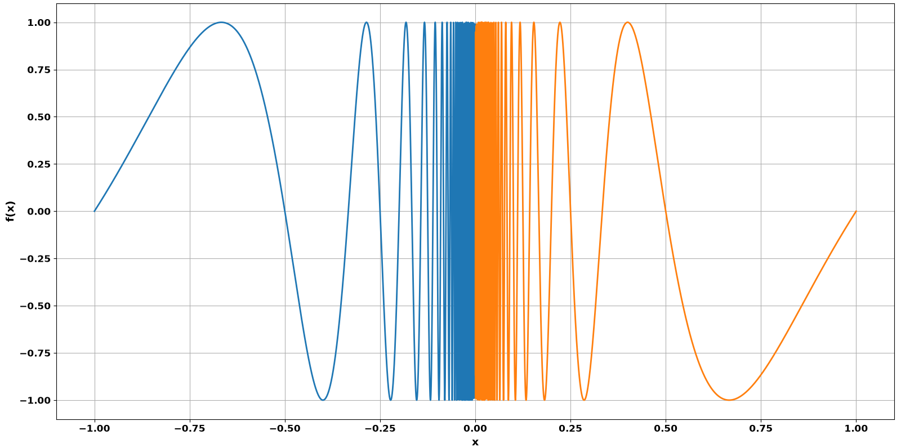

<span><strong>Figure 8.2.</strong> The graph of $\sin \frac{\pi}{x}$ for $-1 \leq x \leq 1$.</span>
</div>

<div class="example-end">$\blacksquare$</div>

## Unbounded Behavior

* A third situation occurs when the function values become arbitrarily large in magnitude as $x$ approaches a particular number.

* Consider

$$
f(x)=\frac1{x^2}
$$

* As $x$ approaches $0$, the denominator becomes very small and positive.

* Consequently, $1/x^2$ becomes larger and larger.

## Example 6 {.green}

Find

$$
\lim_{x\to0}\frac1{x^2}
$$

if it exists

## Solution {.green}

Some values of the function are

<div style="text-align: center;">

<span><strong>Table 7.</strong> Values of $x$ and corresponding function values.</span>

</div>

|        $x$ | $\dfrac1{x^2}$ |
| ---------: | -------------: |
|     $\pm1$ |            $1$ |
|   $\pm0.5$ |            $4$ |
|   $\pm0.2$ |           $25$ |
|   $\pm0.1$ |          $100$ |
|  $\pm0.05$ |          $400$ |
|  $\pm0.01$ |       $10,000$ |
| $\pm0.001$ |    $1,000,000$ |

The values become larger and larger as $x$ approaches $0$.

Therefore, the function does not approach a finite number.

We express this behavior by writing

$$
\boxed{\lim_{x\to0}\frac1{x^2}=\infty}
$$

The symbol $\infty$ does **not** represent a number.

It indicates that the function values become arbitrarily large.


<div style="text-align: center;">
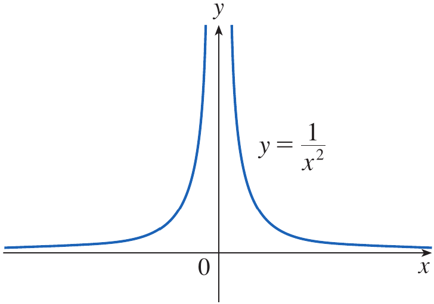

<span><strong>Figure 9.</strong> Graph of $y=\dfrac1{x^2}$ showing unbounded behavior near $x=0$.</span>
</div>

## Infinite Limits

* In general, the following limit means that $f(x)$ can be made arbitrarily large by taking $x$ sufficiently close to $a$, but not equal to $a$.

$$
\lim_{x\to a}f(x)=\infty
$$

* Similarly, below limit means that $f(x)$ becomes arbitrarily large in the negative direction as $x$ approaches $a$.

$$
\lim_{x\to a}f(x)=-\infty
$$

* These expressions describe behavior; they do not mean that the limit exists as an ordinary real number.

## Another Form of Unbounded Behavior

* Consider

$$
f(x)=-\frac1{x^2}
$$

* As $x$ approaches $0$, the function values become arbitrarily large in the negative direction.

* Therefore,

$$
\boxed{\lim_{x\to0}\left(-\frac1{x^2}\right)=-\infty}
$$

# Quick Check

## Question 1 {.red}

Does the following limit exist?

$$
\lim_{x\to0}\sin\frac1x
$$

## Question 2 {.red}

What type of behavior is represented by

$$
\lim_{x\to2} f(x)=\infty
$$

<div class="questions-end">$\blacksquare$</div>

# Objective 4: Infinite Limits; Vertical Asymptotes

## Vertical Asymptotes

* The unbounded behavior of a function is closely related to the idea of a vertical asymptote.

* A vertical line $x=a$ is called a **vertical asymptote** of the curve $y=f(x)$ if at least one of the following one-sided or two-sided limits is infinite:

$$
\lim_{x\to a^-}f(x)=\infty
$$

$$
\lim_{x\to a^+}f(x)=\infty
$$

$$
\lim_{x\to a}f(x)=\infty
$$

$$
\lim_{x\to a^-}f(x)=-\infty
$$

$$
\lim_{x\to a^+}f(x)=-\infty
$$

$$
\lim_{x\to a}f(x)=-\infty
$$

* Thus, a vertical asymptote describes a value of $x$ near which the function becomes unbounded.

## Determining Vertical Asymptotes Using One-Sided Limits

## Example 7 {.green}

Does the curve

$$
y=\frac{2x}{x-3}
$$

have a vertical asymptote?

## Solution {.green}

A potential vertical asymptote occurs where the denominator is zero.

We solve

$$
x-3=0
$$

giving

$$
x=3
$$

We therefore investigate the behavior from both sides.

If $x$ is close to $3$ but greater than $3$, then $x-3$ is a small positive number, while $2x$ is close to $6$.

Therefore, the quotient becomes very large and positive.

$$
\boxed{\lim_{x\to3^+}\frac{2x}{x-3}=\infty}
$$

If $x$ is close to $3$ but less than $3$, then $x-3$ is a small negative number, while $2x$ is still positive.

Therefore, the quotient becomes very large and negative.

$$
\boxed{\lim_{x\to3^-}\frac{2x}{x-3}=-\infty}
$$

Hence, the line

$$
\boxed{x=3}
$$

is a vertical asymptote.


<div style="text-align: center;">
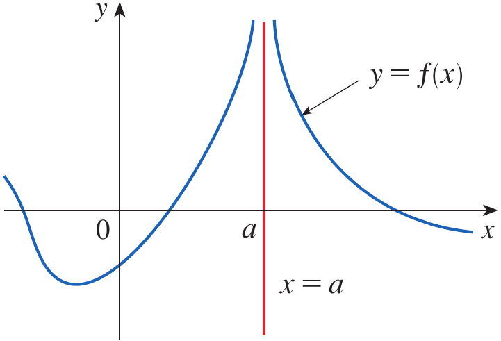

<span><strong>Figure 10.</strong> Graph of $y=\dfrac{2x}{x-3}$ showing the vertical asymptote $x=3$.</span>
</div>

### Important Note

Neither of the two-sided infinite limits is an ordinary finite limit.

In this example, because the function approaches $+\infty$ from one side and $-\infty$ from the other, it is more appropriate to describe the behavior using the two one-sided limits.

<div class="example-end">$\blacksquare$</div>

## Vertical Asymptotes of the Tangent Function

## Example 8 {.green}

Find the vertical asymptotes of $f(x)=\tan x$

## Solution {.green}

Since

$$
\tan x=\frac{\sin x}{\cos x}
$$

potential vertical asymptotes occur where

$$
\cos x=0
$$

The solutions are

$$
x=\frac{\pi}{2}+n\pi
$$

where $n$ is any integer.

For example, near $x=\pi/2$,

$$
\lim_{x\to(\pi/2)^-}\tan x=\infty
$$

and

$$
\lim_{x\to(\pi/2)^+}\tan x=-\infty
$$

Therefore,

$$
\boxed{x=\frac{\pi}{2}+n\pi,\qquad n\in\mathbb Z}
$$

are the vertical asymptotes of $y=\tan x$.


<div style="text-align: center;">
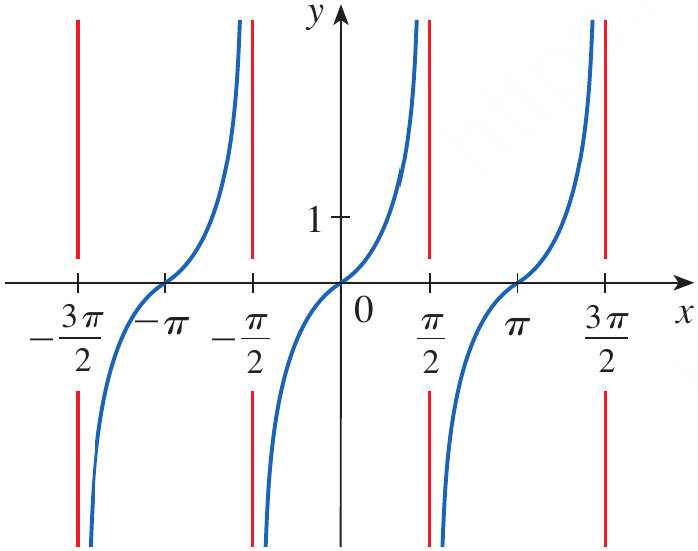

<span><strong>Figure 11.</strong> Graph of $y=\tan x$ showing its vertical asymptotes.</span>
</div>

## Vertical Asymptote of the Natural Logarithm

* Another example of a function with a vertical asymptote is the natural logarithm

$$
y=\ln x
$$

* As $x$ approaches $0$ from the right, the logarithm decreases without bound.

$$
\boxed{\lim_{x\to0^+}\ln x=-\infty}
$$


<div style="text-align: center;">
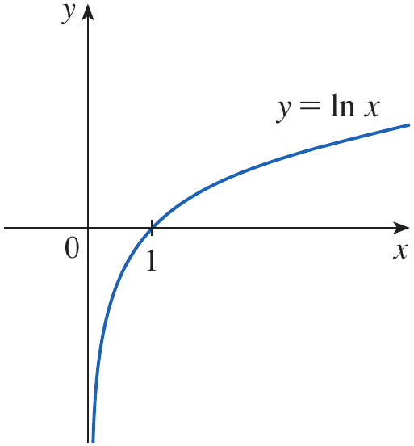

<span><strong>Figure 12.</strong> Graph of $y=\ln x$ showing the vertical asymptote $x=0$.</span>
</div>

* Therefore, the line $x=0$ is a vertical asymptote of $y=\ln x$.

* The same idea applies to $y=\log_bx$ when $b>1$.

# Quick Check

## Question 1 {.red}

Determine the vertical asymptote of

$$
f(x)=\frac1{x-4}
$$

## Question 2 {.red}

Determine the vertical asymptotes of

$$
f(x)=\tan x
$$

<div class="questions-end">$\blacksquare$</div>

# Scenario Problem

## Problem {.green}

A simplified mechanical model describes the response of a component near a critical operating parameter $x=3$ by

$$
R(x)=\frac{2x}{x-3}
$$

The parameter $x$ represents a normalized operating condition, and $R(x)$ represents the corresponding response of the component.

Determine what happens to the response as the operating condition approaches the critical value $x=3$ from the left and from the right, and determine whether $x=3$ is a vertical asymptote.

## Solution {.green}

We first consider values of $x$ slightly less than $3$.

For example, if $x=2.9$, then

$$
R(2.9)=\frac{2(2.9)}{2.9-3}
$$

$$
R(2.9)=\frac{5.8}{-0.1}=-58
$$

If $x=2.99$, then

$$
R(2.99)=\frac{5.98}{-0.01}=-598
$$

The response becomes increasingly negative as $x$ approaches $3$ from the left.

Therefore,

$$
\boxed{\lim_{x\to3^-}R(x)=-\infty}
$$

Now consider values slightly greater than $3$.

If $x=3.1$, then

$$
R(3.1)=\frac{6.2}{0.1}=62
$$

If $x=3.01$, then

$$
R(3.01)=\frac{6.02}{0.01}=602
$$

The response becomes increasingly positive as $x$ approaches $3$ from the right.

Therefore,

$$
\boxed{\lim_{x\to3^+}R(x)=\infty}
$$

Since the response becomes unbounded near $x=3$, the line

$$
\boxed{x=3}
$$

is a vertical asymptote.

Thus, the mathematical model predicts extremely large positive or negative responses as the operating condition approaches the critical value from the corresponding side.

<div class="example-end">$\blacksquare$</div>

# Summary

* A **limit** describes the value that $f(x)$ approaches as $x$ gets closer and closer to a particular number.

* Numerical tables can be used to estimate a limit by evaluating the function at values increasingly close to the point of interest.

* Graphs provide a visual way to observe the behavior of a function near the point being approached.

* The intuitive meaning of a limit is expressed by

$$
\boxed{\lim_{x\to a}f(x)=L}
$$

* The value of $f(a)$ does not necessarily determine the value of the limit, and the function does not even have to be defined at $a$.

* A **left-hand limit** considers values of $x$ approaching $a$ from values less than $a$.

$$
\boxed{\lim_{x\to a^-}f(x)}
$$

* A **right-hand limit** considers values of $x$ approaching $a$ from values greater than $a$.

$$
\boxed{\lim_{x\to a^+}f(x)}
$$

* A two-sided limit exists only when the two one-sided limits exist and are equal.

$$
\boxed{
\lim_{x\to a}f(x)=L
\iff
\lim_{x\to a^-}f(x)=L
\quad\text{and}\quad
\lim_{x\to a^+}f(x)=L
}
$$

* A limit can fail to exist when the left-hand and right-hand limits are different.

* A limit can also fail to exist when the function oscillates indefinitely, as in

$$
\boxed{\lim_{x\to0}\sin\frac{\pi}{x}\text{ does not exist}}
$$

* A function can also become arbitrarily large or negative as $x$ approaches a point.

* The following notation describes values of $f(x)$ that increase without bound and does not mean that $\infty$ is an ordinary real number.

$$
\lim_{x\to a}f(x)=\infty
$$

* A vertical line $x=a$ is a **vertical asymptote** when the function becomes unbounded as $x$ approaches $a$ from at least one appropriate direction.

* For the following function the vertical asymptote is $x=3$.

$$
f(x)=\frac{2x}{x-3}
$$

* For the tangent function, the vertical asymptotes are

$$
\boxed{x=\frac{\pi}{2}+n\pi,\qquad n\in\mathbb Z}
$$

* For the natural logarithm, the vertical asymptote is

$$
\boxed{x=0}
$$

* The central idea of this topic is therefore that **limits describe local behavior**: they tell us what a function approaches, how it approaches from each side, and whether its behavior remains finite, oscillates, or becomes unbounded.

# Exercises

## Exercises Set 1

Solve the odd number exercises from exercise 1 to 51.

## Exercise Set 2 (Reading Material)

Self study objective 4 (Infinite Limits; Vertical Asymptotes)

* Exercises help transform theoretical concepts into practical understanding.

* Mathematics is learned by doing and solving exercises will train you to analyze problems, select appropriate methods, and construct logical solutions.

* Attempting problems sometimes leads to mistakes which provide opportunities for learning and improvement.

* Regular practice increases speed, accuracy, and confidence.

* Exercises are given in the Exercises file and you are expected to solve them on your own.