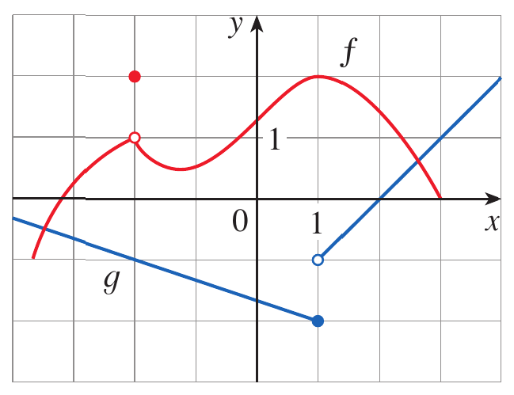
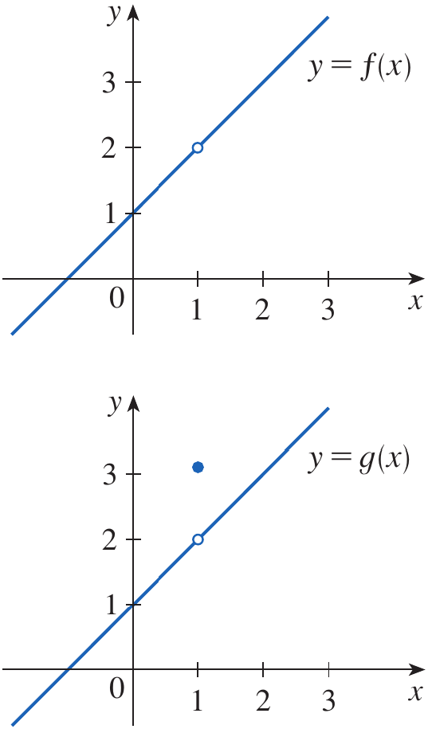
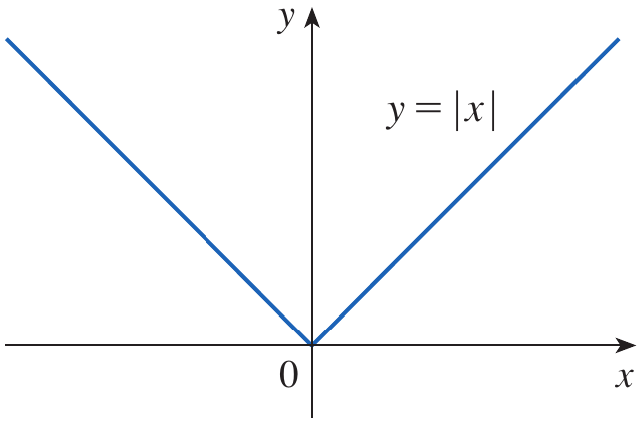
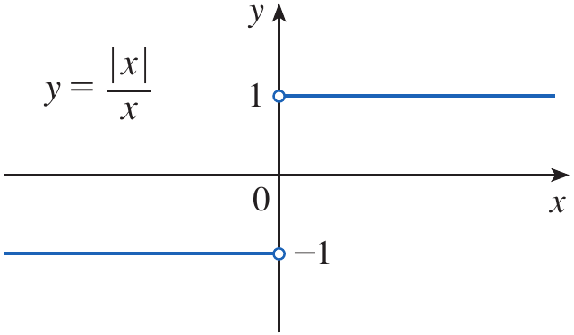
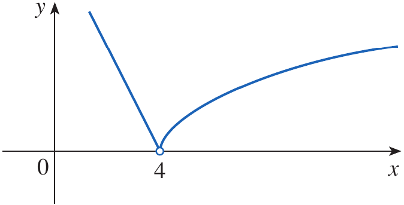
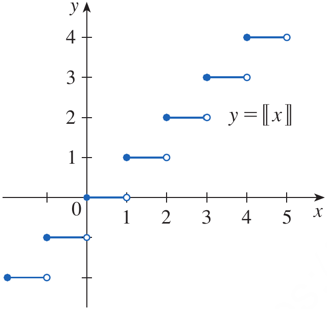
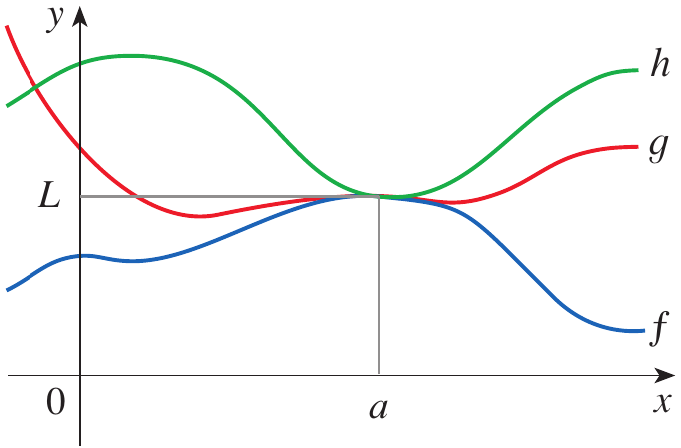
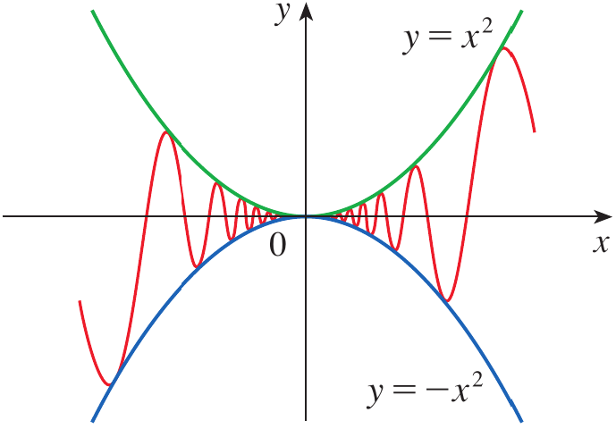

# Calculus and Analytical Geometry

## Calculating Limits Using Limit Laws

### Dr. Aamir Alaud Din

### August 30, 2026

# Objectives

After preparing this topic, you should be able

1. To apply the fundamental limit laws to sums, differences, constant multiples, products, quotients, powers, and roots of functions.

2. To evaluate limits of polynomial and rational functions by direct substitution and simplify indeterminate forms when direct substitution is not sufficient.

3. To evaluate limits using left-hand and right-hand limits and determine whether a two-sided limit exists.

4. To apply the Squeeze Theorem to evaluate limits when direct application of the limit laws is not possible.

# The Why Section

## Objective 1: Why Study the Properties of Limits?

* In engineering, a physical quantity is often constructed from several other quantities.

* For example, the displacement of a mechanical system may be expressed as the sum of several component displacements, while energy, force, or power may involve products or quotients of functions.

* If we know the limiting behavior of the individual quantities, we need rules that allow us to determine the limiting behavior of the combined quantity.

* The **limit laws** provide these rules.

* Without these laws, every new limit would have to be investigated from its graph or numerical behavior.

* Consider a mechanical system whose total displacement is modeled by

$$
s(t)=s_1(t)+s_2(t)
$$

* If the individual displacements approach known values as $t$ approaches a particular instant, the limit laws allow us to determine the limiting total displacement.

* Therefore, this type of engineering problem can be handled systematically by studying the properties of limits.

## Objective 2: Why Study Direct Substitution?

* In many applications, we need to determine the value approached by a mathematical model as an input approaches a particular value.

* For polynomial and many rational functions, the limit can be obtained simply by substituting the approaching value into the function.

* This provides a fast and reliable method for evaluating a large class of limits.

* However, direct substitution does not always work.

* For example, a formula may be undefined at the point even though the limit exists.

* Consider the expression

$$
\frac{x^2-1}{x-1}
$$

* Direct substitution at $x=1$ gives an undefined expression, but the function can be simplified and its limit can still be found.

* Thus, learning direct substitution together with algebraic simplification allows us to distinguish between a limit that is immediately obtainable and one that requires additional algebra.

## Objective 3: Why Study One-Sided Limits?

* In engineering models, a quantity may behave differently immediately before and immediately after a particular point.

* This can occur when a mechanical component changes operating mode, when a force is suddenly applied, or when a control system switches between two rules.

* In such situations, approaching a point from the left may produce a different value from approaching it from the right.

* A two-sided limit exists only when both one-sided limits exist and are equal.

* Therefore, one-sided limits provide a precise method for analyzing functions that are piecewise defined or have jumps.

* Consider a mechanical control law that uses one formula before a switching point and another formula after it.

* To determine whether the output changes continuously at the switching point, we need to compare the left-hand and right-hand limits.

* This problem can be handled by studying one-sided limits.

## Objective 4: Why Study the Squeeze Theorem?

* Some functions oscillate so rapidly near a point that their limits cannot be found by separating them into simpler factors.

* This situation can occur in mathematical models involving vibrations, oscillations, and rapidly varying mechanical disturbances.

* Even when a function itself oscillates, it may remain trapped between two functions that approach the same value.

* The **Squeeze Theorem** allows us to conclude that the trapped function approaches that same value.

* For example, a small oscillatory displacement may have the form

$$
s(x)=x^2\sin\left(\frac{1}{x}\right)
$$

* Although the sine factor oscillates increasingly rapidly as $x$ approaches zero, the factor $x^2$ forces the entire expression toward zero.

* The Squeeze Theorem provides the mathematical justification for this conclusion.

# Objective 1: Properties of Limits

## Limit Laws

* In earlier work, graphs and numerical calculations were used to estimate limits.

* Such methods are useful for developing intuition, but they do not always provide an exact answer.

* The **Limit Laws** provide algebraic rules for calculating limits.

* Suppose the following limits exist and $c$ is a constant.

$$
\lim_{x\to a}f(x)
\qquad
\text{and}
\qquad
\lim_{x\to a}g(x)
$$

* Then the following laws hold.

### Sum Law

* The limit of a sum is the sum of the limits.

$$
\lim_{x\to a}[f(x)+g(x)]
=
\lim_{x\to a}f(x)+\lim_{x\to a}g(x)
$$

### Difference Law

* The limit of a difference is the difference of the limits.

$$
\lim_{x\to a}[f(x)-g(x)]
=
\lim_{x\to a}f(x)-\lim_{x\to a}g(x)
$$

### Constant Multiple Law

* The limit of a constant times a function is the constant times the limit of the function.

$$
\lim_{x\to a}[cf(x)]
=
c\lim_{x\to a}f(x)
$$

### Product Law

* The limit of a product is the product of the limits.

$$
\lim_{x\to a}[f(x)g(x)]
=
\left(\lim_{x\to a}f(x)\right)
\left(\lim_{x\to a}g(x)\right)
$$

### Quotient Law

* The limit of a quotient is the quotient of the limits provided that the limit of the denominator is not zero.

$$
\lim_{x\to a}\frac{f(x)}{g(x)}
=
\frac{\lim_{x\to a}f(x)}
{\lim_{x\to a}g(x)}
$$

* The following condition is essential for the Quotient Law.

$$
\lim_{x\to a}g(x)\neq0
$$

## Power and Root Laws

* Repeated application of the Product Law gives the Power Law.

$$
\lim_{x\to a}[f(x)]^n
=
\left[\lim_{x\to a}f(x)\right]^n
$$

* Here $n$ is a positive integer.

* Similarly, the Root Law gives

$$
\lim_{x\to a}\sqrt[n]{f(x)}
=
\sqrt[n]{\lim_{x\to a}f(x)}
$$

* When $n$ is even, the limit of $f(x)$ is assumed to be positive.

## Two Special Limits

* Two basic limits are particularly useful when applying the limit laws.

* The limit of a constant is the constant itself.

$$
\lim_{x\to a}c=c
$$

* The limit of $x$ as $x$ approaches $a$ is $a$.

$$
\lim_{x\to a}x=a
$$

* Combining the Power Law with the second special limit gives the useful result

$$
\lim_{x\to a}x^n=a^n
$$

* Similarly, the Root Law gives

$$
\lim_{x\to a}\sqrt[n]{x}=\sqrt[n]{a}
$$

* These laws allow us to evaluate many limits algebraically.

## Example 1 {.green}

Use the Limit Laws and the graphs of $f$ and $g$ in Figure 1 to evaluate the following limits, if they exist.

**(a)**

$$
\lim_{x\to-2}[f(x)+5g(x)]
$$

**(b)**

$$
\lim_{x\to1}[f(x)g(x)]
$$

**(c)**

$$
\lim_{x\to2}\frac{f(x)}{g(x)}
$$

<strong>Figure 1.</strong> Graphs of $f$ and $g$ used to evaluate the limits in Example 1.

## Solution {.green}

From the graphs,

$$
\lim_{x\to-2}f(x)=1
\qquad
\text{and}
\qquad
\lim_{x\to-2}g(x)=-1
$$

Therefore, using the Sum Law and Constant Multiple Law,

$$
\begin{aligned}
\lim_{x\to-2}[f(x)+5g(x)]
&=\lim_{x\to-2}f(x)+5\lim_{x\to-2}g(x)\\
&=1+5(-1)\\
&=-4
\end{aligned}
$$

For part (b),

$$
\lim_{x\to1}f(x)=2
$$

However, the left-hand and right-hand limits of $g(x)$ at $x=1$ are different.

$$
\lim_{x\to1^-}g(x)=-2
$$

$$
\lim_{x\to1^+}g(x)=-1
$$

Therefore, the two-sided limit of $g(x)$ does not exist.

We can examine the one-sided limits of the product.

$$
\lim_{x\to1^-}[f(x)g(x)]
=
2(-2)
=
-4
$$

$$
\lim_{x\to1^+}[f(x)g(x)]
=
2(-1)
=
-2
$$

Since the two one-sided limits are different, the required limit does not exist.

For part (c), the graphs show that

$$
\lim_{x\to2}f(x)\approx1.4
$$

and

$$
\lim_{x\to2}g(x)=0
$$

Because the limit of the denominator is zero, the Quotient Law cannot be applied.

Therefore,

$$
\boxed{\lim_{x\to2}\frac{f(x)}{g(x)}\text{ does not exist}}
$$

$\blacksquare$

## Example 2 {.green}

Evaluate the following limits and justify each step.

**(a)**

$$
\lim_{x\to5}(2x^2-3x+4)
$$

**(b)**

$$
\lim_{x\to-2}\frac{x^3+2x^2-1}{5-3x}
$$

## Solution {.green}

**(a)**

Apply the Sum, Difference, Constant Multiple, and Power Laws.

$$
\begin{aligned}
\lim_{x\to5}(2x^2-3x+4)
&=2\lim_{x\to5}x^2-3\lim_{x\to5}x+\lim_{x\to5}4\\
&=2(5^2)-3(5)+4\\
&=39
\end{aligned}
$$

Therefore,

$$
\boxed{39}
$$

**(b)**

We first use the Quotient Law.

$$
\lim_{x\to-2}
\frac{x^3+2x^2-1}{5-3x}
=
\frac{\lim_{x\to-2}(x^3+2x^2-1)}
{\lim_{x\to-2}(5-3x)}
$$

Applying the limit laws gives

$$
\frac{(-2)^3+2(-2)^2-1}{5-3(-2)}
$$

Therefore,

$$
\boxed{\frac{1}{11}}
$$

$\blacksquare$

# Quick Check

## Question 1 {.red}

If

$$
\lim_{x\to a}f(x)=3
$$

and

$$
\lim_{x\to a}g(x)=5
$$

find

$$
\lim_{x\to a}[2f(x)-g(x)]
$$

## Question 2 {.red}

If

$$
\lim_{x\to2}f(x)=4
$$

and

$$
\lim_{x\to2}g(x)=0
$$

can the Quotient Law be used to find

$$
\lim_{x\to2}\frac{f(x)}{g(x)}
$$

$\blacksquare$

# Objective 2: Evaluating Limits by Direct Substitution

## Direct Substitution

* The limit laws show that for polynomial and rational functions, limits can often be evaluated by direct substitution.

* If $f$ is a polynomial or a rational function and $a$ belongs to the domain of $f$, then

$$
\lim_{x\to a}f(x)=f(a)
$$

* This result is called the **Direct Substitution Property**.

* For example, consider the following function.

$$
f(x)=2x^2-3x+4
$$

* Then

$$
\lim_{x\to5}f(x)=f(5)=39
$$

* Direct substitution is therefore the simplest method to try first.

## When Direct Substitution Fails

* Direct substitution does not always produce an answer.

* Consider

$$
\lim_{x\to1}\frac{x^2-1}{x-1}
$$

* Substituting $x=1$ gives a denominator of zero.

* Therefore, we cannot evaluate this limit directly.

* This does not necessarily mean that the limit does not exist.

* We may be able to simplify the expression before taking the limit.

## Example 3 {.green}

Find

$$
\lim_{x\to1}\frac{x^2-1}{x-1}
$$

## Solution {.green}

Direct substitution gives an undefined expression because the denominator becomes zero.

We factor the numerator using the difference of squares.

$$
x^2-1=(x-1)(x+1)
$$

Therefore,

$$
\frac{x^2-1}{x-1}
=
\frac{(x-1)(x+1)}{x-1}
$$

For $x\neq1$, the common factor $x-1$ can be cancelled.

$$
\frac{x^2-1}{x-1}=x+1
$$

Hence,

$$
\begin{aligned}
\lim_{x\to1}\frac{x^2-1}{x-1}
&=\lim_{x\to1}(x+1)\\
&=2
\end{aligned}
$$

Therefore,

$$
\boxed{2}
$$

Notice that the original function is not defined at $x=1$, but its limit still exists.

<strong>Figure 2.</strong> Graphs of the functions in Examples 3 and 4.

$\blacksquare$

## Limits and Functions That Agree Near a Point

* The previous example illustrates an important principle.

* If two functions are equal for all $x$ sufficiently close to $a$, except possibly at $x=a$, then they have the same limit at $a$, provided the limits exist.

* In symbols,

$$
f(x)=g(x)\quad\text{when }x\neq a
$$

* This implies

$$
\lim_{x\to a}f(x)=\lim_{x\to a}g(x)
$$

* The actual value at $x=a$ does not affect the limit.

## Example 4 {.green}

Find

$$
\lim_{x\to1}g(x)
$$

where

$$
g(x)=
\begin{cases}
x+1 & \text{if }x\neq1\\
\pi & \text{if }x=1
\end{cases}
$$

## Solution {.green}

The function is defined at $x=1$ and

$$
g(1)=\pi
$$

However, the value approached by $g(x)$ as $x$ approaches $1$ is determined by the rule for $x\neq1$.

Since

$$
g(x)=x+1
$$

for $x\neq1$, we have

$$
\lim_{x\to1}g(x)
=
\lim_{x\to1}(x+1)
=
2
$$

Therefore,

$$
\boxed{2}
$$

Thus, the value $g(1)=\pi$ does not determine the limit.

$\blacksquare$

## Example 5 {.green}

Evaluate

$$
\lim_{h\to0}\frac{(3+h)^2-9}{h}
$$

## Solution {.green}

Direct substitution gives an undefined expression because the denominator becomes zero.

We simplify the numerator.

$$
(3+h)^2-9
=
9+6h+h^2-9
$$

Therefore,

$$
\frac{(3+h)^2-9}{h}
=
\frac{6h+h^2}{h}
$$

Since $h\neq0$ while $h$ approaches zero, we can cancel $h$.

$$
\frac{6h+h^2}{h}=6+h
$$

Therefore,

$$
\begin{aligned}
\lim_{h\to0}\frac{(3+h)^2-9}{h}
&=\lim_{h\to0}(6+h)\\
&=6
\end{aligned}
$$

Hence,

$$
\boxed{6}
$$

$\blacksquare$

## Example 6 {.green}

Find

$$
\lim_{t\to0}\frac{\sqrt{t^2+9}-3}{t^2}
$$

## Solution {.green}

Direct substitution gives a zero denominator and therefore cannot be used immediately.

We rationalize the numerator by multiplying by its conjugate.

$$
\begin{aligned}
\lim_{t\to0}
\frac{\sqrt{t^2+9}-3}{t^2}
&=
\lim_{t\to0}
\frac{\sqrt{t^2+9}-3}{t^2}
\cdot
\frac{\sqrt{t^2+9}+3}{\sqrt{t^2+9}+3}
\end{aligned}
$$

Using the difference of squares,

$$
\begin{aligned}
&=
\lim_{t\to0}
\frac{(t^2+9)-9}
{t^2(\sqrt{t^2+9}+3)}
\end{aligned}
$$

Simplifying gives

$$
=
\lim_{t\to0}
\frac{t^2}
{t^2(\sqrt{t^2+9}+3)}
$$

For $t\neq0$, cancel $t^2$.

$$
=
\lim_{t\to0}
\frac{1}{\sqrt{t^2+9}+3}
$$

Applying the limit laws,

$$
=
\frac{1}{\sqrt{9}+3}
$$

Therefore,

$$
\boxed{\frac16}
$$

$\blacksquare$

# Quick Check

## Question 1 {.red}

Evaluate

$$
\lim_{x\to3}(x^2+2x-1)
$$

## Answer {.red}

Direct substitution gives

$$
3^2+2(3)-1=14
$$

Therefore,

$$
\boxed{14}
$$

## Question 2 {.red}

Evaluate

$$
\lim_{x\to2}\frac{x^2-4}{x-2}
$$

## Answer {.red}

Factor the numerator.

$$
x^2-4=(x-2)(x+2)
$$

Therefore,

$$
\lim_{x\to2}(x+2)=4
$$

$$
\boxed{4}
$$

$\blacksquare$

# Objective 3: Using One-Sided Limits

## Left-Hand and Right-Hand Limits

* Some limits are most conveniently evaluated by considering the behavior of a function from one side of a point.

* The following notation means that $x$ approaches $a$ from values less than $a$.

$$
\lim_{x\to a^-}f(x)
$$

* The below notation means that $x$ approaches $a$ from values greater than $a$.

$$
\lim_{x\to a^+}f(x)
$$

* A two-sided limit exists if and only if the left-hand and right-hand limits both exist and are equal.

$$
\boxed{
\lim_{x\to a}f(x)=L
\iff
\lim_{x\to a^-}f(x)
=
\lim_{x\to a^+}f(x)
=
L
}
$$

* The Limit Laws can also be applied to one-sided limits.

## Example 7 {.green}

Show that

$$
\lim_{x\to0}|x|=0
$$

## Solution {.green}

Recall that

$$
|x|=
\begin{cases}
x & x\geq0\\
-x & x<0
\end{cases}
$$

For $x>0$,

$$
\lim_{x\to0^+}|x|
=
\lim_{x\to0^+}x
=
0
$$

For $x<0$,

$$
\lim_{x\to0^-}|x|
=
\lim_{x\to0^-}(-x)
=
0
$$

Since the two one-sided limits are equal, the two-sided limit exists.

$$
\boxed{\lim_{x\to0}|x|=0}
$$

<strong>Figure 3.</strong> Graph of $y=|x|$.

$\blacksquare$

## Example 8 {.green}

Prove that

$$
\lim_{x\to0}\frac{|x|}{x}
$$

does not exist.

## Solution {.green}

For $x>0$, we have $|x|=x$.

$$
\lim_{x\to0^+}\frac{|x|}{x}
=
\lim_{x\to0^+}\frac{x}{x}
=
1
$$

For $x<0$, we have $|x|=-x$.

$$
\lim_{x\to0^-}\frac{|x|}{x}
=
\lim_{x\to0^-}\frac{-x}{x}
=
-1
$$

Since

$$
1\neq-1
$$

the left-hand and right-hand limits are different.

Therefore,

$$
\boxed{\lim_{x\to0}\frac{|x|}{x}\text{ does not exist}}
$$

<strong>Figure 4.</strong> Graph of $y=\frac{|x|}{x}$.

$\blacksquare$

## Example 9 {.green}

If

$$
f(x)=
\begin{cases}
\sqrt{x-4} & x>4\\
8-2x & x<4
\end{cases}
$$

determine whether

$$
\lim_{x\to4}f(x)
$$

exists.

## Solution {.green}

For $x>4$,

$$
\lim_{x\to4^+}f(x)
=
\lim_{x\to4^+}\sqrt{x-4}
=
\sqrt{4-4}
=
0
$$

For $x<4$,

$$
\lim_{x\to4^-}f(x)
=
\lim_{x\to4^-}(8-2x)
=
8-2(4)
=
0
$$

The two one-sided limits are equal.

$$
\lim_{x\to4^-}f(x)
=
\lim_{x\to4^+}f(x)
=
0
$$

Therefore, the two-sided limit exists and is

$$
\boxed{\lim_{x\to4}f(x)=0}
$$

<strong>Figure 5.</strong> Graph of the piecewise function in Example 9.

$\blacksquare$

## Example 10 {.green}

The greatest integer function is defined by $[x]$ equal to the largest integer that is less than or equal to $x$. Show that

$$
\lim_{x\to3}[x]
$$

does not exist.

## Solution {.green}

For $3\leq x<4$,

$$
[x]=3
$$

Therefore, approaching $3$ from the right gives

$$
\lim_{x\to3^+}[x]
=
3
$$

For $2\leq x<3$,

$$
[x]=2
$$

Therefore, approaching $3$ from the left gives

$$
\lim_{x\to3^-}[x]
=
2
$$

Since

$$
3\neq2
$$

the one-sided limits are not equal.

Hence,

$$
\boxed{\lim_{x\to3}[x]\text{ does not exist}}
$$

<strong>Figure 6.</strong> Graph of the greatest integer function.

$\blacksquare$

# Quick Check

## Question 1 {.red}

If

$$
\lim_{x\to2^-}f(x)=5
$$

and

$$
\lim_{x\to2^+}f(x)=5
$$

what is

$$
\lim_{x\to2}f(x)
$$

## Question 2 {.red}

If

$$
\lim_{x\to1^-}f(x)=3
$$

and

$$
\lim_{x\to1^+}f(x)=4
$$

does the two-sided limit exist?

$\blacksquare$

# Objective 4: The Squeeze Theorem

## Comparing Functions

* Sometimes the limit of a function can be determined by comparing it with other functions.

* Suppose $f(x)\leq g(x)$ when $x$ is near $a$, except possibly at $a$ itself.

* If the limits of both functions exist, then

$$
\lim_{x\to a}f(x)
\leq
\lim_{x\to a}g(x)
$$

* An especially useful situation occurs when a function is trapped between two functions having the same limit.

## The Squeeze Theorem

* If $f(x)\leq g(x)\leq h(x)$ when $x$ is near $a$, except possibly at $a$, and

$$
\lim_{x\to a}f(x)
=
\lim_{x\to a}h(x)
=
L
$$

* Then

$$
\boxed{\lim_{x\to a}g(x)=L}
$$

* The theorem is sometimes called the **Sandwich Theorem** or **Pinching Theorem**.

* The idea is that if $g(x)$ is squeezed between $f(x)$ and $h(x)$ and both outer functions approach the same value, then $g(x)$ has no choice but to approach that value as well.

<strong>Figure 7.</strong> Illustration of the Squeeze Theorem showing $g(x)$ trapped between $f(x)$ and $h(x).

## Why the Limit Laws Are Not Enough

* Consider

$$
\lim_{x\to0}x^2\sin\left(\frac1x\right)
$$

* It is tempting to write

$$
\lim_{x\to0}x^2
\cdot
\lim_{x\to0}\sin\left(\frac1x\right)
$$

* However, the second limit does not exist because $\sin(1/x)$ oscillates indefinitely as $x$ approaches zero.

* Therefore, the Product Law cannot be used in this way.

* Instead, we use an inequality satisfied by the sine function.

## Example 11 {.green}

Show that

$$
\lim_{x\to0}x^2\sin\left(\frac1x\right)=0
$$

## Solution {.green}

For every real number,

$$
-1\leq\sin\left(\frac1x\right)\leq1
$$

Since

$$
x^2\geq0
$$

multiplying the inequality by $x^2$ gives

$$
-x^2
\leq
x^2\sin\left(\frac1x\right)
\leq
x^2
$$

<strong>Figure 8.</strong> Graph of $y=x^2\sin(1/x)$ together with the bounding functions $y=x^2$ and $y=-x^2$.

Now consider the limits of the two bounding functions.

$$
\lim_{x\to0}(-x^2)=0
$$

and

$$
\lim_{x\to0}x^2=0
$$

Therefore, by the Squeeze Theorem,

$$
\boxed{
\lim_{x\to0}x^2\sin\left(\frac1x\right)=0
}
$$

Notice that the function oscillates rapidly near zero, but its amplitude is bounded by $x^2$, which itself approaches zero.

$\blacksquare$

# Quick Check

## Question 1 {.red}

Given

$$
-x^2\leq f(x)\leq x^2
$$

and

$$
\lim_{x\to0}x^2=0
$$

find

$$
\lim_{x\to0}f(x)
$$

## Question 2 {.red}

Can the Product Law be directly used to evaluate

$$
\lim_{x\to0}x^2\sin\left(\frac1x\right)
$$

$\blacksquare$

# Scenario Problem

## Problem {.green}

A precision mechanical positioning system has a small oscillatory positioning error modeled near its reference position by

$$
e(x)=x^2\sin\left(\frac1x\right)
$$

Here $x$ represents a small displacement from the reference position and $e(x)$ represents the corresponding oscillatory error.

Determine the limiting error as $x$ approaches the reference position.

## Solution {.green}

We know that

$$
-1\leq\sin\left(\frac1x\right)\leq1
$$

Since $x^2\geq0$, multiplying throughout by $x^2$ gives

$$
-x^2\leq x^2\sin\left(\frac1x\right)\leq x^2
$$

The two bounding functions have the same limit.

$$
\lim_{x\to0}(-x^2)=0
$$

and

$$
\lim_{x\to0}x^2=0
$$

Therefore, by the Squeeze Theorem,

$$
\boxed{\lim_{x\to0}e(x)=0}
$$

Thus, although the positioning error oscillates increasingly rapidly as the system approaches its reference position, its magnitude becomes arbitrarily small.

$\blacksquare$

# Summary

* The **Limit Laws** provide algebraic rules for calculating limits of sums, differences, constant multiples, products, and quotients of functions.

* The Sum Law states that the limit of a sum is the sum of the limits.

* The Difference Law states that the limit of a difference is the difference of the limits.

* The Constant Multiple Law allows a constant to be taken outside a limit.

* The Product Law states that the limit of a product is the product of the limits.

* The Quotient Law gives the quotient of the limits provided that the limit of the denominator is not zero.

* The Power Law gives

$$
\lim_{x\to a}[f(x)]^n
=
\left[\lim_{x\to a}f(x)\right]^n
$$

* The Root Law allows limits of roots to be evaluated under the appropriate conditions.

* Two fundamental limits are

$$
\lim_{x\to a}c=c
\qquad
\text{and}
\qquad
\lim_{x\to a}x=a
$$

* For polynomial and rational functions at points in their domains, the **Direct Substitution Property** gives

$$
\lim_{x\to a}f(x)=f(a)
$$

* Direct substitution may fail when the function is undefined at the point being approached.

* An undefined expression obtained by substitution does not necessarily mean that the limit does not exist.

* Algebraic simplification, such as factoring or rationalizing, can reveal the limit.

* Two functions that agree near a point except possibly at that point have the same limit there, provided the limits exist.

* A **left-hand limit** describes the behavior of a function as $x$ approaches a point from smaller values.

* A **right-hand limit** describes the behavior as $x$ approaches a point from larger values.

* A two-sided limit exists if and only if the two one-sided limits exist and are equal.

$$
\boxed{
\lim_{x\to a}f(x)=L
\iff
\lim_{x\to a^-}f(x)
=
\lim_{x\to a^+}f(x)
=
L
}
$$

* The one-sided limits are particularly useful for piecewise functions and functions with jumps.

* The **Squeeze Theorem** provides a method for evaluating a limit when a function is trapped between two other functions.

* If $f(x)\leq g(x)\leq h(x)$ and both outer functions approach the same value $L$, then

$$
\boxed{\lim_{x\to a}g(x)=L}
$$

* The Squeeze Theorem is especially useful for oscillating functions such as

$$
x^2\sin\left(\frac1x\right)
$$

* Although $\sin(1/x)$ has no limit as $x$ approaches zero, the entire product has the limit

$$
\boxed{
\lim_{x\to0}x^2\sin\left(\frac1x\right)=0
}
$$

* The central idea of this lecture is that **limit laws provide algebraic tools for calculating limits, one-sided limits reveal behavior from either side of a point, and the Squeeze Theorem handles functions whose behavior cannot be determined directly**.

# Exercises

## Exercises Set 1

Sove the odd number exercises from exercise 1 to 68.

* Exercises help transform theoretical concepts into practical understanding.

* Mathematics is learned by doing and solving exercises will train you to analyze problems, select appropriate methods, and construct logical solutions.

* Attempting problems sometimes leads to mistakes which provide opportunities for learning and improvement.

* Regular practice increases speed, accuracy, and confidence.

* Exercises are given in the Exercises file and you are expected to solve them on your own.
