# Calculus and Analytical Geometry

## Continuity

### Dr. Aamir Alaud Din

### September 23, 2026

# Objectives

After preparing this topic, you should be able to:

1. Define continuity at a point and determine whether a function is continuous at a point, from one side, or on an interval.

2. Apply the properties of continuous functions to construct new continuous functions and determine the intervals on which familiar functions are continuous.

3. Apply the Intermediate Value Theorem to continuous functions and use it to establish the existence of solutions of equations on closed intervals.

# The Why Section

## Objective 1: Why Study Continuity of a Function?

* In engineering and computer science, mathematical models often describe quantities that change as an input changes.

* For example, the position of a robotic arm may be represented by a function of time.

* If a small change in time produces a sudden and unexplained jump in the predicted position, the mathematical model may not represent a physically smooth motion.

* Continuity provides a mathematical way to describe this idea of smooth behavior.

* A function is continuous at a point when its limiting value at that point agrees with its actual value there.

* Consider a mechatronic system in which a controller determines the position of a robotic component from a sensor measurement.

* If the sensor measurement changes slightly, we may want the calculated position to change only slightly rather than suddenly jumping to another value.

* The concept of continuity allows us to analyze whether such behavior occurs.

* Therefore, continuity provides a mathematical framework for determining whether a function behaves without a break at a particular point or throughout an interval.

## Objective 2: Why Study Properties of Continuous Functions?

* In practical applications, complicated mathematical models are often constructed from simpler functions.

* For example, a mechanical model may contain polynomial expressions, ratios of polynomials, trigonometric functions, logarithms, exponentials, and compositions of several functions.

* It would be inefficient to verify the definition of continuity from the beginning every time a new function is constructed.

* The properties of continuous functions provide rules that allow us to build new continuous functions from functions that are already known to be continuous.

* For example, if two functions are continuous, their sum, difference, product, and suitable quotient are also continuous.

* This allows engineers and computer scientists to determine the continuity of complicated mathematical models systematically.

* Therefore, studying these properties provides a practical way to identify where a function is continuous without repeatedly returning to the basic definition.

## Objective 3: Why Study the Intermediate Value Theorem?

* In engineering and computer science, we frequently need to know whether an equation has a solution within a particular interval.

* For example, a controller may require a parameter value at which a modeled temperature, position, pressure, or error reaches a specified target.

* Solving the equation explicitly may be difficult or even impossible.

* If the mathematical model is continuous and its values at the two endpoints lie on opposite sides of the desired value, the Intermediate Value Theorem guarantees that the desired value is attained somewhere between the endpoints.

* Consider a robotic actuator whose position error is represented by a continuous function of the actuator setting.

* If the error is negative at one setting and positive at another, the Intermediate Value Theorem allows us to establish that there is an intermediate setting at which the error is exactly zero.

* Thus, the theorem provides a mathematical foundation for establishing the existence of solutions even when an explicit formula for the solution is unavailable.

# Objective 1: Continuity of a Function

## Continuity at a Point

* We have already seen that a limit of a function can exist even when the function is not defined at the point being approached.

* Continuity connects the limiting behavior of a function with its actual value at the point.

## Definition: Continuity at a Point {.blue}

A function $f$ is continuous at a number $a$ if

$$
\lim_{x\to a}f(x)=f(a)
$$

$\blacksquare$

* This definition implicitly requires three conditions.

* First, $f(a)$ must be defined.

* Second, $\lim_{x\to a}f(x)$ must exist.

* Third, the limit must equal the actual function value.

$$
\boxed{
\lim_{x\to a}f(x)=f(a)
}
$$

* Thus, continuity means that the function approaches exactly the value that it actually has at the point.

* Geometrically, when a function is continuous at $a$, its graph has no break at the point $(a,f(a))$.

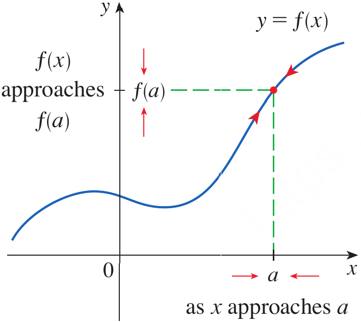

<strong>Figure 1.</strong> A graph illustrating that $\lim_{x\to a}f(x)=f(a)$ for a function continuous at $a$.

* A function is discontinuous at $a$ if any of the conditions required for continuity fails.

## Example 1 {.green}

Figure 2 shows the graph of a function $f$. At which numbers is $f$ discontinuous?

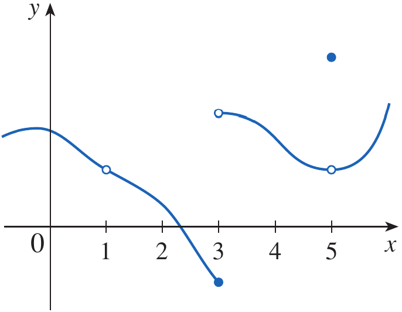

<strong>Figure 2.</strong> Graph illustrating discontinuities of a function at $x=1$, $x=3$, and $x=5$.

## Solution {.green}

At $x=1$, the graph has a break and $f(1)$ is not defined.

Therefore, $f$ is discontinuous at $x=1$.

At $x=3$, the function is defined, but the left-hand and right-hand limits are different.

$$
\lim_{x\to3^-}f(x)\neq\lim_{x\to3^+}f(x)
$$

Therefore, $\lim_{x\to3}f(x)$ does not exist, so $f$ is discontinuous at $x=3$.

At $x=5$, the limit exists, but the limiting value is different from the actual function value.

$$
\lim_{x\to5}f(x)\neq f(5)
$$

Therefore, $f$ is discontinuous at $x=5$.

Hence, the function is discontinuous at

$$
\boxed{x=1,\;3,\;5}
$$

$\blacksquare$

## Types of Discontinuities

* The preceding example illustrates three ways in which continuity can fail.

* A **removable discontinuity** occurs when the limit exists but either the function is not defined at the point or its value is different from the limit.

* A **jump discontinuity** occurs when the left-hand and right-hand limits exist but are different.

* An **infinite discontinuity** occurs when the function becomes unbounded near a point.

* These types can be recognized from the behavior of the graph.

## Example 2 {.green}

Where are each of the following functions discontinuous?

**(a)**

$$
f(x)=\frac{x^2-x-2}{x-2}
$$

**(b)**

$$
f(x)=
\begin{cases}
\dfrac{x^2-x-2}{x-2} & x\neq2\\
1 & x=2
\end{cases}
$$

**(c)**

$$
f(x)=
\begin{cases}
\dfrac{1}{x^2} & x\neq0\\
1 & x=0
\end{cases}
$$

**(d)**

$$
f(x)=[x]
$$

## Solution {.green}

**(a)**

The denominator is zero when $x=2$.

$$
x-2=0
$$

Therefore, $f(2)$ is not defined.

Hence, the function is discontinuous at

$$
\boxed{x=2}
$$

**(b)**

Here $f(2)=1$ is defined.

For $x\neq2$,

$$
\frac{x^2-x-2}{x-2}
=
\frac{(x-2)(x+1)}{x-2}
=
x+1
$$

Therefore,

$$
\lim_{x\to2}f(x)
=
\lim_{x\to2}(x+1)
=
3
$$

Since

$$
\lim_{x\to2}f(x)\neq f(2)
$$

the function is discontinuous at

$$
\boxed{x=2}
$$

This is a removable discontinuity.

**(c)**

Although $f(0)=1$ is defined,

$$
\lim_{x\to0}\frac1{x^2}=\infty
$$

Therefore, the limit is not a finite number and the function is discontinuous at

$$
\boxed{x=0}
$$

This is an infinite discontinuity.

**(d)**

The greatest integer function has a jump at every integer.

Therefore, it is discontinuous at every integer.

$$
\boxed{x\in\mathbb Z}
$$

The corresponding graphs illustrate removable, infinite, and jump discontinuities.

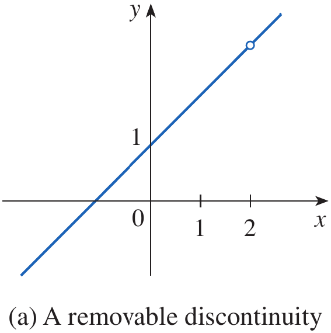

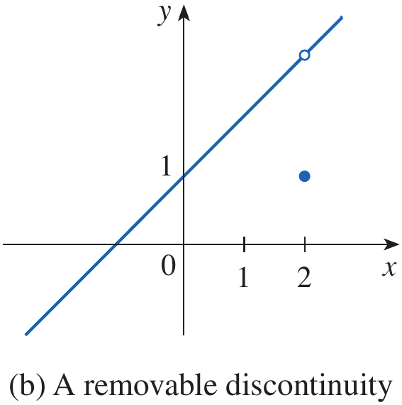

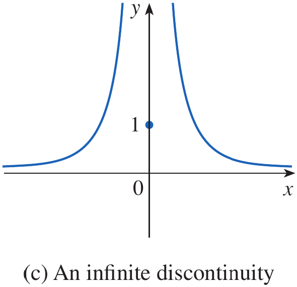

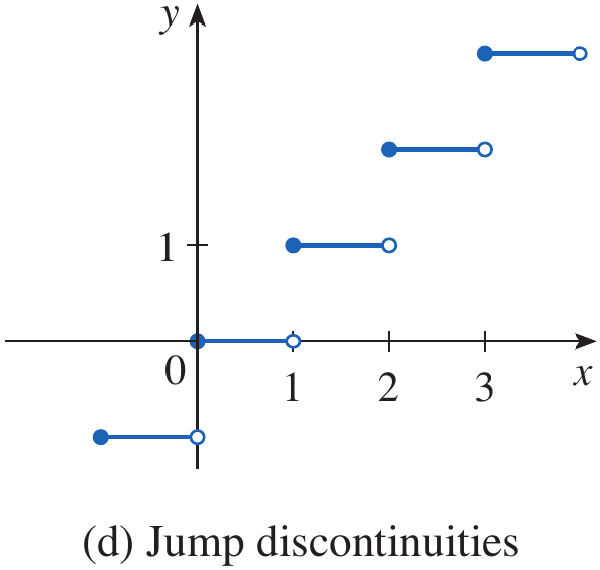

<strong>Figure 3.</strong> Graphs illustrating a removable discontinuity, an infinite discontinuity, and jump discontinuities.

$\blacksquare$

## Continuity from One Side

* At an endpoint of an interval, a function may be defined only on one side.

* This leads naturally to one-sided continuity.

## Definition: Continuity from the Right and Left {.blue}

A function $f$ is continuous from the right at $a$ if

$$
\lim_{x\to a^+}f(x)=f(a)
$$

A function $f$ is continuous from the left at $a$ if

$$
\lim_{x\to a^-}f(x)=f(a)
$$

$\blacksquare$

## Example 3 {.green}

At each integer $n$, the function $f(x)=[x]$ is continuous from the right but not from the left.

## Solution {.green}

At an integer $n$, the greatest integer function satisfies

$$
\lim_{x\to n^+}[x]=n=f(n)
$$

Therefore, $f$ is continuous from the right at every integer.

From the left,

$$
\lim_{x\to n^-}[x]=n-1
$$

Since

$$
n-1\neq n=f(n)
$$

the function is not continuous from the left at an integer.

$\blacksquare$

## Continuity on an Interval

## Definition: Continuity on an Interval {.blue}

A function $f$ is continuous on an interval if it is continuous at every number in the interval.

If the interval contains an endpoint where the function is defined on only one side, continuity at that endpoint means continuity from the appropriate side.

$\blacksquare$

## Example 4 {.green}

Show that the function

$$
f(x)=1-\sqrt{1-x^2}
$$

is continuous on the interval $[-1,1]$.

## Solution {.green}

Let $-1<a<1$.

Using the Limit Laws,

$$
\begin{aligned}
\lim_{x\to a}f(x)
&=\lim_{x\to a}\left(1-\sqrt{1-x^2}\right)\\
&=1-\lim_{x\to a}\sqrt{1-x^2}\\
&=1-\sqrt{\lim_{x\to a}(1-x^2)}\\
&=1-\sqrt{1-a^2}\\
&=f(a)
\end{aligned}
$$

Therefore, $f$ is continuous at every $a$ with $-1<a<1$.

At the left endpoint,

$$
\lim_{x\to-1^+}f(x)=f(-1)
$$

At the right endpoint,

$$
\lim_{x\to1^-}f(x)=f(1)
$$

Therefore, $f$ is continuous on

$$
\boxed{[-1,1]}
$$

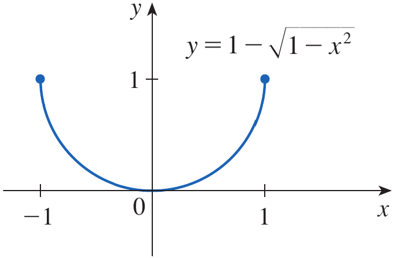

<strong>Figure 4.</strong> Graph of $y=1-\sqrt{1-x^2}$ showing continuity on $[-1,1]$.

$\blacksquare$

# Quick Check

## Question 1 {.red}

For a function to be continuous at $x=a$, must $f(a)$ be defined?

## Question 2 {.red}

Suppose

$$
\lim_{x\to2}f(x)=5
$$

but

$$
f(2)=7
$$

Is $f$ continuous at $x=2$?

$\blacksquare$

# Objective 2: Properties of Continuous Functions

## Algebraic Properties of Continuous Functions

* It is often unnecessary to use the definition of continuity every time we want to determine whether a function is continuous.

* Instead, we can use properties that allow us to construct new continuous functions from functions that are already known to be continuous.

## Theorem {.orange}

If $f$ and $g$ are continuous at $a$ and $c$ is a constant, then the following functions are also continuous at $a$:

1. $f+g$

2. $f-g$

3. $cf$

4. $fg$

5. $\dfrac{f}{g}$ if $g(a)\neq0$

## Proof {.orange}

Since $f$ and $g$ are continuous at $a$,

$$
\lim_{x\to a}f(x)=f(a)
$$

and

$$
\lim_{x\to a}g(x)=g(a)
$$

For the sum,

$$
\begin{aligned}
\lim_{x\to a}(f+g)(x)
&=\lim_{x\to a}[f(x)+g(x)]\\
&=\lim_{x\to a}f(x)+\lim_{x\to a}g(x)\\
&=f(a)+g(a)\\
&=(f+g)(a)
\end{aligned}
$$

Therefore, $f+g$ is continuous at $a$.

The other four results follow from the corresponding Limit Laws.

$\blacksquare$

## Polynomial and Rational Functions

## Theorem {.orange}

Every polynomial function is continuous everywhere.

Therefore, if

$$
P(x)=a_nx^n+\cdots+a_1x+a_0
$$

then $P$ is continuous on

$$
\boxed{\mathbb R}
$$

A rational function is continuous wherever it is defined.

If

$$
f(x)=\frac{P(x)}{Q(x)}
$$

where $P$ and $Q$ are polynomials, then $f$ is continuous at every point where

$$
Q(x)\neq0
$$

$\blacksquare$

## Example 5 {.green}

Find

$$
\lim_{x\to-2}\frac{x^3+2x^2-1}{5-3x}
$$

## Solution {.green}

The function

$$
f(x)=\frac{x^3+2x^2-1}{5-3x}
$$

is rational and therefore continuous wherever its denominator is nonzero.

At $x=-2$,

$$
5-3(-2)=11\neq0
$$

Hence, we can use continuity and direct substitution.

$$
\begin{aligned}
\lim_{x\to-2}\frac{x^3+2x^2-1}{5-3x}
&=
\frac{(-2)^3+2(-2)^2-1}{5-3(-2)}\\
&=\frac{-8+8-1}{11}\\
&=-\frac1{11}
\end{aligned}
$$

$$
\boxed{-\frac1{11}}
$$

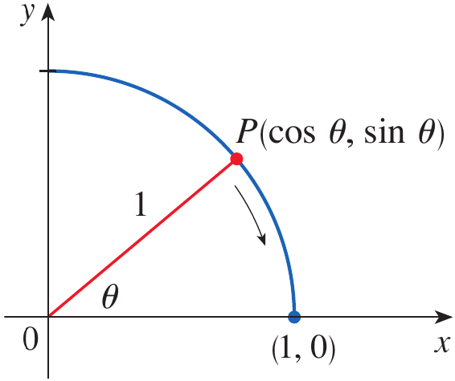

<strong>Figure 5.</strong> Geometric illustration used in Stewart to discuss continuity of the square-root expression.

$\blacksquare$

## Continuity of Familiar Functions

* Many familiar functions are continuous at every number in their domains.

* These include polynomial functions, rational functions, root functions, trigonometric functions, inverse trigonometric functions, exponential functions, and logarithmic functions.

* The following types of functions are continuous at every number in their domains:

    * polynomial functions

    * rational functions

    * root functions

    * trigonometric functions

    * inverse trigonometric functions

    * exponential functions

    * logarithmic functions

* For example, $\tan x$ is continuous wherever it is defined.

* Since

$$
\tan x=\frac{\sin x}{\cos x}
$$

* In this function, possible discontinuities occur where

$$
\cos x=0
$$

* Thus, the vertical asymptotes occur at

$$
x=\frac{\pi}{2}+n\pi
$$

* In the above relation, $n\in\mathbb Z$.

## Example 6 {.green}

Where is the function

$$
f(x)=\frac{\ln x+\tan^{-1}x}{x^2-1}
$$

continuous?

## Solution {.green}

The functions $\ln x$ and $\tan^{-1}x$ are continuous on their domains.

Since $\ln x$ requires

$$
x>0
$$

the numerator is continuous for $x>0$.

The denominator $x^2-1$ is zero when

$$
x^2-1=0
$$

which gives

$$
x=\pm1
$$

Because the domain already requires $x>0$, only $x=1$ must be excluded.

Therefore, $f$ is continuous on

$$
\boxed{(0,1)\cup(1,\infty)}
$$

$\blacksquare$

## Continuity and Limits

* Continuity can make the evaluation of limits much easier.

* If $f$ is continuous at $a$, then by definition,

$$
\lim_{x\to a}f(x)=f(a)
$$

* Thus, once continuity is established, the limit can often be found simply by evaluating the function.

## Example 7 {.green}

Evaluate

$$
\lim_{x\to\pi}\frac{\sin x}{2+\cos x}
$$

## Solution {.green}

The function $\sin x$ is continuous everywhere.

The function $2+\cos x$ is also continuous everywhere.

Moreover,

$$
2+\cos x\geq1
$$

Therefore, the denominator is never zero.

Hence,

$$
f(x)=\frac{\sin x}{2+\cos x}
$$

is continuous everywhere.

Therefore,

$$
\begin{aligned}
\lim_{x\to\pi}\frac{\sin x}{2+\cos x}
&=
\frac{\sin\pi}{2+\cos\pi}\\
&=\frac{0}{1}\\
&=0
\end{aligned}
$$

$$
\boxed{0}
$$

$\blacksquare$

## Continuity of Composite Functions

* Another important way of constructing functions is by composition.

* Suppose

$$
h(x)=f(g(x))
$$

* If $g$ is continuous at $a$ and $f$ is continuous at $g(a)$, then the composition $f\circ g$ is continuous at $a$.

## Theorem {.orange}

If $g$ is continuous at $a$ and $f$ is continuous at $g(a)$, then the composite function

$$
(f\circ g)(x)=f(g(x))
$$

is continuous at $a$.

$\blacksquare$

* This result is often summarized by saying that a continuous function of a continuous function is continuous.

## Example 8 {.green}

Evaluate

$$
\lim_{x\to1}\arcsin\left(\frac{1-\sqrt{x}}{1-x}\right)
$$

## Solution {.green}

Since $\arcsin x$ is continuous on its domain, we first determine the limit of the expression inside it.

Factor the denominator:

$$
1-x=(1-\sqrt{x})(1+\sqrt{x})
$$

Therefore, for $x\neq1$,

$$
\frac{1-\sqrt{x}}{1-x}
=
\frac{1}{1+\sqrt{x}}
$$

Hence,

$$
\begin{aligned}
\lim_{x\to1}\arcsin\left(\frac{1-\sqrt{x}}{1-x}\right)
&=
\arcsin\left(
\lim_{x\to1}\frac{1}{1+\sqrt{x}}
\right)\\
&=\arcsin\left(\frac12\right)\\
&=\frac{\pi}{6}
\end{aligned}
$$

$$
\boxed{\frac{\pi}{6}}
$$

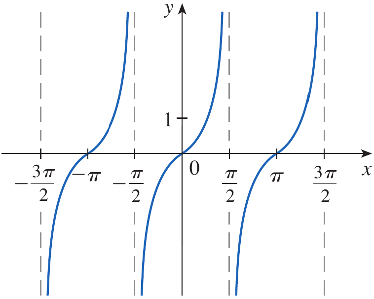

<strong>Figure 6.</strong> Graph of $y=\tan x$ showing its vertical asymptotes.

$\blacksquare$

# Quick Check

## Question 1 {.red}

Is the function

$$
f(x)=\frac{x^2+1}{x-3}
$$

continuous at $x=2$?

## Question 2 {.red}

On which intervals is

$$
f(x)=\frac1{x^2-4}
$$

continuous?

$\blacksquare$

# Objective 3: The Intermediate Value Theorem

## The Idea Behind the Intermediate Value Theorem

* A continuous function cannot jump from one value to another without passing through every intermediate value.

* For example, suppose a continuous function has values $f(a)$ and $f(b)$ at the endpoints of an interval.

* If a number $N$ lies between these two values, continuity guarantees that the function takes the value $N$ somewhere between $a$ and $b$.

## Theorem: Intermediate Value Theorem {.orange}

Suppose that $f$ is continuous on the closed interval $[a,b]$ and let $N$ be any number between $f(a)$ and $f(b)$.

Then there exists a number $c$ in $(a,b)$ such that

$$
\boxed{f(c)=N}
$$

$\blacksquare$

* The theorem therefore guarantees the existence of at least one point at which the function takes the intermediate value.

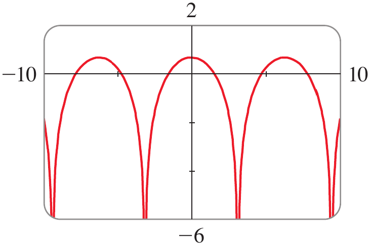

<strong>Figure 7.</strong> Graph of a continuous function illustrating the Intermediate Value Theorem.

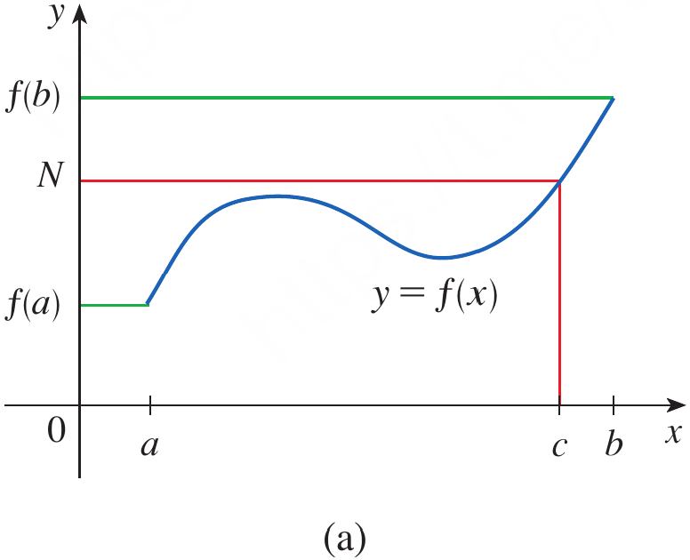

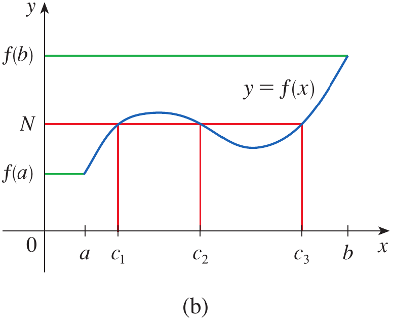

<strong>Figure 8.</strong> Graphical illustrations showing a continuous function taking an intermediate value once or more than once.

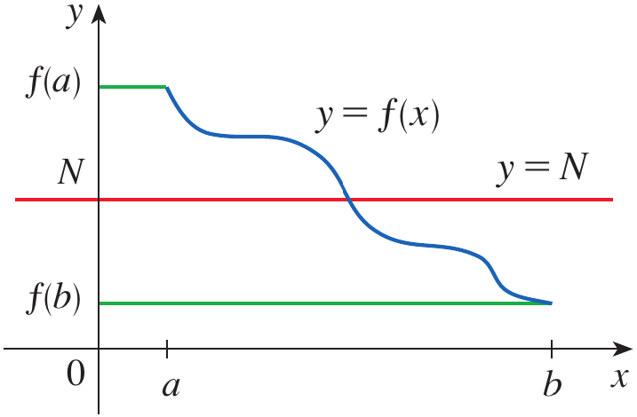

<strong>Figure 9.</strong> Illustration showing that a continuous function cannot jump over the horizontal line $y=N$.

## Using the Intermediate Value Theorem to Locate a Root

* A particularly useful application occurs when we want to determine whether an equation $f(x)=0$ has a solution.

* If $f$ is continuous on $[a,b]$ and $f(a)<0$ while $f(b)>0$ then $0$ lies between $f(a)$ and $f(b)$.

* Therefore, the Intermediate Value Theorem guarantees a number $c\in(a,b)$ such that

$$
f(c)=0
$$

* This means that the equation has at least one solution in the interval.

## Example 9 {.green}

Where are the following functions continuous?

**(a)**

$$
h(x)=\sin(x^2)
$$

**(b)**

$$
F(x)=\ln(1+\cos x)
$$

## Solution {.green}

**(a)**

Let

$$
g(x)=x^2
$$

and

$$
f(x)=\sin x
$$

The polynomial $g(x)=x^2$ is continuous everywhere.

The sine function is also continuous everywhere.

Therefore, by the theorem on composite functions,

$$
h(x)=\sin(x^2)
$$

is continuous for all real numbers.

$$
\boxed{(-\infty,\infty)}
$$

**(b)**

The function $\cos x$ is continuous everywhere.

Therefore,

$$
1+\cos x
$$

is continuous everywhere.

The logarithm is continuous for positive arguments.

Thus, we require

$$
1+\cos x>0
$$

Since

$$
1+\cos x=0
$$

when

$$
\cos x=-1
$$

this occurs at

$$
x=\pm\pi,\pm3\pi,\pm5\pi,\ldots
$$

Therefore, $F$ is continuous everywhere in its domain and discontinuous at the odd multiples of $\pi$.

$$
\boxed{x=(2n+1)\pi,\qquad n\in\mathbb Z}
$$

$\blacksquare$

## Example 10 {.green}

Show that there is a solution of the equation

$$
4x^3-6x^2+3x-2=0
$$

between $1$ and $2$.

## Solution {.green}

Define

$$
f(x)=4x^3-6x^2+3x-2
$$

Since $f$ is a polynomial, it is continuous everywhere.

In particular, $f$ is continuous on $[1,2]$.

Evaluate the function at the endpoints.

$$
f(1)=4-6+3-2=-1<0
$$

and

$$
f(2)=32-24+6-2=12>0
$$

Therefore,

$$
f(1)<0<f(2)
$$

Hence, $0$ lies between $f(1)$ and $f(2)$.

By the Intermediate Value Theorem, there exists some $c\in(1,2)$ such that

$$
f(c)=0
$$

Therefore, the equation has at least one solution between $1$ and $2$.

$$
\boxed{\text{At least one solution exists in }(1,2)}
$$

The same reasoning can then be used with smaller intervals to locate the solution more precisely.

For example,

$$
f(1.2)=-0.128<0
$$

and

$$
f(1.3)=0.548>0
$$

Therefore, a solution lies between $1.2$ and $1.3$.

Further refinement gives

$$
f(1.22)=-0.007008<0
$$

and

$$
f(1.23)=0.056068>0
$$

Hence, a solution lies between $1.22$ and $1.23$.

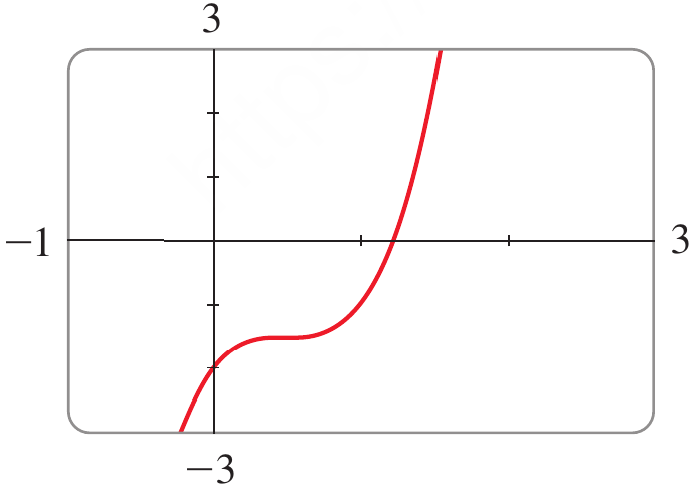

<strong>Figure 10.</strong> Graph of $f(x)=4x^3-6x^2+3x-2$ showing a zero between $1$ and $2$.

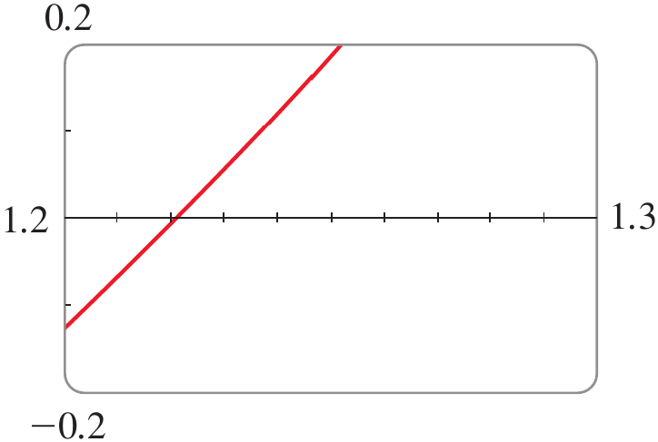

<strong>Figure 11.</strong> Enlarged graph showing the zero between $1.2$ and $1.3$.

$\blacksquare$

# Quick Check

## Question 1 {.red}

Suppose $f$ is continuous on $[1,4]$ and

$$
f(1)=2
$$

and

$$
f(4)=8
$$

Can we conclude that there is some $c\in(1,4)$ such that

$$
f(c)=5
$$

## Question 2 {.red}

Suppose $f$ is continuous on $[0,2]$ and

$$
f(0)=3
$$

and

$$
f(2)=7
$$

Can the Intermediate Value Theorem guarantee a value $c\in(0,2)$ such that $f(c)=10$?

$\blacksquare$

# Scenario Problem

## Problem {.green}

A mechatronic positioning system uses a continuous error model

$$
E(x)=4x^3-6x^2+3x-2
$$

where $x$ represents a normalized controller setting and $E(x)$ represents the positioning error.

The controller must operate at a setting where the positioning error is exactly zero.

Show that such a controller setting exists between $x=1$ and $x=2$.

## Solution {.green}

The error function is a polynomial.

Therefore, it is continuous on the entire real line and, in particular, on $[1,2]$.

At $x=1$,

$$
E(1)=4-6+3-2=-1
$$

At $x=2$,

$$
E(2)=32-24+6-2=12
$$

Therefore,

$$
E(1)<0<E(2)
$$

Since $E$ is continuous on $[1,2]$, the Intermediate Value Theorem guarantees that there exists some $c\in(1,2)$ such that

$$
E(c)=0
$$

Thus, the mathematical model guarantees that a controller setting producing zero positioning error exists between $1$ and $2$.

$$
\boxed{\text{A zero-error controller setting exists in }(1,2)}
$$

$\blacksquare$

# Summary

* A function is continuous at $a$ when its limit as $x$ approaches $a$ exists and equals its actual value $f(a)$.

* Continuity requires that $f(a)$ be defined, $\lim_{x\to a}f(x)$ exist, and $\lim_{x\to a}f(x)=f(a)$.

* A function may have a removable, jump, or infinite discontinuity when one or more requirements for continuity fails.

* Continuity from the right and left is determined using the corresponding one-sided limits.

* A function is continuous on an interval when it is continuous at every point of the interval, with appropriate one-sided continuity at endpoints.

* Sums, differences, constant multiples, products, and suitable quotients of continuous functions are continuous.

* Polynomial functions are continuous everywhere, while rational functions are continuous wherever their denominators are nonzero.

* Many familiar functions, including root, trigonometric, inverse trigonometric, exponential, and logarithmic functions, are continuous at every point in their domains.

* The composition of continuous functions is continuous when the required domains are satisfied.

* The Intermediate Value Theorem guarantees that a continuous function takes every value between its endpoint values and can therefore be used to establish the existence of solutions of equations.

# Exercises

## Exercises Set 1

Sove the odd number exercises from exercise 1 to 76.

* Exercises help transform theoretical concepts into practical understanding.

* Mathematics is learned by doing and solving exercises will train you to analyze problems, select appropriate methods, and construct logical solutions.

* Attempting problems sometimes leads to mistakes which provide opportunities for learning and improvement.

* Regular practice increases speed, accuracy, and confidence.

* Exercises are given in the Exercises file and you are expected to solve them on your own.
