# Calculus and Analytical Geometry

## Derivatives

### Dr. Aamir Alaud Din

# Derivatives in General

- Consider the general function

$$
y = f(x)  \qquad (1)
$$

- A point $(x, y)$ is shown on the graph.


<div style="text-align: center;">
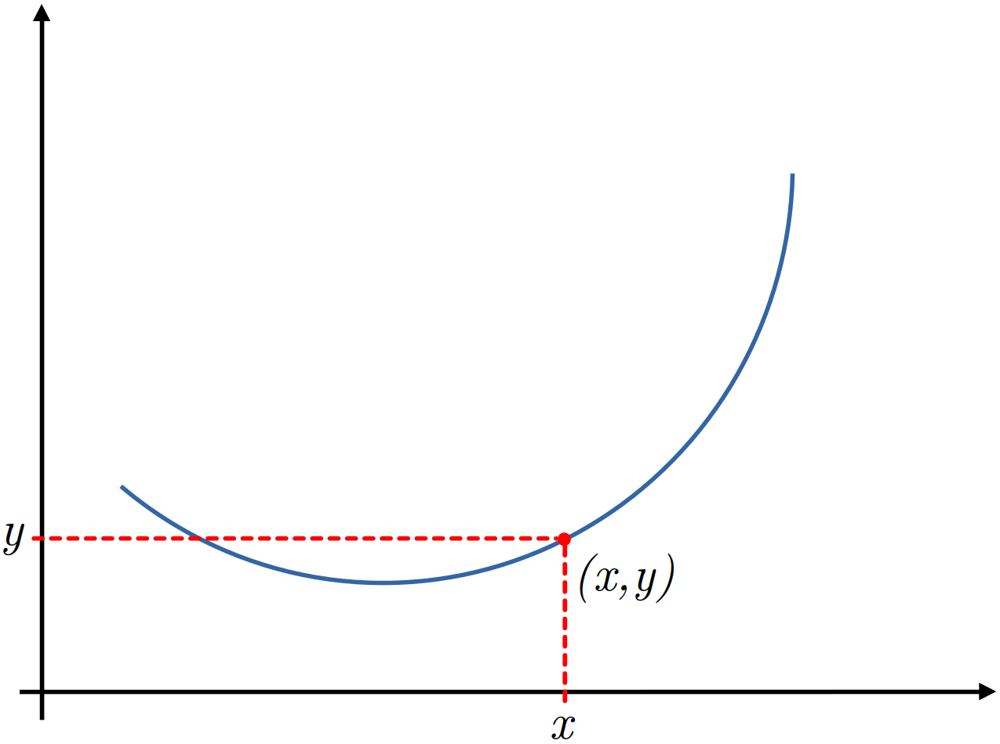

<span><strong>Figure 1.</strong> Graph of $y=\sin x$ and the point $(x,y)$ on the graph.</span>
</div>


- We are interested in finding the instantaneous change in $y$ with respect to $x$.

- Before looking into the instantaneous change, we look into the change in $y$ as $x$ changes.

- This change can be computed as shown below.

$$
y + \Delta y = f(x + \Delta x) \qquad (2)
$$


<div style="text-align: center;">
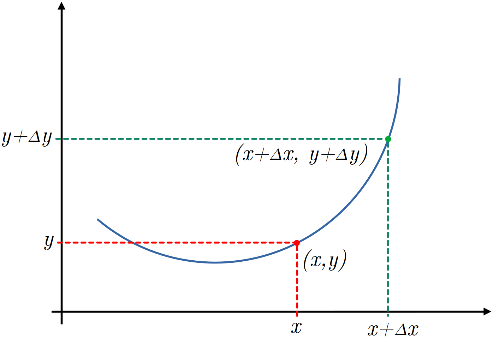

<span><strong>Figure 2.</strong> Graph of $y=\sin x$ with two points shown on the graph.</span>
</div>


- We are interested in finding the change in $y$ $\left( \Delta y \right)$ per unit change in $x$ $\left( \Delta x \right)$ _i.e.,_ how much $y$ changes per unit change in $x$ $\left( \frac{\Delta y}{\Delta x} \right)$.

- Therefore, we modify $(2)$  as shown  below.

$$
\begin{align}
\Delta y &= f(x  + \Delta x) - y \\
&= f(x  + \Delta x) - f(x) \qquad \qquad \qquad (\text{Using equation }(1))
\end{align}
$$

- In order to arrive at $\frac{\Delta y}{\Delta x}$,  we  divide both  sides of  above equation.

$$
\frac{\Delta y}{\Delta x} = \frac{f(x + \Delta x) - f(x)}{\Delta x}
$$

-  We can modify the denominator of the above equations  as shown below.

$$
\frac{\Delta y}{\Delta x} = \frac{f(x + \Delta x) - f(x)}{(x  + \Delta  x) - \Delta x} \qquad (3) 
$$


<div style="text-align: center;">
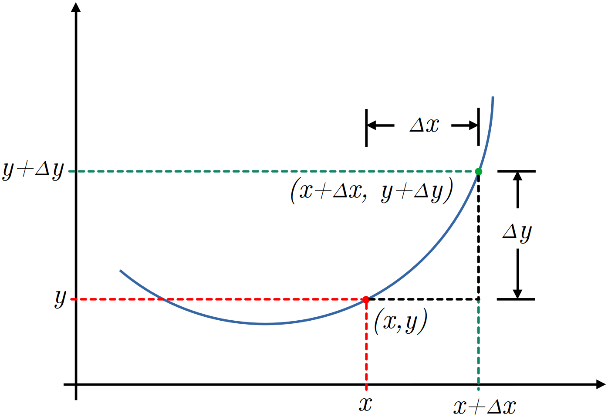

<span><strong>Figure 3.</strong> Graph of $y=\sin x$ with changes $\Delta x$ and $\Delta y$.</span>
</div>


- Let

$$
\begin{align}
y_1  &=  f(x) \\
y_2 &= f(x +  \Delta  x)  \\
x_1  &= \Delta x \\
x_2  &= x + \Delta x
\end{align}
$$

- Using the above four relations, we can write equation $(3)$ as follows.

$$
\frac{\Delta y}{\Delta x} = \frac{f(x + \Delta x) - f(x)}{(x  + \Delta  x) - \Delta x} = \frac{y_2 - y_1}{x_2 - x_1} \qquad (4) 
$$

- It means, equation $(3)$ represents the  slope of the line.

- Note that the  points on the right  hand side  of equation $(3)$ are the coordinates of points $P$ and $Q$ in figure 2.

- These points intersect at two different points on the graph, therefore the line passing through these points is the secant line and the slope of the line in equation $(3)$ or $(4)$ is the slope of the secant line.


<div style="text-align: center;">
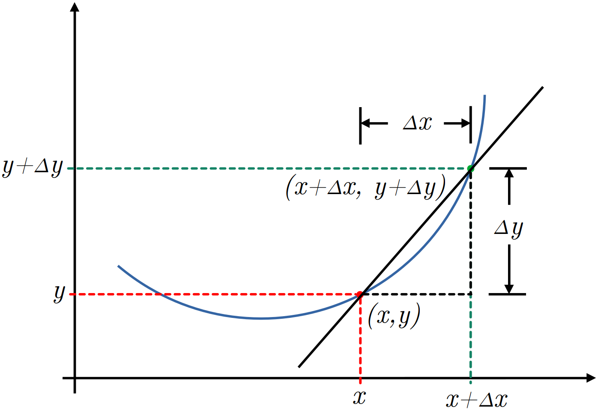

<span><strong>Figure 4.</strong> Graph of $y=\sin x$ and the secant line through two points.</span>
</div>

- In real physical world, we deal  with problems involving continuously varying quantities and in these problems  we need  instantaneous changes in the dependent variable with respect to  (per unit change) the independent  variable.

- Let's represent the small change with $\delta$ and  this  change is so small that $\delta \rightarrow 0$.

- Therefore, we modify equation $(3)$  as shown below.

$$
\lim_{\delta x \rightarrow 0} \frac{\delta y}{\delta x} = \lim_{\delta x \rightarrow 0} \frac{f(x + \delta x) -  f(x)}{\delta x} \qquad (5)
$$

- Since $\delta x \rightarrow 0$,  it means the points $x$  and  $x + \delta x$  are very close  such that

$$
(x + \delta x) - x \approx 0
$$

- It confirms that point $P$  approaches  point  $Q$ and therefore secant line becomes the tangent line as shown in figure.

- This gives the instantaneous change.

- In short form we write

$$
\lim_{\delta x \rightarrow 0} \frac{\delta y}{\delta x} = \frac{dy}{dx}
$$

- So, finally we can write the slope of tangent line (equation $(5)$) as given below.

$$
\frac{dy}{dx} = \lim_{\delta x \rightarrow 0} \frac{f(x + \delta x) -  f(x)}{\delta x} \qquad (6)
$$

- Suppose the angle between the tangent line with the horizontal is $\theta$, then the angle between the tangent line and the line $\delta x$ is also $\theta$, however the triangle is a micro triangle.

- In the micro triangle, we have the following trigonometric identity.

$$
\tan \theta = \frac{f(x + \delta x) - f(x)}{\delta x}
$$

- Since $\delta x \rightarrow 0$, we can rewrite the above equation as shown below.

$$
\tan \theta = \lim_{\delta x \rightarrow 0} \frac{f(x + \delta x) - f(x)}{\delta x} \qquad (7)
$$

- Equations (6) and (7) confirm the following identity.

$$
\tan \theta = \frac{dy}{dx}
$$

- This is because, $\tan \theta$ is also the slope of line (hypotenuse).

- Finally, equation $(6)$ says that we can find derivative along the curve, but in real world problems we need derivatives at fixed points _e.g.,_ at $t = 5$ or $x=3$ etc.

# Derivatives in Real World

## The First Derivative

- Consider the following simple trigonometric function.

$$
y = \sin x
$$

- The first derivative of this function is

$$
\frac{dy}{dx} = \cos x
$$

- Instead of using the first principle, we are interested in derivatives at fixed points.

- For a complete understanding, we consider the following points.

$$
x = \frac{\pi}{4}, \frac{\pi}{2}, \frac{3\pi}{4}, \frac{5\pi}{4}, \frac{3\pi}{2}, \frac{7\pi}{4}
$$

### Case-I: $\mathbf{x = \frac{\pi}{4}}$

- For $x = \pi/4$,

$$
y = \sin (\pi/4) = 0.707
$$

- So, the point is $(x, y) = (\pi/4, 0.707)$.

- Now,

$$
m = \frac{dy}{dx} = \cos x = \cos (\pi/4) = 0.707
$$

- Using the point $(\pi/4, 0.707)$ slope $(0.707)$ form, we can find the $y$-intercept as given below.

$$
y - y_1 = m(x - x_1)
$$

$$
y - 0.707 = 0.707 (x - \pi/4)
$$

- On $y$-axis, $x=0$, therefore

$$
y - 0.707 = -0.707(\pi/4)
$$

$$
y = 0.707 -0.707(\pi/4) = 0.1513 = c
$$

- Now, we can write the equation of line.

$$
y = 0.707x + 0.1513
$$

- At $x=0$, $y = 0.1513$ and at $x=\pi/2$, $y=1.262$.

- Therefore, we have two points $(x_1, y_1) = (0, 0.1513)$ and $(x_2, y_2) = (\pi/2, 1.262)$.

- Joining these two points will automatically draw the tangent to the graph of $y=\sin x$ at $x=\pi/4$.

<div style="text-align: center;">


<span><strong>Figure 5.</strong> Tangent to $y=\sin x$ at $x=\pi/4$.</span>
</div>

- A Python program to draw tangent line at any point on the graph of $y=\sin x$ is shown below.

```python
import numpy as np
import matplotlib.pyplot as plt

def func(x):
    return np.sin(x)

def dydx(x):
    return np.cos(x)

def newy(x, m, c):
    return m*x + c

x = np.linspace(0, 2*np.pi, 1000)
y = func(x)

x1 = np.deg2rad(float(input("Enter the angle (in degrees): ")))
y1 = func(x1)

m = dydx(x1)

c = y1 - m*x1

xl = x1 - np.pi/4
xh = x1 + np.pi/4

yl = newy(xl, m, c)
yh = newy(xh, m, c)

plt.figure(figsize=(8, 6))
plt.plot(x, y, '-k')
plt.plot([xl, xh], [yl, yh], '--r')
plt.plot([-0.10, 2*np.pi],[0, 0], '-b')
plt.plot([0, 0], [-1.1, 1.1], '-b')
plt.scatter(x1, y1, s=50, c='r')
plt.xlim([-0.10, 2*np.pi])
plt.ylim([-1.1, 1.1])
plt.xlabel(r'$\theta$', size=14, weight='bold')
plt.ylabel('Functions', size=14, weight='bold')
plt.xticks(size=14, weight='bold')
plt.yticks(size=14, weight='bold')
plt.grid(axis='both')
plt.tight_layout()
plt.show()
```

- We see that the slope of the tangent line at $x=\pi/4$ is $m=0.707$.

- We want to confirm this slope using $\tan \theta$.

- We can find $\theta$ using dot product.

- Let's first find out the vectors.

- One point on the tangent line is the $y$-intercept and the coordinates of this point are $(0.0, 0.1513)$.

- The second point on the tangent line is $(x_2 = \pi/2, y_2 = 0.707*\pi/2 + 0.1513) = (1.5708, 1.2619)$.

- The vector, say $\mathbf a$ formed by these two points is $\mathbf a = \langle 1.5708-0.0, 1.2619-0.1513 \rangle = \langle 1.5708, 1.1106 \rangle$.

- The vector $\mathbf b$ can be drawn with $(0, 0)$ and any point on $x$-axis _e.g.,_ $(\pi/2, 0.0) = (1.5708, 0.0)$.

- The vector formed by these two points is $\mathbf b = \langle 1.5708-0, 0.0-0.0 \rangle = \langle 1.5708, 0.0 \rangle$.

- Using the two vectors $\mathbf a = 1.5708 \mathbf i + 1.1106 \mathbf j$ and $\mathbf b = 1.5708 \mathbf i + 0 \mathbf j$, we can find the angle between these two vectors (tangent line and $x$-axis) using dot product.

- So,

$$
\theta = \cos ^{-1} \frac{\mathbf a \cdot \mathbf b}{|\mathbf a| |\mathbf b|}
$$

- So, we get

$$
\theta = \cos ^{-1} \frac{(1.5708 \mathbf i + 1.1106 \mathbf j)\cdot(1.5708 \mathbf i + 0 \mathbf j)}{\sqrt{1.5708^2 + 1.1106^2} \sqrt{1.5708^2 + 0^2}} = 0.615427 \text{ radian}
$$

- Finally, we get the slope using $\tan$ function as below.

$$
m = \tan(0.615427) = 0.707
$$

- We see that slope obtained from derivative and trigonometry are the same.

- We can draw the tangent line as already discussed.

- The Python program to compute angle between the given vectors and then computing slope using $\tan \theta$ is given below.

```python
import numpy as np


m = np.cos(np.pi/4)
c = 0.1513

x1 = 0.0
y1 = m*x1 + c

x2 = np.pi/2
y2 = m*x2 + c

pi = np.array([x1, y1])
pf = np.array([x2, y2])

a = pf - pi

b = np.array([np.pi/2, 0.0])

adotb = np.dot(a, b)

am = np.linalg.norm(a)

bm = np.linalg.norm(b)

term = adotb/(am*bm)

theta = np.arccos(term)

print(np.tan(theta))
```

### Case-II: $\mathbf{x = \frac{\pi}{2}}$

- For $x=\pi/2$, $y=\sin \pi/2 = 1$.

- The slope at $x=\pi/2$ is

$$
m = \cos \pi/2 = 0
$$

- The $y$-intercept is

$$
y = mx + c \implies y = c = 1
$$

- Therefore the equation of tangent line at $x=\pi/2$ is

$$
y = 1
$$

- The slope at $x=\pi/2$ is shown below.

<div style="text-align: center;">


<span><strong>Figure 6.</strong> Tangent to $y=\sin x$ at $x=\pi/2$.</span>
</div>

### Case-III: $\mathbf{x=\frac{3\pi}{2}}$

- Calculate yourself.

<div style="text-align: center;">


<span><strong>Figure 7.</strong> Tangent to $y=\sin x$ at $x=3\pi/4$.</span>
</div>

### Case-IV: $\mathbf{x=\frac{5\pi}{4}}$

- Calculate yourself.

<div style="text-align: center;">


<span><strong>Figure 8.</strong> Tangent to $y=\sin x$ at $x=5\pi/4$.</span>
</div>

### Case-V: $\mathbf{x=\frac{3\pi}{2}}$

- Calculate yourself.

<div style="text-align: center;">


<span><strong>Figure 9.</strong> Tangent to $y=\sin x$ at $x=3\pi/2$.</span>
</div>

### Case-VI: $\mathbf{x=\frac{7\pi}{4}}$

- Calculate yourself.

<div style="text-align: center;">


<span><strong>Figure 10.</strong> Tangent to $y=\sin x$ at $x=7\pi/4$.</span>
</div>

## Shape of Curve with First Derivative

- The slope of tangent line gives the idea of the shape of curve at a point.

### Case-A: Positive Slope

- If the slope of tangent line is positive, the curve may have one of the following two shapes.

<div style="text-align: center;">
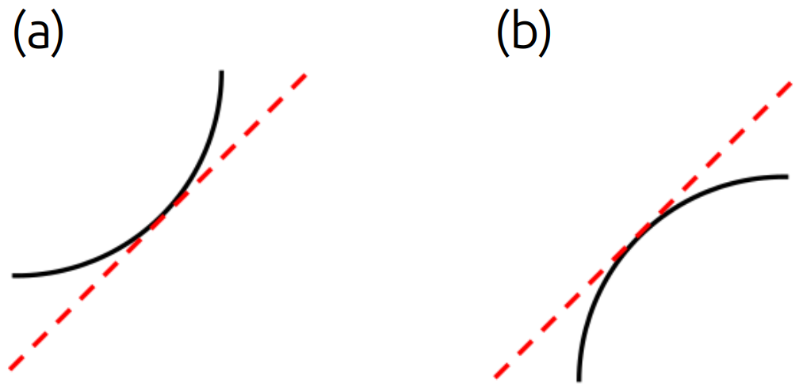

<span><strong>Figure 11.</strong> Shape of curve having positive slope.</span>
</div>

### Case-B: Negative Slope

- If the slope of tangent line is negative, the curve may have one of the following two shapes.


<div style="text-align: center;">
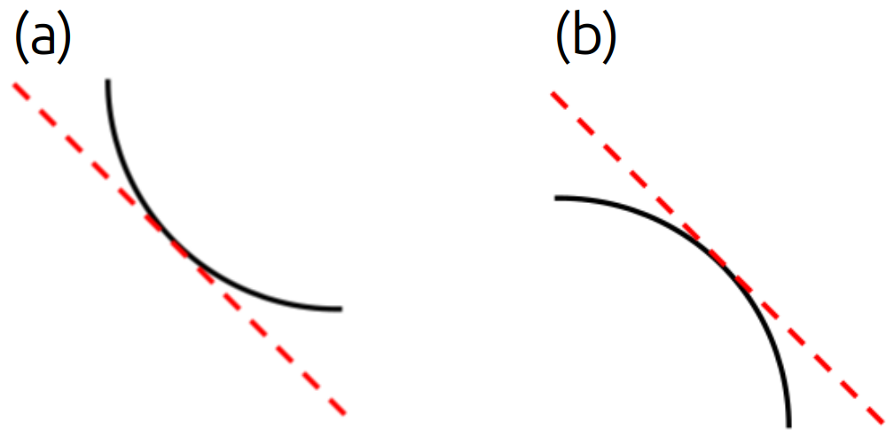

<span><strong>Figure 12.</strong> Shape of curve having negative slope.</span>
</div>

- Consider the standard normal distribution function

$$
f(x) = \frac{1}{\sqrt{2\pi}}e^{\frac{-x^2}{2}} \qquad (8)
$$

- What is the slope of tangent line at $x = -2.0$?

- In order to find the slope of tangent line to the curve of equation $(8)$, we find the derivative of $f(x)$ at $x=-2.0$.

$$
f^{\prime}(x) = -\frac{x}{\sqrt{2\pi}}e^{\frac{-x^2}{2}} \qquad (9)
$$

$$
f^{\prime}(x) \big|_{x=-2.0} = -\frac{(-2.0)}{\sqrt{2\pi}}e^{\frac{-(-2.0^2)}{2}} = 0.1080
$$

- The slope of tangent line to the curve of normal distribution function at $x=-2.5$ is positive $(0.1080)$.

- What will be the shape of curve at $x=-2.5$?

## The Second Derivative

- The second derivative of the standard normal distribution function is

$$
f^{\prime\prime}(x) = \frac{x^2-1}{\sqrt{2\pi}}e^{\frac{-x^2}{2}} \qquad (10)
$$

- This time, we calculate the second derivative at the following four points.

    1. $x=-2$
    2. $x=-0.4$
    3. $x=0.4$
    4. $x=2$

$$
f^{\prime\prime}(-2.0) = \frac{(-2.0)^2-1}{\sqrt{2\pi}}e^{\frac{-(-2.0)^2}{2}} = 0.1620
$$

$$
f^{\prime\prime}(-0.4) = \frac{(-0.4)^2-1}{\sqrt{2\pi}}e^{\frac{-(-0.4)^2}{2}} = -0.3093
$$

$$
f^{\prime\prime}(0.4) = \frac{(0.4)^2-1}{\sqrt{2\pi}}e^{\frac{-(0.4)^2}{2}} = -0.3093
$$

$$
f^{\prime\prime}(2.0) = \frac{(2.0)^2-1}{\sqrt{2\pi}}e^{\frac{-(2.0)^2}{2}} = 0.1620
$$

- Looking at the tangents at the above four points, we conclude the following points.

    - If the second derivative is positive at some point $x=a$, the curve will lie above the tangent line or in other words, the tangent line will be below the curve.

    - If the second derivative is negative at some point $x=a$, the curve will lie below the tangent line or in other words, the tangent line will be above the curve.

<div style="text-align: center;">
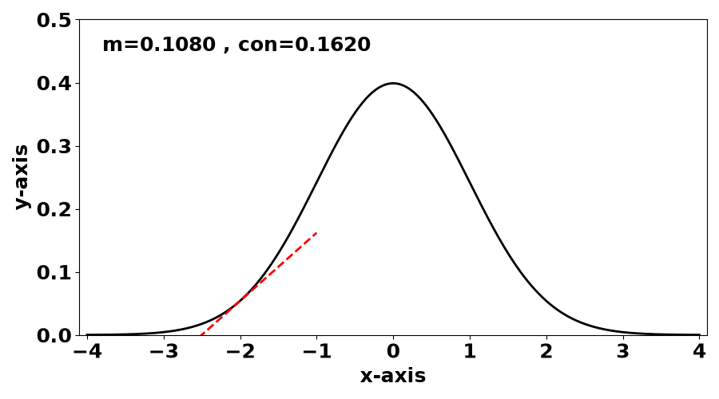

<span><strong>Figure 13.</strong> Slope and concavity at $x=-2$.</span>
</div>

<div style="text-align: center;">
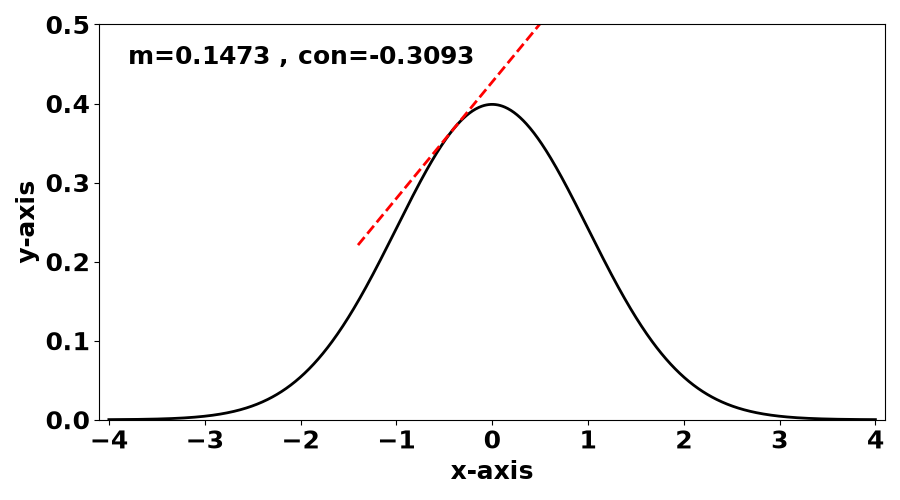

<span><strong>Figure 14.</strong> Slope and concavity at $x=-0.4$.</span>
</div>

<div style="text-align: center;">
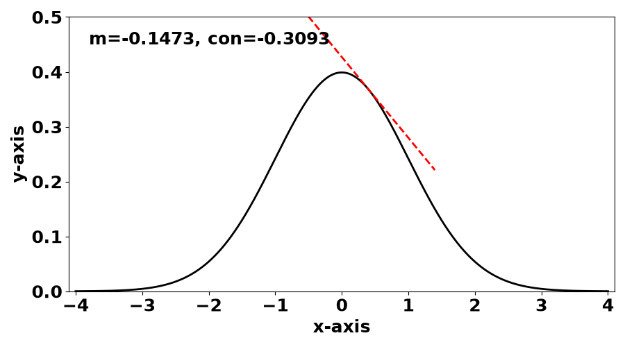

<span><strong>Figure 15.</strong> Slope and concavity at $x=0.4$.</span>
</div>

<div style="text-align: center;">
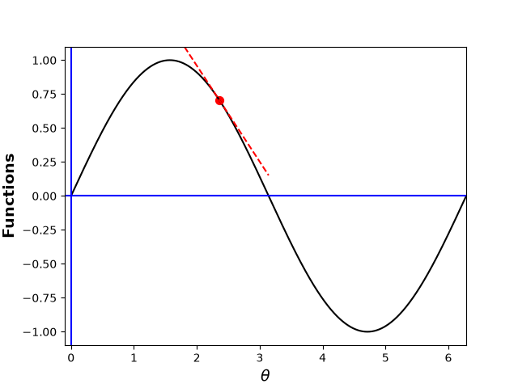

<span><strong>Figure 16.</strong> Slope and concavity at $x=2$.</span>
</div>

- The Python program used to draw figures 13 through 16 is as below.

```python
import numpy as np
import matplotlib.pyplot as plt

def snd(x):
    return 1/(np.sqrt(2*np.pi))*np.exp(-x**2/2)

def sndd(x):
    return -x/(np.sqrt(2*np.pi))*np.exp(-x**2/2)

def snddd(x):
    return (x**2 - 1)/(np.sqrt(2*np.pi))*np.exp(-x**2/2)

x = np.linspace(-4, 4, 1000)
y = snd(x)

xps = np.array([-2.0, -0.4, 0.4, 2.0])
yps = snd(xps)
mps = sndd(xps)
cops = snddd(xps)
cps = yps - mps*xps
print(mps)
print(cops)

for i in range(len(xps)):
    plt.figure(figsize=(9, 5))
    plt.plot(x, y, '-k', linewidth=2)
    plt.plot(
        [xps[i]-1, xps[i]+1],
        [mps[i]*(xps[i]-1)+cps[i], mps[i]*(xps[i]+1)+cps[i]],
        '--r',
        linewidth=2
    )
    plt.xlabel("x-axis", size=18, weight='bold')
    plt.ylabel("y-axis", size=18, weight='bold')
    plt.xticks(size=18, weight='bold')
    plt.yticks(size=18, weight='bold')
    plt.xlim([-4.1, 4.1])
    plt.ylim([0, 0.5])
    plt.text(-3.8, 0.45, f"m={mps[i]:<7.4f}, con={cops[i]:.4f}",
    size=18, weight='bold')
    plt.tight_layout()
    plt.savefig(f"slope_{i:d}.png")

```

## Finalized Shape of Curve

- Now, using first and second derivatives, we can understand the shape of the curve at any point.

### Case-I: $\mathbf{m>0, con>0}$

- If $m>0$ and Concavity$>0$, the shape of the curve will be as shown below and the graph is said concave up (drawn up on the tangent).


<div style="text-align: center;">
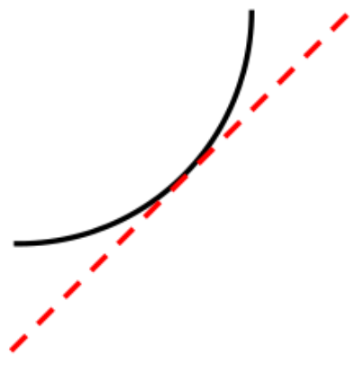

<span><strong>Figure 17.</strong> Shape of curve with $m>0$ and Concavity$>0$.</span>
</div>

### Case-II: $\mathbf{m>0, con<0}$

- If $m>0$ and Concavity$<0$, the shape of the curve will be as shown below and the graph is said concave down (drawn down the tangent).


<div style="text-align: center;">
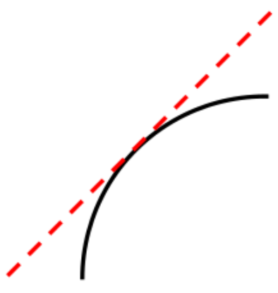

<span><strong>Figure 18.</strong> Shape of curve with $m>0$ and Concavity$< 0$.</span>
</div>

### Case-III: $\mathbf{m<0, con>0}$

- If $m<0$ and Concavity$>0$, the shape of the curve will be as shown below and the graph is said concave up (drawn up on the tangent).


<div style="text-align: center;">
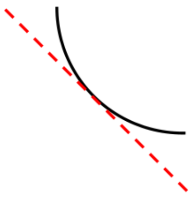

<span><strong>Figure 19.</strong> Shape of curve with $m< 0$ and Concavity$>0$.</span>
</div>

### Case-IV: $\mathbf{m<0, con<0}$

- If $m<0$ and Concavity$<0$, the shape of the curve will be as shown below and the graph is said concave down (drawn down the tangent).


<div style="text-align: center;">
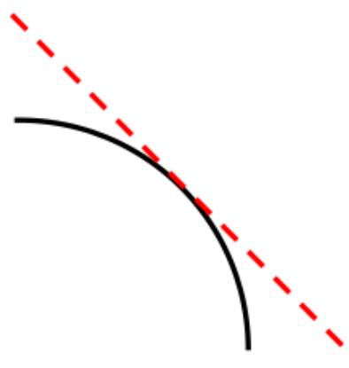

<span><strong>Figure 20.</strong> Shape of curve with $m< 0$ and Concavity$< 0$.</span>
</div>
