# Calculus and Analytical Geometry

## Maximum and Minimum Values

### Dr. Aamir Alaud Din

# Objectives

After preparing this topic, you should be able to:

1. Identify and distinguish absolute and local maximum and minimum values of a function and interpret these extreme values geometrically.

2. Use critical numbers and the Closed Interval Method to determine the absolute maximum and minimum values of a continuous function on a closed interval.

# The Why Section

## Objective 1: Why Study Absolute and Local Extreme Values?

* Many engineering and computing problems require us to determine the largest or smallest value attained by a quantity.

* In mechanical engineering, for example, an engineer may need to determine the maximum acceleration experienced by a spacecraft or the operating condition at which a mechanical system reaches its smallest response.

* In computer science and machine learning, a model may also have a performance measure that becomes locally or globally high or low as a parameter changes.

* An **absolute maximum** identifies the largest value attained over the entire domain or specified interval, whereas a **local maximum** describes a value that is larger than nearby values.

* Similarly, an absolute minimum is the smallest value over the complete domain or interval, while a local minimum is smaller than nearby values.

* Distinguishing these types of extreme values is therefore important because a value that appears to be optimal locally may not be optimal over the entire range.

* For example, the motion controller of a robotic arm may have a performance function depending on the arm angle. We may want to determine whether a particular operating angle gives the best performance only compared with nearby angles or whether it gives the best performance over the entire allowable range.

* This type of engineering problem can be analyzed by studying absolute and local extreme values.

The textbook introduces maximum and minimum values through optimization problems such as minimizing manufacturing cost and finding maximum spacecraft acceleration. 

## Objective 2: Why Study Critical Numbers and the Closed Interval Method?

* Knowing that a function has an extreme value is not enough; in applications, we usually need to determine **where** the extreme value occurs and **what its value is**.

* A graph can suggest the location of a maximum or minimum, but a graph alone may not give an exact answer.

* Differential calculus provides a systematic way to locate possible extreme values.

* If a differentiable function has a local maximum or minimum at an interior point, its derivative is zero there.

* However, an extreme value can also occur where the derivative does not exist, and an absolute extreme value on a closed interval can occur at an endpoint.

* Therefore, we need to examine both **critical numbers** and **endpoints**.

* The Closed Interval Method provides a systematic procedure for finding the absolute maximum and minimum of a continuous function on a closed interval.

* For example, a control system in a mechatronic device may have a performance function defined over a fixed operating range. We may need to determine the operating setting that gives the highest performance and the setting that gives the lowest performance.

* This type of engineering problem can be solved by finding the critical numbers and applying the Closed Interval Method.

# Objective 1: Absolute and Local Extreme Values

## Absolute Maximum and Absolute Minimum

* Let $f$ be a function whose domain is $D$.

* If $f(c)$ is greater than or equal to every other value of the function on $D$, then $f(c)$ is called the **absolute maximum value** of $f$ on $D$.

## Definition: Absolute Maximum and Minimum {.blue}

Let $c$ be a number in the domain $D$ of a function $f$.

- $f(c)$ is the **absolute maximum value** of $f$ on $D$ if $f(c)\geq f(x)$ for all $x$ in $D$.

- $f(c)$ is the **absolute minimum value** of $f$ on $D$ if $f(c)\leq f(x)$ for all $x$ in $D$.

$\blacksquare$

* An absolute maximum or minimum is also called a **global maximum or global minimum**.

* The maximum and minimum values of a function are called its **extreme values**.

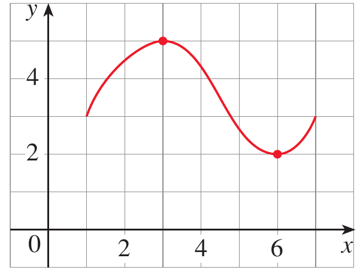

<strong>Figure 1.</strong> Graph illustrating an absolute maximum and an absolute minimum.

* In Figure 1, the highest point of the graph occurs at $(3,5)$ and the lowest point occurs at $(6,2)$.

* Therefore, the absolute maximum value is $f(3)=5$ and the absolute minimum value is $f(6)=2$.

## Local Maximum and Local Minimum

* Sometimes we are interested only in what happens near a particular point rather than over the entire domain.

* A function can have a value that is greater than all nearby values even though it is not the greatest value on the entire domain.

* Such a value is called a **local maximum**.

* Similarly, a value that is smaller than all nearby values is called a **local minimum**.

## Definition: Local Maximum and Minimum {.blue}

The number $f(c)$ is a

* **local maximum value** of $f$ if $f(c)\geq f(x)$ when $x$ is near $c$

* **local minimum value** of $f$ if $f(c)\leq f(x)$ when $x$ is near $c$

$\blacksquare$

* The word **near** means that the comparison is made on some open interval containing $c$.

* Thus, a local maximum or minimum occurs at an interior point rather than at an endpoint.

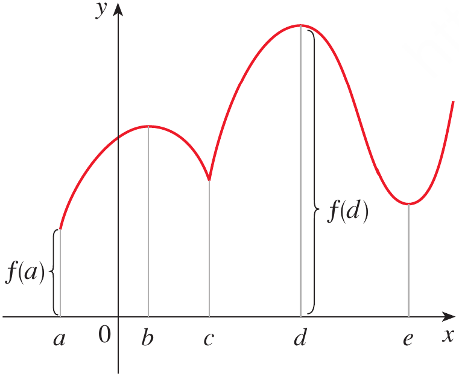

<strong>Figure 2.</strong> Graph showing absolute maximum, absolute minimum, local maximum, and local minimum values.

* Figure 2 illustrates that a function may have several local extreme values while having only one absolute maximum and one absolute minimum.

* A local extreme value does not necessarily have to be an absolute extreme value.

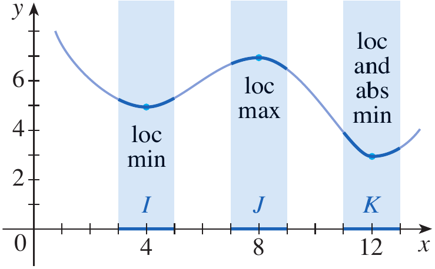

<strong>Figure 3.</strong> Graph illustrating a local minimum, local maximum, and an absolute minimum.

* Figure 3 shows an example in which a local minimum is not the absolute minimum.

* It also shows that a point can simultaneously be a local and absolute extreme value.

## Example 1 {.green}

The graph of the function

$$
f(x)=3x^4-16x^3+18x^2
$$

is shown in Figure 4. You can see that $f(1)=5$ is a local maximum, whereas the absolute maximum is $f(-1)=37$. Also, $f(0)=0$ is a local minimum and $f(3)=-27$ is both a local and an absolute minimum. Note that $f$ has neither a local nor an absolute maximum at $x=4$

### Solution {.green}

From the graph we identify the important values.

At $x=1$

$$
f(1)=5
$$

This value is larger than the values immediately around $x=1$

Therefore, $f(1)=5$ is a local maximum

At $x=0$

$$
f(0)=0
$$

The function decreases toward $x=0$ and increases after $x=0$

Therefore, $f(0)=0$ is a local minimum

At $x=3$

$$
f(3)=-27
$$

This is the lowest value attained by the function on the given interval

Therefore, $f(3)=-27$ is both a local minimum and an absolute minimum

At $x=-1$

$$
f(-1)=37
$$

This is the largest value attained by the function on the given interval

Therefore, $f(-1)=37$ is the absolute maximum

Thus

$$
\text{Absolute maximum}=37
$$

and

$$
\text{Absolute minimum}=-27
$$

The graph also shows that the endpoint $x=4$ is neither a local nor an absolute maximum. The example and its values are given in the textbook.

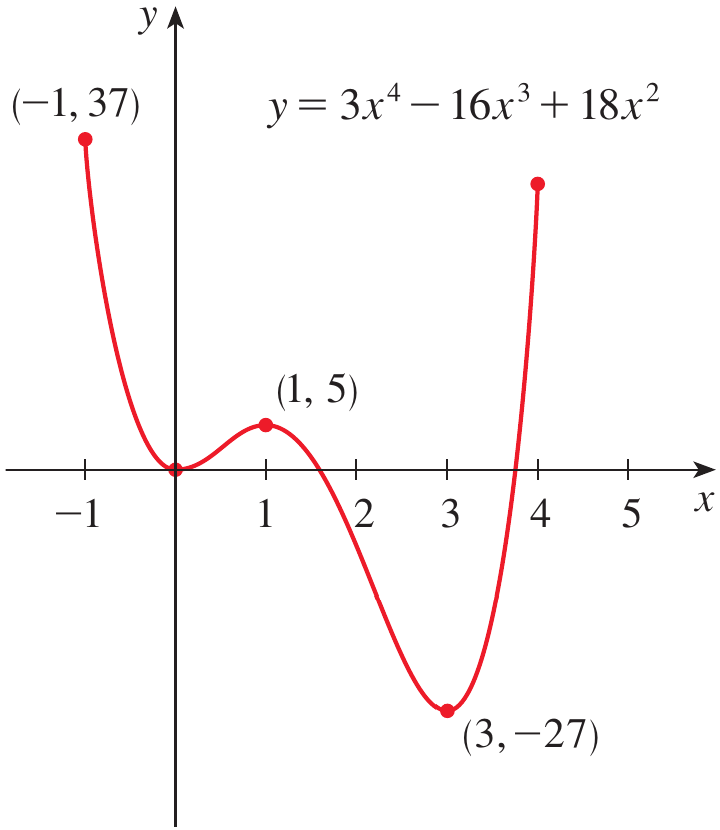

<strong>Figure 4.</strong> Graph of $f(x)=3x^4-16x^3+18x^2$ showing its local and absolute extreme values.

$\blacksquare$

## Example 2 {.green}

The function $f(x)=\cos x$ takes on its local and absolute maximum value of $1$ infinitely many times. Likewise, its minimum value is $-1$

## Solution {.green}

For every integer $n$

$$
\cos(2n\pi)=1
$$

Therefore, the function reaches its maximum value $1$ at infinitely many points.

Thus

$$
\text{Maximum value}=1
$$

The minimum occurs when

$$
x=(2n+1)\pi
$$

because

$$
\cos((2n+1)\pi)=-1
$$

Therefore

$$
\text{Minimum value}=-1
$$

Since these values occur repeatedly, both the maximum and minimum are also local extreme values. 

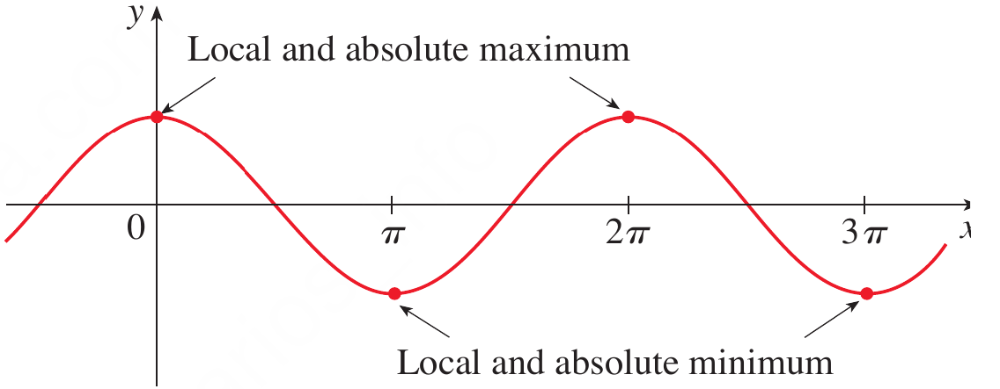

<strong>Figure 5.</strong> Graph of $y=\cos x$ showing repeated local and absolute maximum and minimum values.

$\blacksquare$

## Example 3 {.green}

If $f(x)=x^2$, find the absolute and local minimum value of $f$

## Solution {.green}

For every $x\neq0$

$$
x^2>0
$$

At $x=0$

$$
f(0)=0
$$

Therefore

$$
f(x)\geq0
$$

for every real number $x$

Hence

$$
f(0)=0
$$

is the absolute minimum value

Since values of $x^2$ near $x=0$ are also greater than or equal to $0$, it is also a local minimum

The function has no maximum value because $x^2$ can become arbitrarily large as $|x|$ increases. 

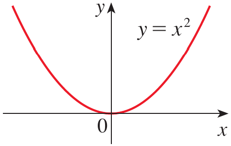

<strong>Figure 6.</strong> Graph of $y=x^2$ showing its minimum value and absence of a maximum.

$\blacksquare$

## Example 4 {.green}

From the graph of the function $f(x)=x^3$, determine whether the function has absolute or local extreme values.

## Solution {.green}

The function is

$$
f(x)=x^3
$$

As $x$ increases, $x^3$ continues to increase

As $x$ decreases, $x^3$ continues to decrease

Therefore, there is no highest value and no lowest value

Although the tangent at $x=0$ is horizontal, the function does not have a maximum or minimum there

Hence

$$
\text{The function has neither an absolute nor a local extreme value}
$$

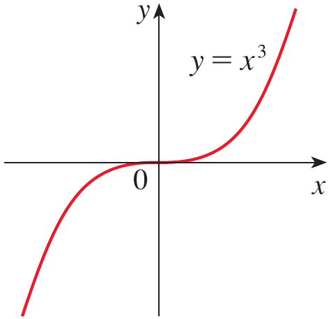

<strong>Figure 7.</strong> Graph of $y=x^3$ showing that the function has no maximum or minimum.

$\blacksquare$

# Quick Check

## Question 1 {.red}

Can a function have a local maximum that is not an absolute maximum?

## Question 2 {.red}

The function $f(x)=x^2$ has a minimum at $x=0$. Is this minimum local, absolute, or both?

$\blacksquare$

# Objective 2: Critical Numbers and the Closed Interval Method

## The Extreme Value Theorem

* The previous examples show that some functions possess extreme values while others do not.

* The Extreme Value Theorem gives a condition that guarantees the existence of absolute maximum and minimum values.

## Theorem {.orange}

If $f$ is continuous on a closed interval $[a,b]$, then $f$ attains an absolute maximum value and an absolute minimum value at some numbers in $[a,b]$

$\blacksquare$

* Both conditions are important.

* The function must be **continuous**.

* The interval must be **closed and bounded**, such as $[a,b]$.

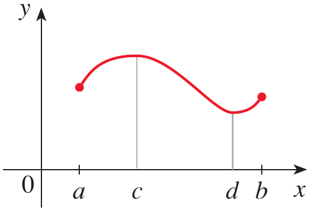
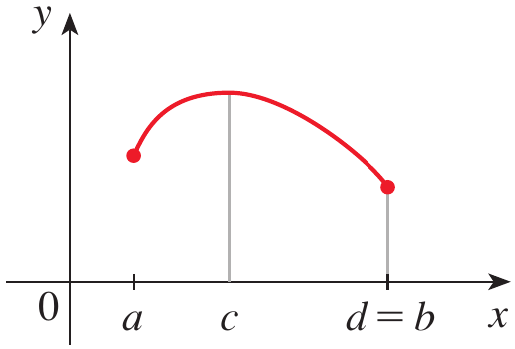
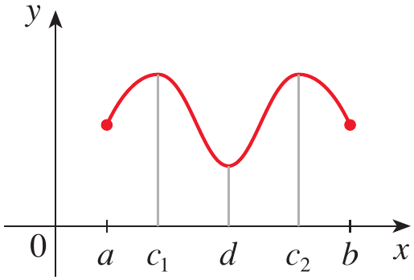

<strong>Figure 8.</strong> Illustration showing that a continuous function on a closed interval attains both an absolute maximum and an absolute minimum.

* If continuity is removed, a function defined on a closed interval may fail to attain a maximum.

* If the interval is not closed, a continuous function may also fail to have an absolute maximum or minimum.

## Fermat's Theorem

* The Extreme Value Theorem guarantees the existence of extreme values but does not tell us where they occur.

* At an interior local maximum or minimum, the tangent line is horizontal when the derivative exists.

* A horizontal tangent has slope zero.

## Theorem: Fermat's Theorem {.orange}

If $f$ has a local maximum or minimum at $c$, and if $f'(c)$ exists, then

$$
f'(c)=0
$$

$\blacksquare$

* This theorem gives us an important way to locate possible extreme values.

* However, the converse is not necessarily true.

* If $f'(c)=0$ we cannot conclude automatically that $f$ has a maximum or minimum at $c$.

## Example 5 {.green}

If $f(x)=x^3$, show that $f'(0)=0$ but $f$ has no maximum or minimum at $x=0$.

## Solution {.green}

Differentiate

$$
f(x)=x^3
$$

to obtain

$$
f'(x)=3x^2
$$

At $x=0$

$$
f'(0)=3(0)^2=0
$$

Thus, $x=0$ is a point where the derivative is zero

However, for $x>0$

$$
x^3>0
$$

and for $x<0$

$$
x^3<0
$$

Therefore, the function passes through $(0,0)$ rather than changing from increasing to decreasing or from decreasing to increasing

Hence

$$
x=0\text{ is not a maximum or minimum}
$$

This demonstrates that $f'(c)=0$ gives a **possible** location of an extreme value, not a guarantee. 

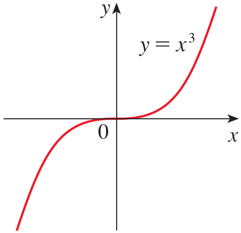

<strong>Figure 9.</strong> Graph of $y=x^3$ showing a horizontal tangent at the origin without an extreme value.

$\blacksquare$

## Example 6 {.green}

The function $f(x)=|x|$ has its local and absolute minimum value at $0$. Explain why this value cannot be found by setting $f'(x)=0$.

## Solution {.green}

The function is

$$
f(x)=|x|
$$

Its minimum occurs at

$$
x=0
$$

because

$$
|x|\geq0
$$

for every real $x$

Therefore

$$
f(0)=0
$$

is both a local and absolute minimum

However, $f'(0)$ does not exist because the graph has a sharp corner at the origin

Therefore, the minimum cannot be found by solving only

$$
f'(x)=0
$$

This shows that an extreme value can occur even when the derivative does not exist. 

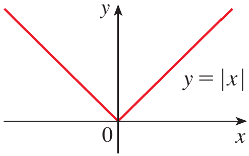

<strong>Figure 10.</strong> Graph of $y=|x|$ showing a minimum where the derivative does not exist.

$\blacksquare$

## Critical Numbers

* Fermat's Theorem suggests that we should examine points where the derivative is zero.

* Example 6 shows that we must also examine points where the derivative does not exist.

## Definition: Critical Number {.blue}

A **critical number** of a function $f$ is a number $c$ in the domain of $f$ such that either

$$
f'(c)=0
$$

or

$$
f'(c)\text{ does not exist}
$$

$\blacksquare$

* A critical number must belong to the **domain of the function**.

* Therefore, a point where the function itself is not defined is not a critical number.

The definition and its application are given in Stewart Section 4.1. 

## Example 7 {.green}

Find the critical numbers of

**(a)**

$$
f(x)=x^3-3x^2+1
$$

**(b)**

$$
f(x)=x^{3/5}(4-x)
$$

## Solution {.green}

**(a)**

Differentiate

$$
f'(x)=3x^2-6x
$$

Factor

$$
f'(x)=3x(x-2)
$$

Set the derivative equal to zero

$$
3x(x-2)=0
$$

Therefore

$$
x=0
$$

or

$$
x=2
$$

The derivative exists for every real number $x$

Hence the critical numbers are

$$
x=0,\;2
$$

**(b)**

The function is

$$
f(x)=x^{3/5}(4-x)
$$

Using the Product Rule

$$
f'(x)=\frac35x^{-2/5}(4-x)-x^{3/5}
$$

Writing over a common denominator gives

$$
f'(x)=\frac{12-8x}{5x^{2/5}}
$$

For $f'(x)=0$, the numerator must be zero

$$
12-8x=0
$$

Therefore

$$
x=\frac32
$$

The derivative does not exist at

$$
x=0
$$

and $x=0$ belongs to the domain of $f$

Therefore the critical numbers are

$$
x=0,\;\frac32
$$

$\blacksquare$

## The Closed Interval Method

* Suppose $f$ is continuous on a closed interval $[a,b]$.

* By the Extreme Value Theorem, $f$ must have an absolute maximum and an absolute minimum on that interval.

* An absolute extreme value can occur at an interior critical number or at an endpoint.

* Therefore, we evaluate the function at all critical numbers in the interval and at both endpoints.

## The Closed Interval Method {.orange}

To find the absolute maximum and minimum values of a continuous function $f$ on a closed interval $[a,b]$:

1. Find the critical numbers of $f$ in $(a,b)$

2. Find the values of $f$ at all critical numbers

3. Find the values of $f$ at the endpoints $a$ and $b$

4. The largest value obtained is the absolute maximum and the smallest value obtained is the absolute minimum

$\blacksquare$

## Example 8 {.green}

Find the absolute maximum and minimum values of the function

$$
f(x)=x^3-3x^2+1
$$

on the interval

$$
[-1,4]
$$

## Solution {.green}

The function is a polynomial and is therefore continuous on $[-1,4]$

We can use the Closed Interval Method

### Step 1: Find the critical numbers {.green}

From Example 7

$$
f'(x)=3x(x-2)
$$

Thus

$$
x=0,\;2
$$

are the critical numbers

Both lie inside $[-1,4]$

### Step 2: Evaluate the function at the critical numbers {.green}

At $x=0$

$$
f(0)=1
$$

At $x=2$

$$
f(2)=8-12+1=-3
$$

### Step 3: Evaluate the function at the endpoints {.green}

At $x=-1$

$$
f(-1)=(-1)^3-3(-1)^2+1=-3
$$

At $x=4$

$$
f(4)=4^3-3(4)^2+1=17
$$

We therefore have

|  $x$ | $f(x)$ |
| ---: | -----: |
| $-1$ |   $-3$ |
|  $0$ |    $1$ |
|  $2$ |   $-3$ |
|  $4$ |   $17$ |

### Step 4: Compare the values {.green}

The largest value is

$$
17
$$

The smallest value is

$$
-3
$$

Therefore

$$
\text{Absolute maximum}=17\text{ at }x=4
$$

and

$$
\text{Absolute minimum}=-3\text{ at }x=2
$$

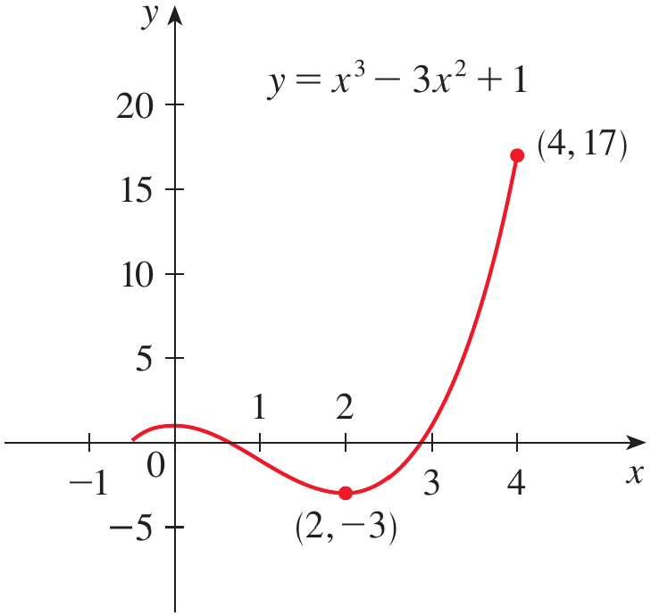

<strong>Figure 11.</strong> Graph of $y=x^3-3x^2+1$ showing the absolute maximum at $(4,17)$ and absolute minimum at $(2,-3)$.

$\blacksquare$

## Example 9 {.green}

**(a)** Use a calculator or computer to estimate the absolute minimum and maximum of

$$
f(x)=x-2\sin x,\qquad 0\leq x\leq2\pi
$$

**(b)** Use calculus to find the exact minimum and maximum values

## Solution {.green}

### Part (a): Numerical estimate {.green}

A graph or calculator gives approximately

$$
\text{Absolute minimum}\approx-0.68
$$

at approximately

$$
x\approx1.05
$$

The approximate absolute maximum is

$$
\text{Absolute maximum}\approx6.97
$$

at approximately

$$
x\approx5.24
$$

Numerical methods give useful estimates, but calculus is required for the exact values. 

### Part (b): Exact values {.green}

The function is continuous on $[0,2\pi]$

Differentiate

$$
f'(x)=1-2\cos x
$$

Find the critical numbers by setting the derivative equal to zero

$$
1-2\cos x=0
$$

Therefore

$$
\cos x=\frac12
$$

On $[0,2\pi]$, this occurs at

$$
x=\frac{\pi}{3}
\qquad\text{and}\qquad
x=\frac{5\pi}{3}
$$

Evaluate the function at the critical numbers

At

$$
x=\frac{\pi}{3}
$$

we obtain

$$
f\left(\frac{\pi}{3}\right)
=
\frac{\pi}{3}
-
2\sin\left(\frac{\pi}{3}\right)
$$

Since

$$
\sin\left(\frac{\pi}{3}\right)=\frac{\sqrt3}{2}
$$

we get

$$
f\left(\frac{\pi}{3}\right)
=
\frac{\pi}{3}-\sqrt3
\approx-0.684853
$$

At

$$
x=\frac{5\pi}{3}
$$

we obtain

$$
f\left(\frac{5\pi}{3}\right)
=
\frac{5\pi}{3}
-
2\sin\left(\frac{5\pi}{3}\right)
$$

Since

$$
\sin\left(\frac{5\pi}{3}\right)=-\frac{\sqrt3}{2}
$$

we obtain

$$
f\left(\frac{5\pi}{3}\right)
=
\frac{5\pi}{3}+\sqrt3
\approx6.968039
$$

Now evaluate the endpoints

At $x=0$

$$
f(0)=0
$$

At $x=2\pi$

$$
f(2\pi)=2\pi
$$

We compare all four values

$$
0
$$

$$
\frac{\pi}{3}-\sqrt3
$$

$$
\frac{5\pi}{3}+\sqrt3
$$

$$
2\pi
$$

The smallest value is

$$
\frac{\pi}{3}-\sqrt3
$$

and the largest value is

$$
\frac{5\pi}{3}+\sqrt3
$$

Therefore

$$
\text{Absolute minimum}=
\frac{\pi}{3}-\sqrt3
$$

at

$$
x=\frac{\pi}{3}
$$

and

$$
\text{Absolute maximum}=
\frac{5\pi}{3}+\sqrt3
$$

at

$$
x=\frac{5\pi}{3}
$$

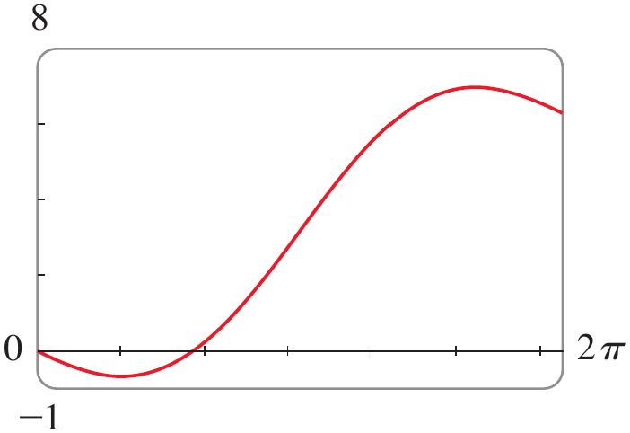

<strong>Figure 12.</strong> Graph of $f(x)=x-2\sin x$ on $[0,2\pi]$ showing its absolute minimum and maximum.

$\blacksquare$

## Example 10 {.green}

The Hubble Space Telescope was deployed on April 24, 1990, by the space shuttle *Discovery*. A model for the velocity of the shuttle during this mission, from liftoff at $t=0$ until the solid rocket boosters were jettisoned at $t=126$ seconds, is given by

$$
v(t)=0.000397t^3-0.02752t^2+7.196t-0.9397
$$

where velocity is measured in meters per second

Using this model, estimate the absolute maximum and minimum values of the acceleration of the shuttle between liftoff and the jettisoning of the boosters

## Solution {.green}

We are interested in the extreme values of the **acceleration**, not directly the velocity

Acceleration is the derivative of velocity

$$
a(t)=v'(t)
$$

Differentiate the velocity function

$$
a(t)
=
0.001191t^2-0.05504t+7.196
$$

The acceleration is considered on the closed interval

$$
[0,126]
$$

Differentiate again

$$
a'(t)=0.0023808t-0.05504
$$

Find the critical number

$$
0.0023808t-0.05504=0
$$

Therefore

$$
t\approx23.12
$$

Now evaluate the acceleration at the critical number and at the endpoints

At $t=0$

$$
a(0)=7.196
$$

At $t\approx23.12$

$$
a(23.12)\approx6.56
$$

At $t=126$

$$
a(126)\approx19.16
$$

Comparing the three values

$$
7.196,\qquad6.56,\qquad19.16
$$

the largest value is approximately

$$
19.16\;m/s^2
$$

and the smallest value is approximately

$$
6.56\;m/s^2
$$

Therefore, the shuttle's maximum acceleration is approximately $19.16;m/s^2$ and its minimum acceleration is approximately $6.56;m/s^2$

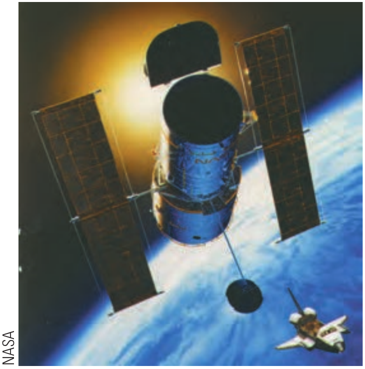

<strong>Figure 13.</strong> NASA illustration associated with the Hubble Space Telescope acceleration application.

$\blacksquare$

# Quick Check

## Question 1 {.red}

Find the critical numbers of

$$
f(x)=x^3-3x^2+1
$$

## Question 2 {.red}

For a continuous function on $[a,b]$, why must the endpoints be checked when finding the absolute maximum and minimum?

$\blacksquare$

# Scenario Problem

## Problem {.green}

A mechatronic robotic arm operates during a four-second motion cycle. A controller uses the following performance index to evaluate the quality of the motion

$$
P(t)=t^3-6t^2+9t+2
$$

where $t$ is the time in seconds and

$$
0\leq t\leq4
$$

Determine the absolute maximum and absolute minimum values of the performance index during the complete motion cycle

Also determine any local extreme values occurring inside the interval

## Solution {.green}

The function is a polynomial, so it is continuous on the closed interval $[0,4]$

Therefore, the Closed Interval Method can be used

### Step 1: Find the critical numbers {.green}

Differentiate

$$
P'(t)=3t^2-12t+9
$$

Factor

$$
P'(t)=3(t^2-4t+3)
$$

$$
P'(t)=3(t-1)(t-3)
$$

Set the derivative equal to zero

$$
3(t-1)(t-3)=0
$$

Therefore

$$
t=1
\qquad\text{or}\qquad
t=3
$$

Both are inside the interval $(0,4)$

### Step 2: Evaluate the critical numbers {.green}

At $t=1$

$$
P(1)=1-6+9+2
$$

$$
P(1)=6
$$

At $t=3$

$$
P(3)=27-54+27+2
$$

$$
P(3)=2
$$

### Step 3: Evaluate the endpoints {.green}

At $t=0$

$$
P(0)=2
$$

At $t=4$

$$
P(4)=64-96+36+2
$$

$$
P(4)=6
$$

The values to compare are therefore

| $t$ | $P(t)$ |
| --: | -----: |
| $0$ |    $2$ |
| $1$ |    $6$ |
| $3$ |    $2$ |
| $4$ |    $6$ |

The largest value is

$$
6
$$

and it occurs at

$$
t=1\text{ and }t=4
$$

Therefore, the absolute maximum is

$$
P_{\max}=6
$$

The smallest value is

$$
2
$$

and it occurs at

$$
t=0\text{ and }t=3
$$

Therefore, the absolute minimum is

$$
P_{\min}=2
$$

Inside the interval, $t=1$ is a local maximum because the derivative changes from positive to negative

Similarly, $t=3$ is a local minimum because the derivative changes from negative to positive

Thus

$$
\text{Local maximum}=6\text{ at }t=1
$$

and

$$
\text{Local minimum}=2\text{ at }t=3
$$

This problem illustrates why we need both ideas: **critical numbers identify possible interior extreme values, while the Closed Interval Method ensures that the endpoints are also examined**.

$\blacksquare$

# Summary

* An **absolute maximum** is the largest value of a function over its entire domain or specified interval, while an **absolute minimum** is the smallest value.

* A **local maximum** is a value that is greater than or equal to nearby function values, while a **local minimum** is smaller than or equal to nearby values.

* A function may have several local extreme values but only one absolute maximum or minimum value, although an absolute extreme value may occur at more than one point.

* The **Extreme Value Theorem** guarantees that a continuous function on a closed interval $[a,b]$ attains both an absolute maximum and an absolute minimum.

* **Fermat's Theorem** states that if a differentiable function has a local maximum or minimum at an interior point $c$, then $f'(c)=0$.

* A **critical number** is a number in the domain of $f$ where $f'(c)=0$ or $f'(c)$ does not exist.

* A critical number does not necessarily correspond to a maximum or minimum, as demonstrated by $f(x)=x^3$.

* To find absolute extreme values on a closed interval, evaluate the function at all critical numbers in the interval and at both endpoints.

* The **Closed Interval Method** compares these values, with the largest being the absolute maximum and the smallest being the absolute minimum.

* These ideas allow calculus to determine optimal operating conditions in engineering systems such as robotic mechanisms, spacecraft, and other physical or computational models. 
